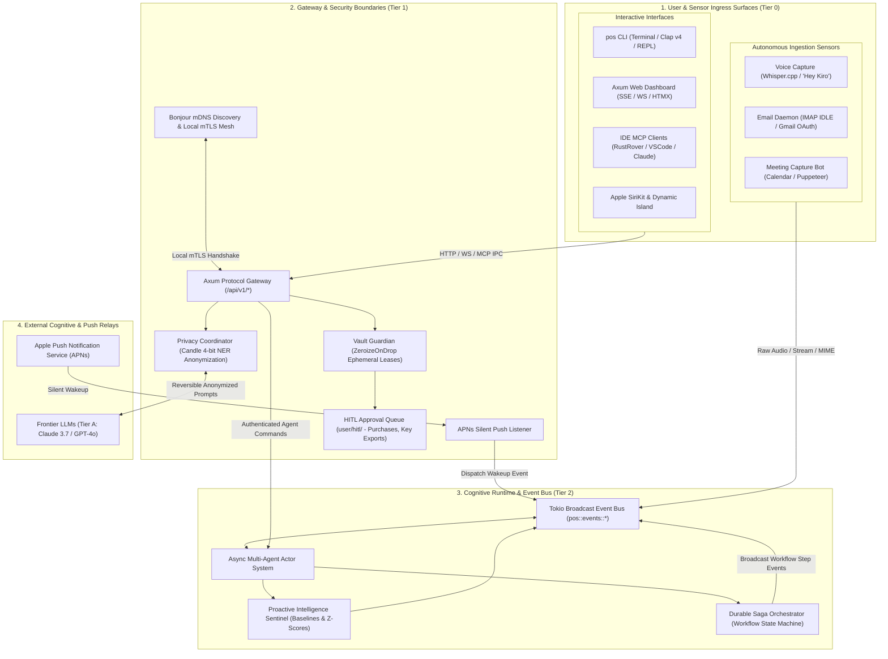
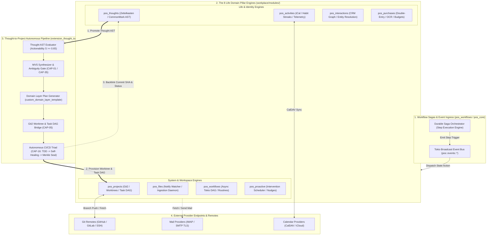
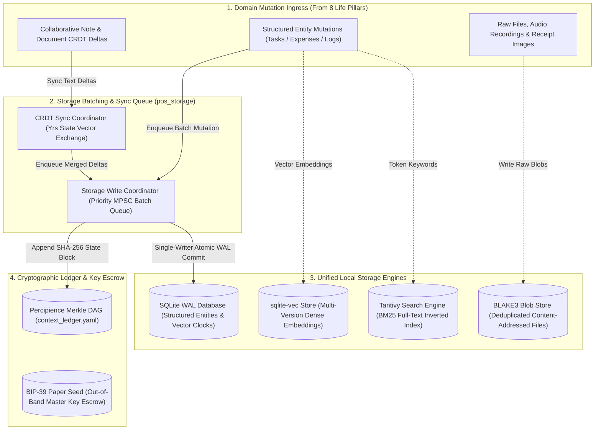
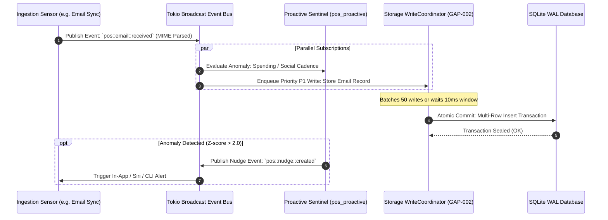
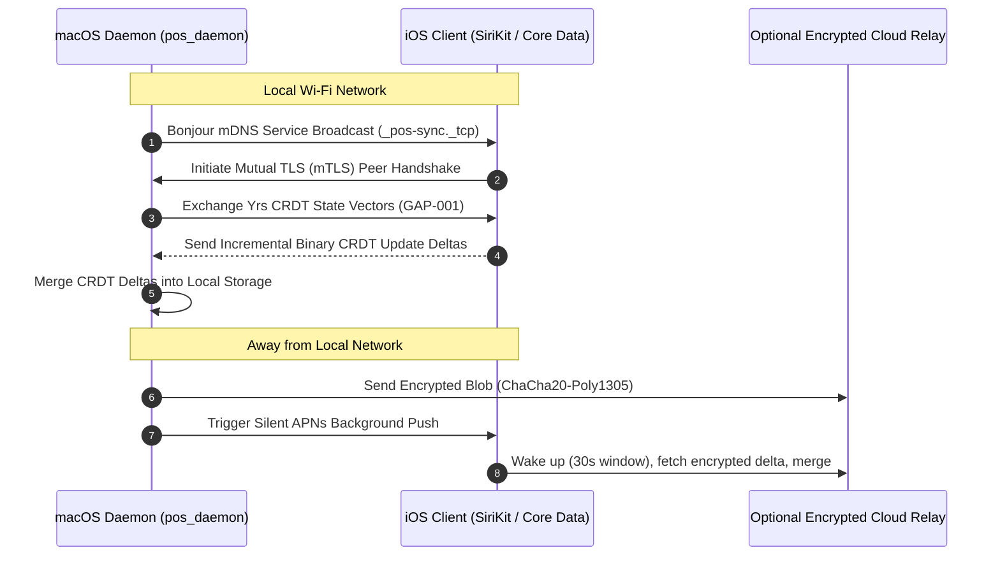

# Personal OS: Finished Product Interaction Points & Mechanisms

**Document Version**: `1.0.0`  
**Status**: Specification & Architectural Verification  
**Target System**: Personal OS (Safe Rust Daemon + Multi-Surface Ecosystem)  
**Parent Plan**: [Parent Master Plan](./master/parent-master-plan/README.md) · [Core Plan](./personal_os/README.md) · [GAPS Complete](./architecture/GAPS_COMPLETE.md)

---

## 📋 Executive Overview

A unified personal operating system must coordinate diverse asynchronous inputs (voice, emails, keystrokes, filesystem events, calendar alerts) and route them through security, cognitive processing, storage, and external actions without data loss, race conditions, or infinite recursion.

This document provides a **comprehensive mapping of all interaction points and mechanisms** across the finished Personal OS product. It maps every communication boundary, protocol, wire contract, and dataflow path, explicitly identifying **architectural loose ends**, edge-case failure modes, and required mitigation invariants.

---

## 🗺️ Master Interaction Points Topology

To eliminate visual clutter and ensure effortless architectural readability, the interaction topology of the finished product is partitioned into three dedicated, vertically aligned diagrams:

1. **[Diagram 1: Ingress, Security Boundaries & Cognitive Orchestration](#diagram-1-ingress-security-boundaries--cognitive-orchestration)** (Surfaces → Gateways → Security Boundaries → Agentic Event Bus).
2. **[Diagram 2A: Domain Engines & Workflow Execution Topology](#diagram-2a-domain-engines--workflow-execution-topology)** (Durable Sagas → The 8 Life Domain Pillars → Remote Provider Sync).
3. **[Diagram 2B: Local Storage Pipeline, Indexing & Audit Ledger Topology](#diagram-2b-local-storage-pipeline-indexing--audit-ledger-topology)** (Domain Mutations → Priority Write Coordinator & CRDT Queue → SQLite WAL, Vector Embeddings, Tantivy BM25, BLAKE3 CAS, and Merkle Ledger).

---

### Diagram 1: Ingress, Security Boundaries & Cognitive Orchestration



---

### Diagram 2A: Domain Engines & Workflow Execution Topology



---

### Diagram 2B: Local Storage Pipeline, Indexing & Audit Ledger Topology



---

## ⚙️ The 6 Core Interaction Mechanisms

### Mechanism 1: User-to-System Interactive Channels
| Channel | Technology | Direction | Wire Contract / Protocol | Failure Recovery |
|---|---|---|---|---|
| **CLI (`pos`)** | Clap v4, `rustyline` | Bi-directional | Local IPC / UNIX domain socket | Immediate terminal stderr exit code |
| **Web Dashboard** | Axum, SSE, HTMX | Bi-directional | REST JSON (`/api/v1/*`), WS (`/ws/events`) | Exponential reconnection backoff |
| **IDE Extensions** | Model Context Protocol | Bi-directional | JSON-RPC 2.0 over STDIO / SSE | MCP Client session restart |
| **Apple Siri & Shortcuts** | SiriKit App Intents | Inbound / Outbound | Swift App Intent Bridge $\rightarrow$ Native IPC | Haptic error alert & fallback speech |
| **Local Voice Capture** | CPAL audio buffer | Inbound | 16kHz PCM stream $\rightarrow$ Whisper.cpp | Local ring-buffer drop on audio overflow |

### Mechanism 2: Autonomous Ingestion & Sensor Sensing
| Sensor | Trigger Mechanism | Ingestion Frequency | Invariant Gate | Destination Pillar |
|---|---|---|---|---|
| **File Watcher** | `notify-rs` (kqueue/FSEvents) | Real-time event | Deduplicate via BLAKE3 CAS | `pos_files` |
| **Email IMAP Sync** | IMAP IDLE push + Poll | Continuous IDLE / 15m | PII De-identification filter | `pos_email` $\rightarrow$ `pos_interactions` |
| **Calendar CalDAV** | RFC 4791 CalDAV WebDAV | Every 15 minutes | Conflict detection | `pos_activities` |
| **Meeting Bot** | Calendar alert trigger | Scheduled event | Participant consent validation | `pos_meeting` $\rightarrow$ `pos_projects` |
| **Telemetry Sensor** | OS focus / window poll | Every 60 seconds | Anonymized application hash | `pos_activities` (Telemetry) |

### Mechanism 3: Intra-System Asynchronous Messaging & Concurrency


### Mechanism 4: Security, Privacy & Capability Brokerage
1. **Secret Lease Brokerage (`pos_vault`)**:
   - Subagents never hold permanent API credentials.
   - Mechanism: Agent calls `acquire_lease(secret_id, duration_sec)`. Vault checks subagent permissions, generates an ephemeral lease, and wraps secret bytes in `zeroize::ZeroizeOnDrop`. Memory is zeroed on drop.
2. **Dual-Pass PII De-Identification (`PrivacyCoordinator`)**:
   - Outbound prompt text is scanned via pure-Rust `candle` (BERT-Tiny 4-bit) + regex for SSN, credit cards, phones, emails, and names.
   - Text is rewritten with reversible tokens (`[PERSON_01]`). Cloud LLM responds; local coordinator re-hydrates tokens before rendering to user.
3. **HITL Authorization Gate**:
   - Any financial purchase $> \$0.00$, private key export, or destructive git action enters `user/hitl/`.
   - Execution pauses until the user signs off via `pos hitl approve <id>` or Web UI toggle.

### Mechanism 5: Multi-Device P2P & Cloud Synchronization


### Mechanism 6: Proactive Intelligence & Continuous Background Learning
- **Rolling Window Computation**: Every night at 03:00 AM, `pos_baseline` recalculates $\mu, \sigma, Q_1, Q_3$ across 90 days of transactions, habit streaks, work hours, and communication cadence.
- **Anti-Nagging Sentinel**:
  - Maximum **2 high-priority alerts per day**.
  - Quiet Hours enforcement: 10:00 PM – 07:00 AM (all audible nudges silenced).
  - Context-Aware Suppression: If `pos_activities` reports an active `focus_block` or `meeting`, alerts are buffered into the Morning/Evening Brief queue.

---

## 🧩 Cross-Pillar Interaction Matrix

The 8 core pillars interact through strongly-typed event payloads across the Tokio broadcast bus:

| Calling Pillar $\downarrow$ \ Target $\rightarrow$ | 1. Projects | 2. Files | 3. Thoughts | 4. Activities | 5. Workflows | 6. Vault | 7. Interactions | 8. Purchases |
|---|---|---|---|---|---|---|---|---|
| **1. Projects** | — | Ingest repo files | Link tasks to notes | Schedule sprint blocks | Trigger CI/CD DAG | Fetch git credentials | Assign tasks to contacts | Track project expenses |
| **2. Files** | Detect repo root | — | Extract file thoughts | Ingest .ics files | Trigger OCR workflow | Decrypt encrypted files | Index meeting audio | Ingest PDF receipts |
| **3. Thoughts** | Auto-create task | Attach file | — | Block thinking time | Run weekly review | Scramble sensitive notes | Link contact mention | Tag budget ideas |
| **4. Activities** | Deadline alerts | Attach agenda | Journal daily log | — | Trigger Morning Brief | Calendar OAuth lease | Pre-meeting brief | Detect paid booking |
| **5. Workflows** | Auto-merge branch | Re-index CAS | Synthesize digest | Check calendar gap | — | Request lease | Send email follow-up | Reconcile expenses |
| **6. Vault** | Audit git token | Encrypt blob | Zeroize scratch | Log auth attempt | Revoke timed leases | — | Verify contact token | Mask credit card |
| **7. Interactions** | Extract action item | Save transcript | Wikilink profile | Schedule sync | Draft follow-up email | Store contact key | — | Split dinner expense |
| **8. Purchases** | Charge project | Save receipt blob | Log purchase thought| Calendar renewal | Trigger audit saga | Scoped Stripe token | Link vendor contact | — |

---

## 🔍 Critical "Loose Ends", Boundary Leaks & Failure Modes

A rigorous architectural review reveals **seven critical loose ends** in the interaction topology that must be actively guarded:

### 1. ⚠️ Recursive Feedback Loop (Event Cascades)
- **The Loose End**: A transaction is parsed from an email (`pos_email`). This triggers a purchase log (`pos_purchases`). `pos_proactive` detects a spending anomaly and generates a draft email nudge to the user. `pos_email` sees the new draft and parses it as an inbound event, triggering an infinite event loop.
- **Mitigation Invariant**: Every event on `tokio::sync::broadcast` must carry a cryptographic `causality_id` and an incrementing `depth` counter (max depth $D_{\max} = 3$). Synthetic agent events are marked `is_synthetic: true` and ignored by ingestion watchers.

### 2. ⚠️ HITL Approval Queue Starvation
- **The Loose End**: A durable saga workflow (`wf_post_meeting_debrief`) extracts an email draft that requires user approval before sending. The user does not open their laptop for 7 days. The workflow remains in `in_progress` indefinitely, holding locks or stale context.
- **Mitigation Invariant**: All HITL approval requests must specify a strict `ttl_seconds` (default: 48 hours). When expired, the saga transitions to `state: expired_cancelled` and executes safe compensating rollbacks.

### 3. ⚠️ Storage Write Coordinator Channel Backpressure
- **The Loose End**: Initial setup indexes 50,000 workspace files and 10,000 emails. If `pos_files` inundates the `WriteCoordinator`'s MPSC channel faster than SQLite WAL can commit, RAM usage explodes, risking an Out-Of-Memory (OOM) panic.
- **Mitigation Invariant**: Replace unbounded channels with a bounded channel (`tokio::sync::mpsc::channel(2048)`). When the queue reaches 80% capacity, backpressure propagates to the file ingestion watcher, throttling filesystem reads until the database catches up.

### 4. ⚠️ Ephemeral Secret Lease Expiration Mid-Execution
- **The Loose End**: A subagent requests a 60-second lease to upload a large repository backup to an S3 WORM bucket. Network congestion causes the upload to take 75 seconds. The lease expires at $t=60\text{s}$, zeroizing the token in RAM mid-stream and causing an unhandled socket crash.
- **Mitigation Invariant**: Implement a **heartbeat renewal protocol** on active leases (`pos_vault::lease::renew()`). As long as the subagent's task thread is actively processing I/O, it can extend the lease up to a hard ceiling ($T_{\max} = 15\text{ minutes}$).

### 5. ⚠️ Local P2P Split-Brain & Asymmetric Network Topology
- **The Loose End**: The user's iPhone connects to Mac via Bonjour local Wi-Fi, begins syncing CRDT updates, and walks out the door. The Wi-Fi drops midway through vector clock reconciliation. When the iPhone connects via cellular APNs later, vector clocks are partially applied.
- **Mitigation Invariant**: CRDT sync transactions must be **atomic chunks**. Updates are staged in a transient `crdt_staging` buffer and only applied to the primary `crdt_updates` table once the full payload checksum is validated.

### 6. ⚠️ Storage Tier Inconsistency (Dangling CAS Blobs)
- **The Loose End**: A receipt image is uploaded, hashed with BLAKE3, and written to disk. The database write transaction fails due to a foreign-key constraint violation. The file exists in CAS on disk, but no SQLite record references it.
- **Mitigation Invariant**: The CAS Garbage Collector (`cas_garbage_collection.md`) sweeps unreferenced blobs older than 24 hours. Inverted write order: write to SQLite first inside transaction; commit CAS blob second; rollback SQLite if blob write fails.

### 7. ⚠️ Platform Permission Degradation (macOS / iOS Sandboxing)
- **The Loose End**: macOS prompts for Microphone or Accessibility permission for `pos_meeting` or `pos_voice`. The user denies permission. The background daemon hangs waiting for audio streams that never arrive.
- **Mitigation Invariant**: Strict health probes before initiating any sensory workflow (`pos_audio::check_permissions()`). If denied, gracefully fallback to text-only mode and emit an actionable CLI notification: `pos doctor --permissions`.

---

## 🛡️ Implementation Defensive Invariants Checklist

```markdown
- [ ] Invariant I-01: Every broadcast event carries `causality_id` and `depth <= 3` (Anti-Recursion).
- [ ] Invariant I-02: Bounded MPSC write channel with capacity 2048 and backpressure throttling.
- [ ] Invariant I-03: All secrets held in RAM implement `zeroize::ZeroizeOnDrop`.
- [ ] Invariant I-04: Dual-pass PII anonymization occurs before ANY remote LLM egress.
- [ ] Invariant I-05: HITL approvals enforce a 48-hour timeout with compensating saga rollbacks.
- [ ] Invariant I-06: CRDT sync operations are atomic and staged before local ledger commit.
- [ ] Invariant I-07: Proactive alerts are capped at max 2 high-priority notifications per 24 hours.
- [ ] Invariant I-08: Master key derivation includes a 12/24-word BIP-39 mnemonic seed backup.
```
