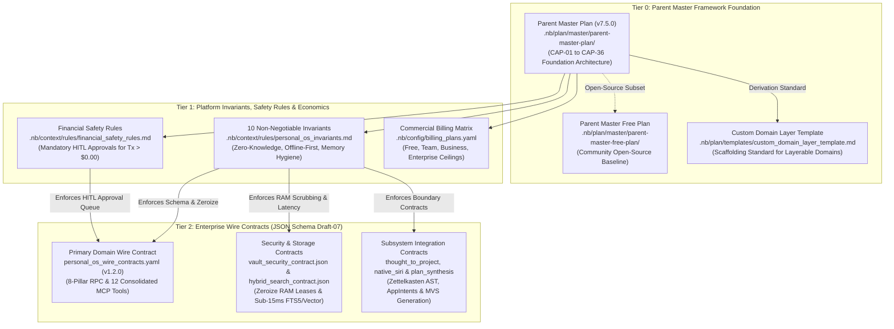
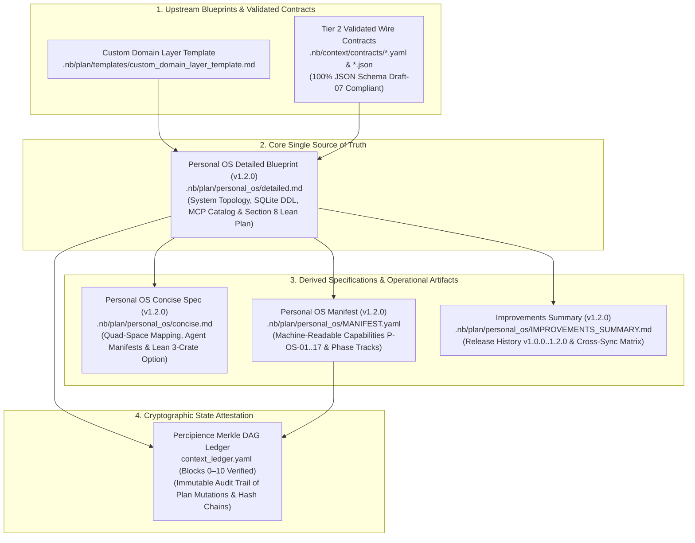
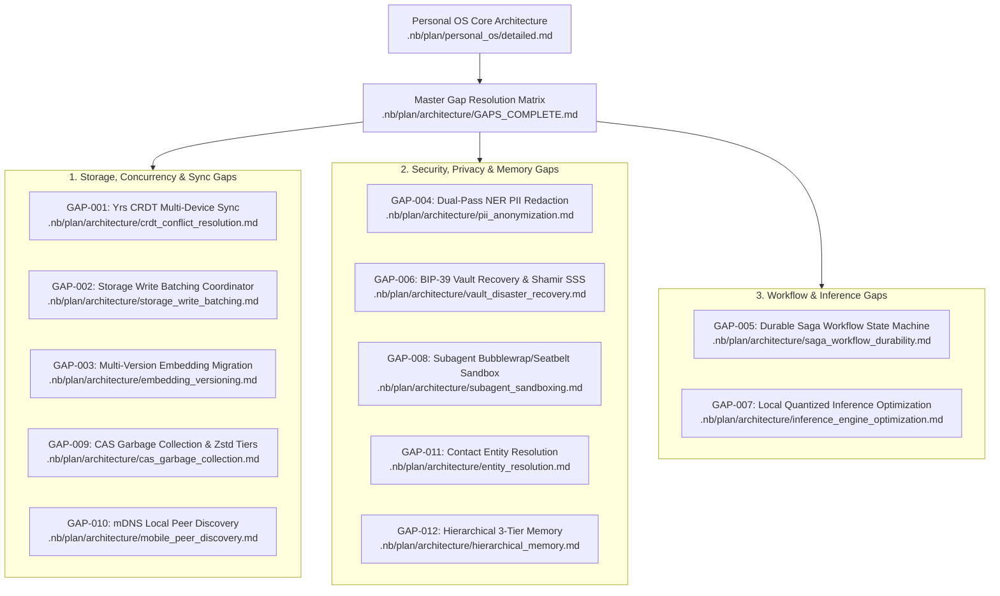
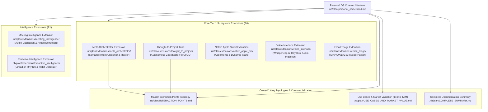
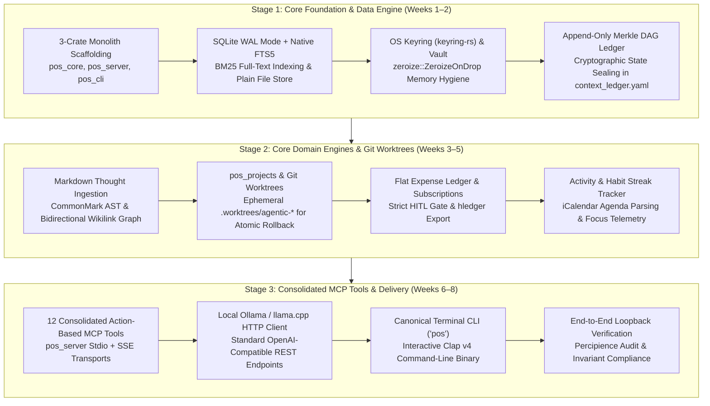
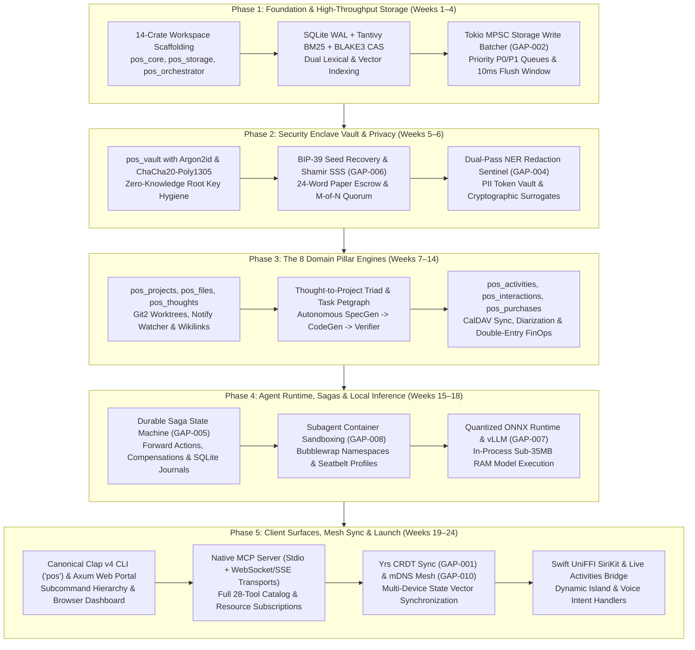

# Personal OS & Percipience Plan Lineage, Hierarchy & Dependency Index

### Executive Overview & Strategic Purpose
The **Percipience Context Engineering Framework** structures complex agentic software development into a strictly governed, multi-tiered hierarchy of plans. These plans range from domain-agnostic master framework governance down to low-level cryptographic wire contracts and specialized AI subagent extensions.

This document serves as the **authoritative master lineage and dependency index** for all plans across [`.nb/plan/`](file:///Users/lakhwinder/RustroverProjects/nb_antwalk/.nb/plan/README.md). It defines:
1. **The Architectural Lineage Graph**: How parent frameworks derive domain plans, how domain plans branch into architectural gap resolutions and domain extensions, and how contracts govern execution.
2. **Topological Implementation Order**: Strict dependency-ordered execution sequences for both the **Pragmatic Lean MVP Track (8 Weeks)** and the **Full Enterprise Track (24 Weeks)**.
3. **The Master Plan Catalog**: An exhaustive, searchable reference matrix of every plan document, specifying its type, version, prerequisites, and downstream consumers.
4. **Invariant Governance Traceability**: Direct mapping between platform security invariants (Invariants 1–10) and their enforcing plan files.

---

## 1. Master Plan Lineage Topology

To maximize readability and eliminate diagram clutter, the overall plan lineage is divided into three focused, vertically oriented architectural diagrams:
- **Diagram 1A: Master Governance & Core Plan Derivation Hierarchy**
- **Diagram 1B: Architecture Gaps & Hardening Specifications**
- **Diagram 1C: Modular Extensions & Commercialization Lineage**

---

### Diagram 1A: Master Governance & Core Plan Derivation Hierarchy

To ensure crystal-clear readability and eliminate visual crowding across the governance and domain tiers, Diagram 1A is divided into two focused, progressive diagrams:
- **Diagram 1A-1: Strategic Framework Governance & Wire Contract Pipeline** (Parent framework to platform invariants and validated wire contracts)
- **Diagram 1A-2: Core Domain Plan Suite & Operational Artifact Derivation** (Validated contracts and blueprints to the full Personal OS plan suite and Merkle audit ledger)

---

#### Diagram 1A-1: Strategic Framework Governance & Wire Contract Pipeline

This vertical pipeline illustrates how the root **Parent Master Plan (v7.5.0)** establishes the 10 platform security invariants and commercial billing matrices, which directly parameterize the JSON Schema Draft-07 wire contracts:



---

#### Diagram 1A-2: Core Domain Plan Suite & Operational Artifact Derivation

This vertical sequence illustrates how upstream validated wire contracts and the domain layer template synthesize the **Personal OS Detailed Blueprint**, which subsequently derives the concise spec, capability manifest, and immutable Merkle ledger:



---

### Diagram 1B: Architecture Gaps & Hardening Lineage

The core Personal OS architecture anchors 12 critical engineering gap specifications ([`GAPS_COMPLETE.md`](file:///Users/lakhwinder/RustroverProjects/nb_antwalk/.nb/plan/architecture/GAPS_COMPLETE.md)), categorized into three functional pillars:



---

### Diagram 1C: Modular Extensions & Commercialization Lineage

The core Personal OS architecture directly drives modular subsystem extensions and maps to cross-cutting interaction topologies and commercial monetization models:



---

## 2. Topological Implementation Order

To prevent circular dependencies and blocking states, implementation must follow a strictly ordered DAG sequence. Personal OS provides two execution pathways:

---

### Track A: Pragmatic Lean MVP Track (Recommended: 6–8 Weeks)
*Consolidates codebase into a 3-crate modular monolith (`pos_core`, `pos_server`, `pos_cli`), reducing compile times by 7x and lines of code by 68%.*



#### Stage Deliverables Breakdown:
1. **Stage 1 (Weeks 1–2): Scaffolding, Data & Cryptographic Security**:
   - **Prerequisites**: [`.nb/context/rules/personal_os_invariants.md`](file:///Users/lakhwinder/RustroverProjects/nb_antwalk/.nb/context/rules/personal_os_invariants.md), [`.nb/context/contracts/personal_os_wire_contracts.yaml`](file:///Users/lakhwinder/RustroverProjects/nb_antwalk/.nb/context/contracts/personal_os_wire_contracts.yaml).
   - **Outputs**: `pos_core` scaffold, SQLite WAL mode with FTS5 lexical full-text index. Configure OS Keyring via `keyring-rs` and `zeroize::ZeroizeOnDrop` memory hygiene. Implement Merkle block appending to `context_ledger.yaml`.
2. **Stage 2 (Weeks 3–5): Core Domain Engines & Git Worktrees**:
   - **Prerequisites**: Stage 1 SQLite and Vault foundation.
   - **Outputs**: Markdown thought parser with bidirectional wikilink indexing. Implement `pos_projects` with Git2 worktree provisioning (`.worktrees/agentic-*`) for atomic agent rollback. Build flat transactional expense table with HITL gate. Build habit streak calculation and iCal agenda parsing.
3. **Stage 3 (Weeks 6–8): 12 Consolidated MCP Tools, Local LLM & CLI**:
   - **Prerequisites**: Stage 2 Domain Engines.
   - **Outputs**: Implement the 12 consolidated MCP tools in `pos_server` using standard `action` parameters. Wire local Ollama / llama.cpp HTTP inference endpoint. Build the canonical interactive `pos` CLI binary.

---

### Track B: Full Enterprise Track (24 Weeks)
*Deploys the full 14-crate workspace with custom distributed sagas, Tantivy, BLAKE3 CAS, and native mobile mesh synchronization.*



#### Enterprise Phase Matrix:

| **Phase 1: Storage & Foundation** | Weeks 1–4 | `pos_core`, `pos_storage`, `pos_orchestrator` | Platform Invariants, Base Contracts | [detailed.md § 7.1](file:///Users/lakhwinder/RustroverProjects/nb_antwalk/.nb/plan/personal_os/detailed.md), [GAP-002](file:///Users/lakhwinder/RustroverProjects/nb_antwalk/.nb/plan/architecture/storage_write_batching.md), [GAP-003](file:///Users/lakhwinder/RustroverProjects/nb_antwalk/.nb/plan/architecture/embedding_versioning.md) |
| **Phase 2: Security & Vault Enclave** | Weeks 5–6 | `pos_vault` | Phase 1 Storage Engine | [detailed.md § 7.2](file:///Users/lakhwinder/RustroverProjects/nb_antwalk/.nb/plan/personal_os/detailed.md), [GAP-004](file:///Users/lakhwinder/RustroverProjects/nb_antwalk/.nb/plan/architecture/pii_anonymization.md), [GAP-006](file:///Users/lakhwinder/RustroverProjects/nb_antwalk/.nb/plan/architecture/vault_disaster_recovery.md) |
| **Phase 3: The 8 Domain Pillar Engines** | Weeks 7–14 | `pos_projects`, `pos_files`, `pos_thoughts`, `pos_activities`, `pos_workflows`, `pos_interactions`, `pos_purchases` | Phase 2 Vault & Security Enclave | [detailed.md § 7.3](file:///Users/lakhwinder/RustroverProjects/nb_antwalk/.nb/plan/personal_os/detailed.md), [GAP-009](file:///Users/lakhwinder/RustroverProjects/nb_antwalk/.nb/plan/architecture/cas_garbage_collection.md), [GAP-011](file:///Users/lakhwinder/RustroverProjects/nb_antwalk/.nb/plan/architecture/entity_resolution.md), [thought_to_project](file:///Users/lakhwinder/RustroverProjects/nb_antwalk/.nb/plan/extensions/thought_to_project/detailed.md) |
| **Phase 4: Agent Runtime & Durable Sagas** | Weeks 15–18 | `pos_agents`, `pos_workflows` (Saga Engine) | Phase 3 Domain Engines | [detailed.md § 7.4](file:///Users/lakhwinder/RustroverProjects/nb_antwalk/.nb/plan/personal_os/detailed.md), [GAP-005](file:///Users/lakhwinder/RustroverProjects/nb_antwalk/.nb/plan/architecture/saga_workflow_durability.md), [GAP-007](file:///Users/lakhwinder/RustroverProjects/nb_antwalk/.nb/plan/architecture/inference_engine_optimization.md), [GAP-008](file:///Users/lakhwinder/RustroverProjects/nb_antwalk/.nb/plan/architecture/subagent_sandboxing.md) |
| **Phase 5: Client Surfaces & Mesh Sync** | Weeks 19–24 | `pos_cli`, `pos_server`, Swift SiriKit FFI | Phase 4 Agent Runtime | [detailed.md § 7.5](file:///Users/lakhwinder/RustroverProjects/nb_antwalk/.nb/plan/personal_os/detailed.md), [GAP-001](file:///Users/lakhwinder/RustroverProjects/nb_antwalk/.nb/plan/architecture/crdt_conflict_resolution.md), [GAP-010](file:///Users/lakhwinder/RustroverProjects/nb_antwalk/.nb/plan/architecture/mobile_peer_discovery.md), [native_apple_siri](file:///Users/lakhwinder/RustroverProjects/nb_antwalk/.nb/plan/extensions/native_apple_siri/concise.md) |

---

## 3. Exhaustive Master Plan Catalog & Index

The following table indexes all plans, contracts, gap specifications, extensions, and topologies across `.nb/plan/`:

| Path & Link | Plan Title | Category | Ver / Status | Direct Prerequisites | Downstream Consumers | Key Deliverables |
|:---|:---|:---|:---|:---|:---|:---|
| [master/parent-master-plan/detailed.md](file:///Users/lakhwinder/RustroverProjects/nb_antwalk/.nb/plan/master/parent-master-plan/detailed.md) | Parent Master Plan | Framework Foundation | `7.5.0` Active | None (Root Architecture) | All domain plans & extensions | 36 Capabilities (CAP-01 to CAP-36), quad-space architecture, AST pruning |
| [master/parent-master-free-plan/detailed.md](file:///Users/lakhwinder/RustroverProjects/nb_antwalk/.nb/plan/master/parent-master-free-plan/detailed.md) | Community Edition Framework | Framework Foundation | `1.0.0` Active | None (Open Source Subset) | Community users | Free tier specifications and developer tools |
| [templates/custom_domain_layer_template.md](file:///Users/lakhwinder/RustroverProjects/nb_antwalk/.nb/plan/templates/custom_domain_layer_template.md) | Domain Layer Template | Scaffolding Template | `1.0.0` Template | Parent Master Plan | All custom domain plans | Standard scaffolding structure for new agentic domain layers |
| [personal_os/detailed.md](file:///Users/lakhwinder/RustroverProjects/nb_antwalk/.nb/plan/personal_os/detailed.md) | Personal OS Detailed Blueprint | Core Domain Plan | `1.2.0` Active | Parent Master, Platform Invariants, Wire Contracts | All extensions, CLI, server, daemons | Complete architectural blueprint, SQLite schema, 28 MCP tools, Section 8 Lean Plan |
| [personal_os/concise.md](file:///Users/lakhwinder/RustroverProjects/nb_antwalk/.nb/plan/personal_os/concise.md) | Personal OS Concise Plan | Core Domain Plan | `1.2.0` Active | Parent Master Plan | Subagent system prompts, context loaders | Quad-space mapping, wire contract summaries, agent manifests, 3-crate lean option |
| [personal_os/MANIFEST.yaml](file:///Users/lakhwinder/RustroverProjects/nb_antwalk/.nb/plan/personal_os/MANIFEST.yaml) | Personal OS Manifest | Plan Metadata | `1.2.0` Active | Detailed Plan | Percipience build & packaging toolchain | Machine-readable capability ledger (P-OS-01 to P-OS-17), hashes, phase tracks |
| [personal_os/README.md](file:///Users/lakhwinder/RustroverProjects/nb_antwalk/.nb/plan/personal_os/README.md) | Personal OS Quick Guide | Quick Navigation | `1.2.0` Active | Detailed Plan | Onboarding engineers, human users | Executive summary, 13-crate table, lean architecture callouts |
| [personal_os/IMPROVEMENTS_SUMMARY.md](file:///Users/lakhwinder/RustroverProjects/nb_antwalk/.nb/plan/personal_os/IMPROVEMENTS_SUMMARY.md) | Improvements Summary | Historical Changelog | `1.2.0` Active | Detailed Plan | Governance & audit review | Evolution history (v1.0.0 to v1.2.0) and sync verification matrix |
| [architecture/GAPS_COMPLETE.md](file:///Users/lakhwinder/RustroverProjects/nb_antwalk/.nb/plan/architecture/GAPS_COMPLETE.md) | Master Gap Resolution Matrix | Architecture Hardening | `1.0.0` Complete | Core Detailed Plan | All 12 GAP specifications | Gap matrix linking GAP-001 through GAP-012 |
| [architecture/crdt_conflict_resolution.md](file:///Users/lakhwinder/RustroverProjects/nb_antwalk/.nb/plan/architecture/crdt_conflict_resolution.md) | GAP-001: CRDT Conflict Resolution | Architecture Hardening | `1.0.0` Complete | Detailed Plan § 3.2 | Phase 5 Multi-Device Sync | Yrs CRDT integration, vector clocks, LWW element-set conflict resolution |
| [architecture/storage_write_batching.md](file:///Users/lakhwinder/RustroverProjects/nb_antwalk/.nb/plan/architecture/storage_write_batching.md) | GAP-002: Storage Write Batching | Architecture Hardening | `1.0.0` Complete | Detailed Plan § 4 | `pos_storage` Crate | Tokio MPSC write batch coordinator, priority lanes, 10ms commit window |
| [architecture/embedding_versioning.md](file:///Users/lakhwinder/RustroverProjects/nb_antwalk/.nb/plan/architecture/embedding_versioning.md) | GAP-003: Embedding Versioning | Architecture Hardening | `1.0.0` Complete | Detailed Plan § 4 | `pos_storage`, `pos_thoughts` | Multi-version embedding tables, migration queue, vector re-indexing pipeline |
| [architecture/pii_anonymization.md](file:///Users/lakhwinder/RustroverProjects/nb_antwalk/.nb/plan/architecture/pii_anonymization.md) | GAP-004: PII Anonymization | Architecture Hardening | `1.0.0` Complete | Detailed Plan § 5.2 | `pos_agents`, Egress filter | Dual-pass NER scrubber, PII token vault, cryptographic surrogates |
| [architecture/saga_workflow_durability.md](file:///Users/lakhwinder/RustroverProjects/nb_antwalk/.nb/plan/architecture/saga_workflow_durability.md) | GAP-005: Saga Workflow Durability | Architecture Hardening | `1.0.0` Complete | Detailed Plan § 3.5 | `pos_workflows` Crate | Orchestrated Saga engine, forward/compensating transactions, SQLite step checkpoints |
| [architecture/vault_disaster_recovery.md](file:///Users/lakhwinder/RustroverProjects/nb_antwalk/.nb/plan/architecture/vault_disaster_recovery.md) | GAP-006: Vault Disaster Recovery | Architecture Hardening | `1.0.0` Complete | Detailed Plan § 3.6 | `pos_vault` Crate | BIP-39 24-word paper seed derivation, Shamir Secret Sharing (M-of-N quorum) |
| [architecture/inference_engine_optimization.md](file:///Users/lakhwinder/RustroverProjects/nb_antwalk/.nb/plan/architecture/inference_engine_optimization.md) | GAP-007: Inference Engine Optimization | Architecture Hardening | `1.0.0` Complete | Detailed Plan § 3.3 | `pos_agents`, Inference engine | Quantized local models (4-bit MiniLM / Candle / ONNX), sub-35MB RAM footprint |
| [architecture/subagent_sandboxing.md](file:///Users/lakhwinder/RustroverProjects/nb_antwalk/.nb/plan/architecture/subagent_sandboxing.md) | GAP-008: Subagent Sandboxing | Architecture Hardening | `1.0.0` Complete | Detailed Plan § 5 | `pos_agents` Crate | Bubblewrap / Landlock namespaces, filesystem chroot, network domain allowlisting |
| [architecture/cas_garbage_collection.md](file:///Users/lakhwinder/RustroverProjects/nb_antwalk/.nb/plan/architecture/cas_garbage_collection.md) | GAP-009: CAS Garbage Collection | Architecture Hardening | `1.0.0` Complete | Detailed Plan § 3.2 | `pos_files`, `pos_storage` | Two-phase Mark & Sweep GC, `cas_references` tracking, Zstd compression tiers |
| [architecture/mobile_peer_discovery.md](file:///Users/lakhwinder/RustroverProjects/nb_antwalk/.nb/plan/architecture/mobile_peer_discovery.md) | GAP-010: Mobile Peer Discovery | Architecture Hardening | `1.0.0` Complete | Detailed Plan § 1 | `pos_server`, iOS Sync | mDNS / Bonjour local mesh discovery over TLS 1.3, silent APNs triggers |
| [architecture/entity_resolution.md](file:///Users/lakhwinder/RustroverProjects/nb_antwalk/.nb/plan/architecture/entity_resolution.md) | GAP-011: Entity Resolution | Architecture Hardening | `1.0.0` Complete | Detailed Plan § 3.7 | `pos_interactions` Crate | TF-IDF, Jaro-Winkler string similarity, contact and alias deduplication |
| [architecture/hierarchical_memory.md](file:///Users/lakhwinder/RustroverProjects/nb_antwalk/.nb/plan/architecture/hierarchical_memory.md) | GAP-012: Hierarchical Memory | Architecture Hardening | `1.0.0` Complete | Detailed Plan § 3.3 | `pos_thoughts`, `pos_agents` | 3-tier memory consolidation (working RAM, episodic SQLite, semantic vector graphs) |
| [extensions/meta_orchestrator/README.md](file:///Users/lakhwinder/RustroverProjects/nb_antwalk/.nb/plan/extensions/meta_orchestrator/README.md) | Meta-Orchestrator Extension | Subsystem Extension | `1.0.0` Complete | Detailed Plan § 3.9 | All cross-domain workflows | Semantic intent classifier (<2ms LRU cache), dynamic processor registry, router |
| [extensions/thought_to_project/detailed.md](file:///Users/lakhwinder/RustroverProjects/nb_antwalk/.nb/plan/extensions/thought_to_project/detailed.md) | Thought-to-Project Triad | Subsystem Extension | `1.0.0` Complete | `pos_thoughts`, `pos_projects` | Autonomous CI/CD pipeline | Multi-agent conversion from raw thought to verifiable Git task DAG and worktrees |
| [extensions/native_apple_siri/concise.md](file:///Users/lakhwinder/RustroverProjects/nb_antwalk/.nb/plan/extensions/native_apple_siri/concise.md) | Native Apple SiriKit Extension | Subsystem Extension | `1.0.0` Complete | Detailed Plan § 6.4 | iOS / macOS App Client | Swift-Rust UniFFI bindings, SiriKit App Intents, Dynamic Island Live Activities |
| [extensions/voice_interface/concise.md](file:///Users/lakhwinder/RustroverProjects/nb_antwalk/.nb/plan/extensions/voice_interface/concise.md) | Voice Interface Extension | Subsystem Extension | `1.0.0` Planned | `pos_files`, `pos_thoughts` | Audio input daemon | Local Whisper.cpp audio ingestion, wake word ("Hey Kiro"), 3s thought capture |
| [extensions/email_triage/concise.md](file:///Users/lakhwinder/RustroverProjects/nb_antwalk/.nb/plan/extensions/email_triage/concise.md) | Email Triage Extension | Subsystem Extension | `1.0.0` Planned | `pos_files`, `pos_purchases` | Communication pipeline | IMAP/Gmail OAuth2 sync, 5-category classification, receipt attachment parser |
| [extensions/meeting_intelligence/concise.md](file:///Users/lakhwinder/RustroverProjects/nb_antwalk/.nb/plan/extensions/meeting_intelligence/concise.md) | Meeting Intelligence Extension | Subsystem Extension | `1.0.0` Planned | `pos_activities`, `pos_interactions` | Meeting debrief pipeline | Calendar auto-join, multi-speaker diarization, decision & commitment extraction |
| [extensions/proactive_intelligence/concise.md](file:///Users/lakhwinder/RustroverProjects/nb_antwalk/.nb/plan/extensions/proactive_intelligence/concise.md) | Proactive Intelligence Extension | Subsystem Extension | `1.0.0` Planned | `pos_activities`, `pos_projects` | Schedule optimizer | Baseline habit learning, focus rhythm telemetry, circadian load balancer |
| [INTERACTION_POINTS.md](file:///Users/lakhwinder/RustroverProjects/nb_antwalk/.nb/plan/INTERACTION_POINTS.md) | Master Interaction Points Topology | Cross-Cutting Blueprint | `1.0.0` Complete | All Domain Plans & Extensions | Frontend, IDEs, API clients | Decoupled vertical interaction diagrams (Client/Ingestion, Domain/Storage, Audit) |
| [USE_CASES_AND_MARKET_VALUE.md](file:///Users/lakhwinder/RustroverProjects/nb_antwalk/.nb/plan/USE_CASES_AND_MARKET_VALUE.md) | Use Cases & Market Valuation | Commercial Strategy | `1.0.0` Complete | Core Detailed Plan, Billing Plans | Commercial Packager & Provisioner | 5 operational use cases, $194B TAM analysis, SaaS pricing tiers & unit economics |
| [COMPLETE_SUMMARY.md](file:///Users/lakhwinder/RustroverProjects/nb_antwalk/.nb/plan/COMPLETE_SUMMARY.md) | Complete Documentation Summary | Comprehensive Summary | `1.0.0` Complete | All Plan Documents | Project stakeholders | Architectural overview, component inventories, and end-to-end dataflow diagrams |

---

## 4. Invariant Governance & Traceability Matrix

Every plan in Personal OS must strictly conform to the 10 platform security invariants established in [`.nb/context/rules/personal_os_invariants.md`](file:///Users/lakhwinder/RustroverProjects/nb_antwalk/.nb/context/rules/personal_os_invariants.md):

| Invariant # | Invariant Rule Name | Governing Plan / Gap Specification | Implementation Mechanism | Enforcing Wire Contract |
|:---|:---|:---|:---|:---|
| **Invariant 1** | **Zero-Knowledge Memory** | [detailed.md § 5.1](file:///Users/lakhwinder/RustroverProjects/nb_antwalk/.nb/plan/personal_os/detailed.md), [GAP-006](file:///Users/lakhwinder/RustroverProjects/nb_antwalk/.nb/plan/architecture/vault_disaster_recovery.md) | `zeroize::ZeroizeOnDrop` wrapper; root secrets never written to logs or prompts | [vault_security_contract.json](file:///Users/lakhwinder/RustroverProjects/nb_antwalk/.nb/context/contracts/vault_security_contract.json) |
| **Invariant 2** | **HITL Financial & Secret Gate** | [detailed.md § 5.3](file:///Users/lakhwinder/RustroverProjects/nb_antwalk/.nb/plan/personal_os/detailed.md), [financial_safety_rules.md](file:///Users/lakhwinder/RustroverProjects/nb_antwalk/.nb/context/rules/financial_safety_rules.md) | Mandatory human authorization queue (`user/hitl/`) for transactions > $0.00 and key exports | [personal_os_wire_contracts.yaml](file:///Users/lakhwinder/RustroverProjects/nb_antwalk/.nb/context/contracts/personal_os_wire_contracts.yaml) (`pos_finance`) |
| **Invariant 3** | **Local-First Offline Resilience** | [detailed.md § 1](file:///Users/lakhwinder/RustroverProjects/nb_antwalk/.nb/plan/personal_os/detailed.md), [GAP-007](file:///Users/lakhwinder/RustroverProjects/nb_antwalk/.nb/plan/architecture/inference_engine_optimization.md) | Local SQLite WAL + FTS5 / LanceDB; local quantized inference (Ollama / Candle) | All contracts (fail-safe local mode) |
| **Invariant 4** | **Tamper Evidence** | [detailed.md § 5](file:///Users/lakhwinder/RustroverProjects/nb_antwalk/.nb/plan/personal_os/detailed.md), [parent-master-plan § CAP-08](file:///Users/lakhwinder/RustroverProjects/nb_antwalk/.nb/plan/master/parent-master-plan/detailed.md) | Cryptographic SHA-256 Merkle block append-only ledger (`context_ledger.yaml`) | [personal_os_wire_contracts.yaml](file:///Users/lakhwinder/RustroverProjects/nb_antwalk/.nb/context/contracts/personal_os_wire_contracts.yaml) (`pos_ledger`) |
| **Invariant 5** | **Memory Safety** | [detailed.md § 2](file:///Users/lakhwinder/RustroverProjects/nb_antwalk/.nb/plan/personal_os/detailed.md) | 100% safe Rust (zero `unsafe` blocks in application crates, `cargo geiger` verified) | Rust compiler + CI/CD Gate |
| **Invariant 6** | **Least-Privilege Execution** | [detailed.md § 5](file:///Users/lakhwinder/RustroverProjects/nb_antwalk/.nb/plan/personal_os/detailed.md), [GAP-008](file:///Users/lakhwinder/RustroverProjects/nb_antwalk/.nb/plan/architecture/subagent_sandboxing.md) | Capability tokens, Git worktree filesystem isolation, stripped subagent env | [personal_os_wire_contracts.yaml](file:///Users/lakhwinder/RustroverProjects/nb_antwalk/.nb/context/contracts/personal_os_wire_contracts.yaml) (`pos_agent`) |
| **Invariant 7** | **Privacy Boundaries** | [detailed.md § 3.2](file:///Users/lakhwinder/RustroverProjects/nb_antwalk/.nb/plan/personal_os/detailed.md), [GAP-009](file:///Users/lakhwinder/RustroverProjects/nb_antwalk/.nb/plan/architecture/cas_garbage_collection.md) | 30-day soft-delete, automated CAS garbage collection, zero remote telemetry | `pos_files`, `cas_references` |
| **Invariant 8** | **Idempotency & Crash Safety** | [detailed.md § 3.5](file:///Users/lakhwinder/RustroverProjects/nb_antwalk/.nb/plan/personal_os/detailed.md), [GAP-005](file:///Users/lakhwinder/RustroverProjects/nb_antwalk/.nb/plan/architecture/saga_workflow_durability.md) | SQLite WAL mode, atomic database transactions, Git worktree rollbacks | [personal_os_wire_contracts.yaml](file:///Users/lakhwinder/RustroverProjects/nb_antwalk/.nb/context/contracts/personal_os_wire_contracts.yaml) (`pos_workflow`) |
| **Invariant 9** | **Rate Limiting & Quotas** | [detailed.md § 3.2](file:///Users/lakhwinder/RustroverProjects/nb_antwalk/.nb/plan/personal_os/detailed.md) | Token-bucket rate limiters on file ingestion watchers and external API calls | `pos_files`, `pos_server` |
| **Invariant 10** | **Dual-Pass Egress Filter** | [detailed.md § 5.2](file:///Users/lakhwinder/RustroverProjects/nb_antwalk/.nb/plan/personal_os/detailed.md), [GAP-004](file:///Users/lakhwinder/RustroverProjects/nb_antwalk/.nb/plan/architecture/pii_anonymization.md) | Regex patterns + Shannon entropy scan replacing secrets/PII with surrogates (`[REDACTED_SECRET]`) | `RedactionSentinel`, `PrivacyCoordinator` |

---

## 5. Verification & Context Ledger Audit

The entire plan lineage, contracts, and invariants are continuously validated by the Percipience CLI:

```bash
# 1. Audit context maturity and cryptographic Merkle chain continuity
./.nb/bin/percipience audit

# 2. Validate 3-tier layered context hierarchy and JSON Schema Draft-07 wire contracts
./.nb/bin/percipience validate --layered

# 3. Verify autonomous CI/CD triad health
./.nb/bin/percipience cicd status
```
