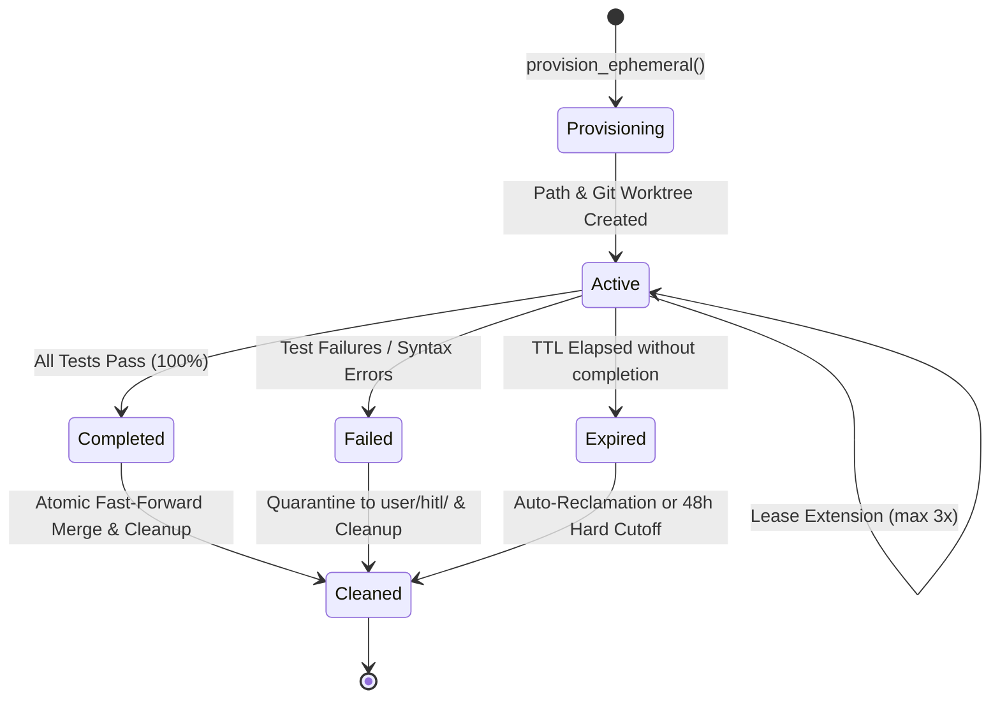
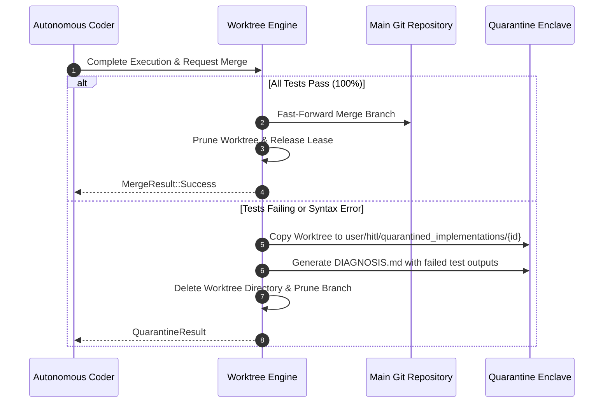

# Worktree Sandbox Isolation & Ephemeral Lease Management

## Executive Summary

Autonomous code generation agents (`agent_autonomous_coder`) execute multi-step code synthesis, refactoring, and test execution cycles. If these agents execute directly within the primary repository workspace, partial changes, failed builds, and dirty git working trees pollute the developer's main branch and cause unrecoverable state loss.

This architecture specification implements **Worktree Sandbox Isolation and Ephemeral Lease Management**, enforcing strict operating boundaries per [`.nb/agentic/custom/rulesets/worktree_isolation_rules.md`](../agentic/custom/rulesets/worktree_isolation_rules.md).

---

## Threat Model & Invariants

| Threat / Risk Vector | Failure Mode | Mitigation Rule |
|---|---|---|
| **Main Branch Pollution** | Subagent writes untested code into user's active branch | **RULE-WI-01**: Mandatory provisioning under isolated enclave |
| **Orphaned Zombie Worktrees** | Subagent crashes or hangs, leaking git worktrees indefinitely | **RULE-WI-02 / WI-07**: Time-bound TTL leases with 48h hard limit |
| **Disk Quota Exhaustion** | Unbounded concurrent agents saturate project filesystem | **RULE-WI-03**: Quota ceiling ($\le 5$ worktrees) with auto-reclamation |
| **Branch Clashing & Pollution** | Multiple agents generate conflicting temporary branches | **RULE-WI-04**: Deterministic branch naming `wt/{agent_id[:8]}/{slug}/{timestamp}` |
| **Partial Code Leaks** | Failed or broken implementation merged partially | **RULE-WI-05**: Atomic merge only on 100% test pass; quarantine on failure |
| **Filesystem Traversal / Escape** | Malicious or buggy code writes to `~/.ssh` or host folders | **RULE-WI-06 / WI-10**: Strict prefix boundary validation & no symlink escapes |
| **Hidden Cross-Worktree Coupling** | Agent references another agent's worktree path dependency | **RULE-WI-08**: Cargo manifest path isolation scanner |
| **Unattributed Commits** | Autonomous commits lack linkage to task/thought DAG | **RULE-WI-09**: Mandatory commit headers (`Task-ID`, `DAG-ID`, `Execution-ID`) |

---

## Architectural Lifecycle & State Machine



---

## Core Principles & Enforcement Details

### 1. RULE-WI-01: Mandatory Worktree Provisioning Gate
All autonomous code generation pipelines must execute `WorktreeManager::enforce_autonomous_gate(worktree_id)`.
- If `worktree_id` is missing or unverified, execution aborts immediately with `E_NO_WORKTREE_ISOLATION`.

### 2. RULE-WI-02: Lease Duration & Expiration Rules
- Every worktree lease is assigned an initial TTL (default: 24 hours).
- Leases can be extended up to a strict ceiling of **3 extensions** (`MAX_LEASE_EXTENSIONS`), each requiring an explicit justification string.
- If expired, any file write is immediately aborted with `E_LEASE_EXPIRED`.

### 3. RULE-WI-03: Concurrent Worktree Quota Ceiling
- The project limits concurrent active worktrees to 5 (`MAX_WORKTREES_PER_PROJECT = 5`).
- When a 6th worktree is requested, the engine checks for expired leases to automatically reclaim.
- If all 5 worktrees are active and unexpired, provisioning rejects with `E_MAX_WORKTREES_EXCEEDED`.

### 4. RULE-WI-04: Deterministic Branch Naming
- Branch format: `wt/{agent_id[..8]}/{slug}/{timestamp}`
- Example: `wt/a3f2b9c1/vector_cache/20261004-142300`
- Ensures complete auditability in `git branch -a`.

### 5. RULE-WI-05: Atomic Merge or Quarantine Rollback


### 6. RULE-WI-06: Path Boundary Validation
- All provisioned paths must reside under `.claude/worktrees/` or `.nb/workspaces/`.
- Path canonicalization prevents directory traversal (`../`).
- Symlinks are strictly prohibited to prevent arbitrary host filesystem tampering.

### 7. RULE-WI-07: Cleanup Guarantees & 48-Hour Hard Limit
- Cleanups safely release distributed Redlock tokens and remove temporary git worktrees.
- `enforce_hard_cleanup_limit()` enforces a mandatory 48-hour cutoff across all worktrees.

### 8. RULE-WI-08: Cross-Worktree Path Dependency Scanner
- Scans `Cargo.toml` (`[dependencies]`, `[dev-dependencies]`, `[build-dependencies]`).
- Any `path = "..."` dependency pointing outside the worktree directory triggers `E_CROSS_WORKTREE_DEPENDENCY`.

### 9. RULE-WI-09: Commit Traceability
- Every commit generated by an autonomous subagent must include:
  - `Task-ID: <uuid>`
  - `DAG-ID: <uuid>`
  - `Execution-ID: <uuid>`
  - `Co-Authored-By: Claude Sonnet 5 <noreply@anthropic.com>`
- Failure to supply these headers fails validation with `E_INVALID_COMMIT_MESSAGE`.

### 10. RULE-WI-10: Write Isolation
- The agent holds read-only access to existing project modules in main workspace.
- Any attempt to write to files outside the assigned ephemeral worktree boundary triggers `E_ISOLATION_VIOLATION`.

---

## Schema & Persistence Models

### SQLite Schema (`pos_core::storage`)
```sql
CREATE TABLE IF NOT EXISTS worktrees (
    id TEXT PRIMARY KEY,
    project_id TEXT NOT NULL,
    path TEXT NOT NULL,
    branch_name TEXT NOT NULL,
    base_ref TEXT NOT NULL DEFAULT 'main',
    created_at TEXT NOT NULL DEFAULT CURRENT_TIMESTAMP,
    status TEXT NOT NULL CHECK (status IN ('provisioning', 'active', 'completed', 'failed', 'expired', 'cleaned')),
    merged INTEGER NOT NULL DEFAULT 0,
    cleaned_at TEXT
);

CREATE TABLE IF NOT EXISTS worktree_leases (
    lease_id TEXT PRIMARY KEY,
    worktree_id TEXT NOT NULL REFERENCES worktrees(id) ON DELETE CASCADE,
    agent_id TEXT NOT NULL,
    created_at TEXT NOT NULL DEFAULT CURRENT_TIMESTAMP,
    expires_at TEXT NOT NULL,
    extended_count INTEGER NOT NULL DEFAULT 0,
    status TEXT NOT NULL CHECK (status IN ('active', 'expired', 'released', 'revoked'))
);
```

### Metadata JSON Enclave (`.claude/worktrees/.metadata/leases.json`)
Persistent state synchronization between the Rust runtime and Python subagent toolchains.

---

## Verification & Test Matrix

| Test Case | Rule Tested | Verified In | Result |
|---|---|---|---|
| `test_rule_wi_01_mandatory_provisioning_gate` | RULE-WI-01 | `pos_core::projects::tests` | PASS |
| `test_rule_wi_02_lease_expiration_and_extensions` | RULE-WI-02 | `pos_core::projects::tests` | PASS |
| `test_rule_wi_03_concurrent_worktree_limit` | RULE-WI-03 | `pos_core::projects::tests` | PASS |
| `test_rule_wi_04_branch_naming_convention` | RULE-WI-04 | `pos_core::projects::tests` | PASS |
| `test_rule_wi_05_atomic_merge_and_quarantine` | RULE-WI-05 | `pos_core::projects::tests` | PASS |
| `test_rule_wi_06_path_isolation` | RULE-WI-06 | `pos_core::projects::tests` | PASS |
| `test_rule_wi_08_cross_worktree_dependencies` | RULE-WI-08 | `pos_core::projects::tests` | PASS |
| `test_rule_wi_09_commit_traceability` | RULE-WI-09 | `pos_core::projects::tests` | PASS |
| `test_rule_wi_10_write_isolation` | RULE-WI-10 | `pos_core::projects::tests` | PASS |
| `reclaim_stale_leases` & `verify_canary` | Dual-Runtime | `.nb/core/worktree_engine.py` | PASS |
