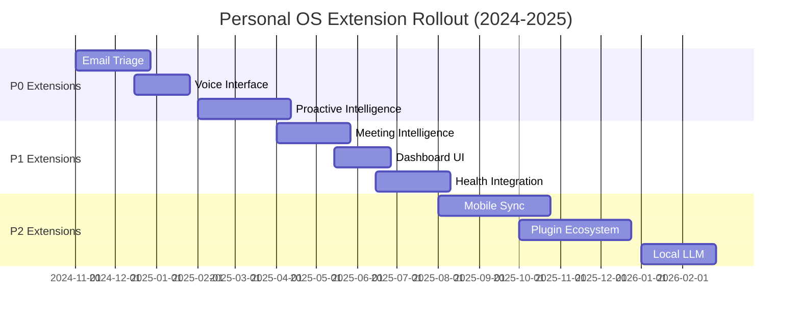

# Personal OS: Extension Plans Index

**Last Updated**: 2024-10-04  
**Status**: Specification Phase

This document provides a comprehensive index of all planned extensions for Personal OS, organized by priority and implementation status.

---

## Priority Classification

- **P0**: Critical features that dramatically improve core workflows (implement first)
- **P1**: High-value features that expand capabilities significantly
- **P2**: Important features that round out the ecosystem
- **P3**: Nice-to-have features for specialized use cases

---

## P0 Extensions (Implement First)

### 1. ✅ AI-Powered Email Triage & Smart Inbox
**Status**: Specification Complete  
**Path**: `.nb/plan/extensions/email_triage/`  
**Capabilities**: E-EMAIL-01 to E-EMAIL-08

Automatically classify, summarize, and extract entities (tasks, events, contacts, receipts) from emails. Reduces email processing time from 60 minutes to 10 minutes daily.

**Key Files**:
- [README.md](./email_triage/README.md) - Overview and use cases
- [MANIFEST.yaml](./email_triage/MANIFEST.yaml) - Metadata and dependencies
- [concise.md](./email_triage/concise.md) - Layerable specification
- Agent: `agent_inbox_triager`, `agent_entity_extractor`
- Workflows: `wf_inbox_zero`, `wf_email_sync`

**Impact**: High | **Effort**: Medium | **Integration**: All 8 pillars

---

### 2. ✅ Voice Interface & Dictation
**Status**: Specification Complete  
**Path**: `.nb/plan/extensions/voice_interface/`  
**Capabilities**: E-VOICE-01 to E-VOICE-06

Hands-free interaction with Personal OS through natural speech. Whisper-based local transcription for complete privacy. Fastest way to capture thoughts (3s vs 30s typing).

**Key Files**:
- [README.md](./voice_interface/README.md) - Overview and voice commands
- [MANIFEST.yaml](./voice_interface/MANIFEST.yaml) - Metadata
- [concise.md](./voice_interface/concise.md) - Audio pipeline specification
- Agent: `agent_voice_assistant`, `agent_intent_parser`
- Workflows: `wf_voice_capture`, `wf_voice_journal`

**Impact**: High | **Effort**: Medium | **Integration**: Thoughts, Activities, Projects

---

### 4. ✅ Native Android Integration (Google Assistant & Gemini Nano)
**Status**: Specification Complete  
**Path**: `.nb/plan/extensions/native_android/`  
**Capabilities**: E-AND-01 to E-AND-12

Native Android and Wear OS companion app integrating deeply with Google Assistant App Actions, Jetpack Glance Widgets, Rich Ongoing Notifications, AppSearch, and on-device Gemini Nano (AICore).

**Key Files**:
- [README.md](./native_android/README.md) - Overview, architecture & shortcuts.xml
- [MANIFEST.yaml](./native_android/MANIFEST.yaml) - Metadata and capabilities
- [concise.md](./native_android/concise.md) - Layerable specification
- [native_android_wire_contracts.yaml](../../context/contracts/native_android_wire_contracts.yaml) - App Actions & AppSearch wire contracts
- Agent: `agent_android_sync_coordinator`
- Workflows: `wf_morning_brief_android`, `wf_workmanager_sync`

**Key Features**:
- Google Assistant App Actions (CREATE_NOTE, GET_ITEM_LIST BIIs)
- Android AppSearch local on-device document indexing (Zero cloud leakage)
- Jetpack Glance interactive home screen and lock screen widgets
- Rich Ongoing Notifications & Status Bar Chips for active focus intervals
- Rust UniFFI JNI safe bindings (`libpos_android.so`)
- Hardware-backed Android Keystore (StrongBox TEE) + BiometricPrompt
- Wear OS 4+ companion app with interactive Tiles and Complications
- On-device Gemini Nano (AICore) SLM summarization
- Text-To-Speech (TTS) voice announcements over Pixel Buds & Android Auto
- Notification Bubbles & Quick Settings pull-down capture tile

**Impact**: High | **Effort**: High | **Integration**: All 8 pillars

---

### 3. ✅ Native Apple Siri Integration
**Status**: Specification Complete  
**Path**: `.nb/plan/extensions/native_apple_siri/`  
**Capabilities**: E-SIRI-01 to E-SIRI-12

Native iOS/macOS integration using SiriKit App Intents, Announce Notifications, Widgets, and Live Activities. Deep Apple ecosystem integration with local-first architecture.

**Key Files**:
- [README.md](./native_apple_siri/README.md) - Overview and architecture
- [MANIFEST.yaml](./native_apple_siri/MANIFEST.yaml) - Metadata and capabilities
- [concise.md](./native_apple_siri/concise.md) - Layerable specification
- [native_siri_wire_contracts.yaml](../../context/contracts/native_siri_wire_contracts.yaml) - API contracts
- [native_siri_privacy_rules.md](../../context/rules/native_siri_privacy_rules.md) - Privacy rules
- Agent: `agent_ios_sync_coordinator`
- Workflows: `wf_morning_brief_siri`, `wf_background_sync`

**Key Features**:
- Siri App Intents (capture, query, actions)
- Announce Notifications via AirPods/CarPlay
- Home & Lock Screen Widgets
- Live Activities with Dynamic Island
- Background sync every 15 minutes
- Spotlight search integration
- Apple Watch complications
- Handoff & Continuity support
- Local-first with Core Data

**Impact**: High | **Effort**: High | **Integration**: All 8 pillars

---

### 5. ✅ Proactive Intelligence & Anomaly Detection
**Status**: Specification Complete  
**Path**: `.nb/plan/extensions/proactive_intelligence/`  
**Capabilities**: E-PROACT-01 to E-PROACT-06

System learns usage patterns and surfaces anomalies proactively. Detects unusual behavior (spending spikes, missed habits, uncharacteristic inactivity) and suggests interventions.

**Key Files**:
- [README.md](./proactive_intelligence/README.md) - Overview and scenarios
- [MANIFEST.yaml](./proactive_intelligence/MANIFEST.yaml) - Metadata and dependencies
- [concise.md](./proactive_intelligence/concise.md) - Layerable specification & algorithms

**Impact**: High | **Effort**: High | **Integration**: All 8 pillars

---

### 6. ✅ Thought-to-Project Autonomous Plan Pipeline
**Status**: Specification Complete  
**Path**: `.nb/plan/extensions/thought_to_project/`  
**Capabilities**: E-THOUGHT-01 to E-THOUGHT-08

Autonomous bridge connecting `pos_thoughts` (Zettelkasten CommonMark AST) to `pos_projects` (Git2 / Worktrees / Task DAG) and the Percipience Autonomous CI/CD Triad. Evaluates thought actionability, derives MVS specifications, compiles layerable plans, provisions ephemeral worktrees, and executes closed-loop TDD self-healing to automatically ship ideas into production.

**Key Files**:
- [README.md](./thought_to_project/README.md) - Pipeline overview & CLI usage
- [MANIFEST.yaml](./thought_to_project/MANIFEST.yaml) - Capabilities & success metrics
- [concise.md](./thought_to_project/concise.md) - Layerable domain specification
- [detailed.md](./thought_to_project/detailed.md) - Comprehensive implementation blueprint

**Impact**: Critical | **Effort**: Medium | **Integration**: Thoughts, Projects, Workflows, CI/CD

---

## P1 Extensions (High Value)

### 5. 🔜 Meeting Intelligence
**Status**: Planned  
**Path**: `.nb/plan/extensions/meeting_intelligence/`  
**Capabilities**: E-MEET-01 to E-MEET-08

Auto-join meetings, record, transcribe with speaker diarization, extract action items, and generate summaries. Pre-meeting context briefs and post-meeting follow-ups.

**Key Features**:
- Zoom/Google Meet auto-join and recording
- Real-time transcription with speaker labels
- Action item extraction → automatic task creation
- Pre-meeting context from past interactions
- Post-meeting summary and follow-up drafts

**Impact**: High | **Effort**: Medium | **Integration**: Interactions, Projects, Activities

---

### 5. 🔜 Dashboard & Analytics UI
**Status**: Planned  
**Path**: `.nb/plan/extensions/dashboard/`  
**Capabilities**: E-DASH-01 to E-DASH-08

Web-based dashboard (Axum + HTMX) with customizable widgets, real-time updates, and analytics across all 8 pillars. Dark mode, accessibility compliance.

**Key Features**:
- Drag-and-drop widget layout
- Real-time data from all pillars
- Habit streak visualizations
- Project burn-down charts
- Financial spending trends
- Knowledge graph visualization

**Impact**: Medium | **Effort**: Low | **Integration**: All 8 pillars (read-only)

---

### 6. 🔜 Health & Biometric Integration
**Status**: Planned  
**Path**: `.nb/plan/extensions/health_integration/`  
**Capabilities**: E-HEALTH-01 to E-HEALTH-06

Integrate Apple Health, Google Fit, Oura Ring, Whoop. Correlate productivity with sleep quality, HRV, activity. Optimize scheduling based on biometrics.

**Key Features**:
- Apple Health / Google Fit sync
- Sleep quality → productivity correlation
- HRV-based energy level prediction
- Optimal work scheduling based on circadian rhythm
- Activity tracking integration

**Impact**: Medium | **Effort**: Medium | **Integration**: Activities, Workflows

---

## P2 Extensions (Important)

### 7. 🔜 Multi-Device Sync & Mobile Companion
**Status**: Planned  
**Path**: `.nb/plan/extensions/mobile_sync/`  
**Capabilities**: E-SYNC-01 to E-SYNC-08

End-to-end encrypted sync daemon + iOS/Android companion app. Access thoughts, tasks, and search from mobile. Capture on-the-go.

**Impact**: High | **Effort**: High | **Integration**: All 8 pillars

---

### 8. 🔜 Plugin Ecosystem & Marketplace
**Status**: Planned  
**Path**: `.nb/plan/extensions/plugin_system/`  
**Capabilities**: E-PLUGIN-01 to E-PLUGIN-08

Third-party developer API for custom agents and tools. Sandboxed WASM runtime for plugin isolation. Plugin discovery and installation.

**Impact**: Medium | **Effort**: High | **Integration**: Core architecture

---

### 9. 🔜 Local LLM Runtime
**Status**: Planned  
**Path**: `.nb/plan/extensions/local_llm/`  
**Capabilities**: E-LLM-01 to E-LLM-06

Run quantized Llama 3 / Mistral locally for full offline operation. Zero API costs, complete privacy. Hybrid: local for simple tasks, cloud for complex synthesis.

**Impact**: Medium | **Effort**: Medium | **Integration**: All agents

---

### 10. 🔜 Code Review & Repository Intelligence
**Status**: Planned  
**Path**: `.nb/plan/extensions/code_intelligence/`  
**Capabilities**: E-CODE-01 to E-CODE-06

Automatic PR summarization, review checklist generation, code smell detection, technical debt tracking, refactoring suggestions.

**Impact**: Medium | **Effort**: Medium | **Integration**: Projects

---

## P3 Extensions (Nice to Have)

### 11. 🔜 Investment & Net Worth Tracking
**Status**: Planned  
**Capabilities**: E-INVEST-01 to E-INVEST-06

Brokerage integration via Plaid, crypto wallet tracking, net worth dashboard, portfolio rebalancing suggestions, tax-loss harvesting.

**Impact**: Low | **Effort**: Medium | **Integration**: Purchases

---

### 12. 🔜 Dream Journal & Analysis
**Status**: Planned  
**Capabilities**: E-DREAM-01 to E-DREAM-04

Voice/text capture immediately upon waking. Pattern detection across dreams. Link to waking thoughts/events.

**Impact**: Low | **Effort**: Low | **Integration**: Thoughts

---

### 13. 🔜 Multi-User & Family Modes
**Status**: Planned  
**Capabilities**: E-FAMILY-01 to E-FAMILY-08

Shared calendars, shopping lists, family CRM. Per-user encrypted vaults with shared spaces. Coordinated scheduling.

**Impact**: Low | **Effort**: High | **Integration**: All 8 pillars

---

## Implementation Roadmap



---

## Extension Development Guidelines

### File Structure
Each extension must follow this structure:
```
.nb/plan/extensions/{extension_name}/
├── README.md              # Overview, use cases, getting started
├── MANIFEST.yaml          # Metadata, dependencies, capabilities
├── concise.md            # Layerable specification (~200 lines)
└── detailed.md           # Implementation blueprint (~1500 lines)
```

### Integration Requirements
- Wire contracts in `.nb/context/contracts/{extension}_*`
- Rules in `.nb/context/rules/{extension}_*`
- Agents in `.nb/agentic/custom/agents/agent_{extension}_*`
- Workflows in `.nb/agentic/custom/workflows/wf_{extension}_*`
- Rust crates in `workplace/modules/pos_{extension}/`

### Quality Gates
- [ ] All referenced contract files exist
- [ ] All agents have complete YAML manifests
- [ ] All workflows have DAG specifications
- [ ] Privacy/security rules documented
- [ ] CLI usage examples provided
- [ ] Performance targets defined
- [ ] Success metrics specified

---

## Contributing

To propose a new extension:

1. Create a new directory under `.nb/plan/extensions/your_extension/`
2. Follow the template structure (use `email_triage` as reference)
3. Define capabilities, wire contracts, agents, and workflows
4. Document integration points with Personal OS pillars
5. Specify success metrics and performance targets

---

**Total Extensions**: 13 planned  
**Specification Complete**: 3 (Email Triage, Voice Interface, Native Apple Siri)  
**In Progress**: 0  
**Implemented**: 0
