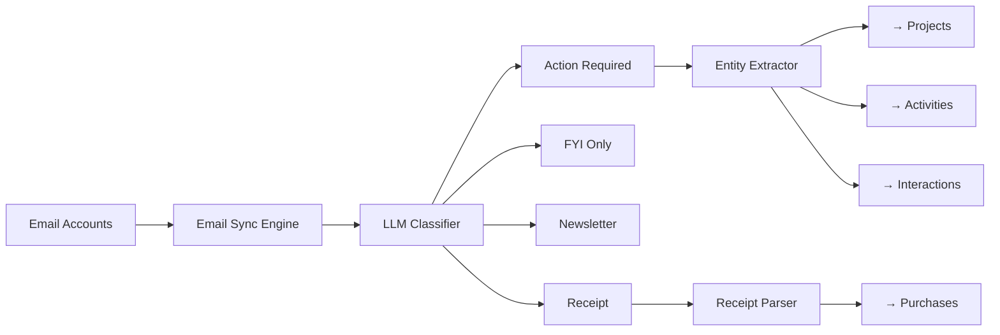

# Extension Plan: AI-Powered Email Triage & Smart Inbox

**Plan ID**: `extension_email_triage`  
**Capability Rating**: `Extension Specialist (E-EMAIL-01 to E-EMAIL-08)`  
**Parent Plan**: [Personal OS](../../personal_os/README.md)  
**Version**: `1.0.0`  
**Integration Crates**: `pos_email`, `pos_triage`

---

## 1. Executive Summary

Email remains one of the most overwhelming information streams for knowledge workers. The **Email Triage Extension** transforms Personal OS into an intelligent email assistant that automatically:

- **Categorizes** emails into actionable vs informational
- **Summarizes** long threads into key points
- **Extracts** tasks, contacts, calendar events, and receipts
- **Drafts** context-aware replies
- **Routes** information to the right Personal OS subsystem



---

## 2. The Email Triage Problem

### Current Pain Points
- ☑ 200+ emails per day requiring manual review
- ☑ 30-60 minutes daily on email triage
- ☑ Important emails buried in noise
- ☑ Action items lost in long threads
- ☑ Meeting invites not synced to primary calendar
- ☑ Receipts scattered across inbox

### Personal OS Solution
- ✅ Auto-categorize with 90%+ accuracy
- ✅ 5-second summaries of complex threads
- ✅ Zero-click task, contact, and event extraction
- ✅ Smart reply drafts using knowledge graph context
- ✅ Inbox Zero in 10 minutes instead of 60

---

## 3. Quick Links

- **[MANIFEST.yaml](./MANIFEST.yaml)**: Machine-readable extension metadata, capabilities (E-EMAIL-01 to E-EMAIL-08)
- **[concise.md](./concise.md)**: Layerable extension specification, wire contracts, agent manifest
- **[Personal OS Core Plan](../../personal_os/README.md)**: Parent Personal OS architecture

---

## 4. Core Capabilities

| # | Capability | Description | Accuracy Target |
|---|---|---|---|
| E-EMAIL-01 | Email Sync | IMAP/Gmail API fetching with incremental sync | 99.9% reliability |
| E-EMAIL-02 | Classification | 5-category smart inbox (Action, FYI, Newsletter, Receipt, Spam) | >90% precision |
| E-EMAIL-03 | Summarization | Key points extraction from emails and threads | >85% relevance |
| E-EMAIL-04 | Task Extraction | Detect action items and create project tasks | >80% precision |
| E-EMAIL-05 | Calendar Sync | Parse .ics invites and add to activities | 95% accuracy |
| E-EMAIL-06 | Contact Extraction | Build CRM from email signatures and interactions | >85% accuracy |
| E-EMAIL-07 | Receipt Parsing | Detect receipts and log to purchases subsystem | >90% detection |
| E-EMAIL-08 | Smart Replies | Context-aware draft generation | User acceptance >60% |

---

## 5. Integration Architecture

### Pillar Integration Matrix

| Personal OS Pillar | Integration Point | Data Flow |
|---|---|---|
| **Projects** | Task creation | Email action items → project tasks |
| **Activities** | Calendar events | Meeting invites → calendar sync |
| **Interactions** | CRM enrichment | Email metadata → contact records |
| **Purchases** | Expense logging | Receipts → financial ledger |
| **Thoughts** | Insight capture | Email highlights → knowledge capture |
| **Vault** | Credential management | OAuth tokens, IMAP passwords |

---

## 6. Getting Started

### Installation
```bash
# Install email extension
cargo build -p pos_email --release

# Initialize email account
pos email add-account \
  --provider gmail \
  --email user@example.com \
  --auth oauth

# Start triage daemon
pos email triage start --auto-categorize
```

### First Run
```bash
# Fetch and classify last 7 days
pos email sync --since 7d --classify

# View smart inbox
pos email inbox --category action_required

# Process inbox zero workflow
pos email workflow inbox-zero
```

---

## 7. Privacy & Security

- **Zero-Knowledge**: Emails processed locally; summaries not sent to cloud unless opted-in
- **OAuth 2.0**: Secure authentication with token refresh
- **Encrypted Storage**: Email metadata encrypted at rest in SQLite
- **Selective Sync**: Choose which folders/labels to monitor
- **Data Minimization**: Only store headers + classification; bodies discarded after processing

---

## 8. Example Workflow

### Morning Email Triage (5 minutes)
1. System fetches overnight emails (150 new)
2. Auto-classified: 8 Action Required, 95 FYI, 40 Newsletters, 7 Receipts
3. Show Action Required inbox (8 emails):
   - **From: Sarah Chen** - "Q4 Planning Meeting" → Auto-extracted calendar invite ✅
   - **From: GitHub** - "PR #123 review needed" → Created task in nb-antwalk project ✅
   - **From: Stripe** - "Payment receipt" → Logged $29 expense ✅
4. Review 5 remaining action items, archive rest
5. **Inbox Zero achieved in 5 minutes**

---

## 9. Roadmap

**Phase 1** (MVP): IMAP sync + basic classification  
**Phase 2**: Entity extraction (tasks, events, contacts)  
**Phase 3**: Smart reply generation  
**Phase 4**: Advanced intelligence (SLA tracking, VIP detection, thread insights)  
**Phase 5**: Multi-account, team inboxes, shared labels
