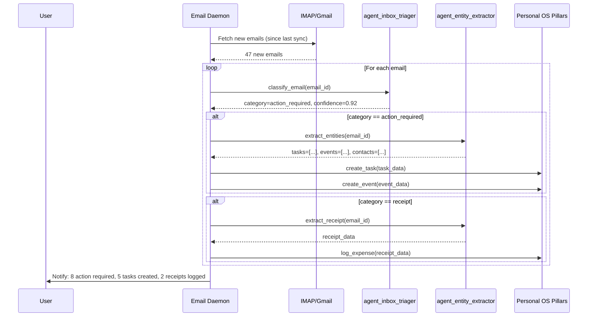

# Layerable Extension Plan: Email Triage & Smart Inbox

### Executive Overview
This extension adds intelligent email management capabilities to Personal OS, integrating with all 8 core pillars to automatically extract actionable intelligence from email communications. It reduces email processing time from 60 minutes to 10 minutes daily while ensuring zero information loss.

---

## 1. Extension-Specific Quad-Space Mapping

```
.
├── context/
│   ├── contracts/
│   │   ├── email_triage_wire_contracts.yaml     # Email classification, extraction, reply APIs
│   │   ├── email_sync_protocol.json             # IMAP/Gmail API sync specification
│   │   └── email_entity_extraction.json         # Task/event/contact extraction schemas
│   └── rules/
│       ├── email_privacy_rules.md               # Email data retention and privacy policy
│       └── email_classification_standards.md    # Category definitions and accuracy requirements
├── agentic/
│   ├── custom/agents/
│   │   ├── agent_inbox_triager.yaml             # Main email classification agent (Tier A)
│   │   ├── agent_email_summarizer.yaml          # Thread summarization agent (Tier B)
│   │   ├── agent_entity_extractor.yaml          # Extract tasks/events/contacts (Tier A)
│   │   └── agent_reply_composer.yaml            # Smart reply draft generator (Tier A)
│   └── custom/workflows/
│       ├── wf_email_sync.yaml                   # Periodic email fetch and sync
│       ├── wf_inbox_zero.yaml                   # Guided inbox zero workflow
│       ├── wf_email_digest.yaml                 # Daily/weekly email digest generation
│       └── wf_smart_reply.yaml                  # Context-aware reply composition
├── workplace/
│   ├── modules/
│   │   ├── pos_email/                           # Email sync engine (IMAP, Gmail API)
│   │   ├── pos_triage/                          # Classification and entity extraction
│   │   └── pos_email_ui/                        # Terminal UI for email management
│   └── integrations/
│       ├── gmail_oauth_bridge.rs                # Gmail OAuth 2.0 flow
│       ├── imap_client.rs                       # Generic IMAP client
│       └── email_parser.rs                      # RFC 5322 email parsing
└── user/
    ├── inputs/
    │   ├── email_accounts.yaml                  # Configured email accounts
    │   └── email_rules.yaml                     # User-defined filter rules
    └── outputs/
        └── email_digest/                        # Generated email digests
```

---

## 2. Wire Contracts & Integration Points

### 2.1. Primary Wire Contract (`context/contracts/email_triage_wire_contracts.yaml`)
```yaml
schema_version: "1.0.0"
domain: "email_triage"
service_endpoint: "/api/v1/email"

operations:
  - id: "sync_email"
    description: "Fetch new emails from account"
    input:
      account_id: string
      since: datetime
      folder: string (default: "INBOX")
    output:
      fetched_count: integer
      last_sync: datetime
      
  - id: "classify_email"
    description: "Classify email into smart inbox categories"
    input:
      email_id: string
    output:
      category: enum[action_required, fyi, newsletter, receipt, spam]
      confidence: float (0.0-1.0)
      reasoning: string
      
  - id: "summarize_thread"
    description: "Generate summary of email thread"
    input:
      thread_id: string
      max_tokens: integer (default: 200)
    output:
      summary: string
      key_points: array[string]
      participants: array[string]
      
  - id: "extract_entities"
    description: "Extract tasks, events, contacts from email"
    input:
      email_id: string
    output:
      tasks: array[{title, description, due_date, priority}]
      events: array[{title, start, end, location, attendees}]
      contacts: array[{name, email, organization}]
      receipts: array[{vendor, amount, date}]
      
  - id: "draft_reply"
    description: "Generate contextual reply draft"
    input:
      email_id: string
      reply_intent: string
      tone: enum[professional, friendly, brief]
    output:
      draft_body: string
      confidence: float
      suggested_edits: array[string]

categories:
  action_required:
    description: "Emails requiring a response or action"
    indicators:
      - contains_question_marks
      - ends_with_call_to_action
      - from_known_contact
      - mentioned_deadline
    examples:
      - "Can you review this PR?"
      - "Meeting tomorrow at 2pm?"
      
  fyi:
    description: "Informational emails (no action needed)"
    indicators:
      - cc_recipient
      - notification_pattern
      - status_update_keywords
    examples:
      - "Deployed to production"
      - "FYI: Budget approved"
      
  newsletter:
    description: "Marketing, promotions, bulk emails"
    indicators:
      - unsubscribe_link
      - bulk_sender
      - html_heavy
    examples:
      - Product launch announcements
      - Weekly digests
      
  receipt:
    description: "Purchase confirmations, invoices"
    indicators:
      - contains_price
      - merchant_keywords
      - invoice_attachment
    examples:
      - "Your receipt from Stripe"
      - "Order confirmation"
      
  spam:
    description: "Unwanted or suspicious emails"
    indicators:
      - suspicious_links
      - excessive_caps
      - unknown_sender
```

### 2.2. Integration with Personal OS Pillars

#### Projects Pillar Integration
```yaml
# Extract tasks from emails
integration:
  trigger: email_classified_as(action_required)
  agent: agent_entity_extractor
  action: extract_tasks
  output:
    - create_project_task:
        project_id: infer_from_email_context
        title: extracted_task_title
        description: email_body_snippet
        source: "email:{{email_id}}"
```

#### Activities Pillar Integration
```yaml
# Parse calendar invites
integration:
  trigger: email_contains_attachment(.ics)
  agent: agent_entity_extractor
  action: parse_calendar_invite
  output:
    - sync_calendar:
        title: event_title
        start_time: event_start
        end_time: event_end
        attendees: extracted_attendees
        source: "email:{{email_id}}"
```

#### Interactions Pillar Integration
```yaml
# Build CRM from email signatures
integration:
  trigger: new_email_from_unknown_sender
  agent: agent_entity_extractor
  action: extract_contact
  output:
    - create_contact:
        name: extracted_name
        email: sender_email
        organization: extracted_company
        first_interaction: email_timestamp
```

#### Purchases Pillar Integration
```yaml
# Log receipts automatically
integration:
  trigger: email_classified_as(receipt)
  agent: agent_entity_extractor
  action: extract_receipt
  output:
    - log_expense:
        vendor: extracted_vendor
        amount_cents: extracted_amount
        category: inferred_category
        receipt_source: "email:{{email_id}}"
```

---

## 3. Specialized Agent Manifests

| Agent ID | Name | Model Tier | Responsibility |
|---|---|---|---|
| `agent_inbox_triager` | Inbox Triage Coordinator | Tier_A | Email classification, priority scoring, smart inbox routing |
| `agent_email_summarizer` | Thread Summarizer | Tier_B | Email/thread summarization, key point extraction |
| `agent_entity_extractor` | Entity Extractor | Tier_A | Task, event, contact, receipt extraction via structured output |
| `agent_reply_composer` | Reply Composer | Tier_A | Context-aware reply drafting using knowledge graph |

---

## 4. Email Sync Architecture



---

## 5. Privacy & Security Rules

### Email Data Retention (`context/rules/email_privacy_rules.md`)

**Rule 1: Minimal Storage**
- Store only: message_id, from, to, subject, date, category, summary
- NEVER store: full email body, inline images, non-critical attachments
- Exception: Receipts (.pdf) stored encrypted with 7-year retention

**Rule 2: Local Processing**
- Email classification runs locally (LLM prompts with email content)
- Summaries generated locally
- Only metadata synced to cloud (if user opts in)

**Rule 3: Credential Security**
- OAuth tokens stored in vault with 1-hour lease maximum
- IMAP passwords never logged or transmitted
- Email account credentials require HITL approval for first-time access

**Rule 4: Third-Party API Usage**
- If using OpenAI API for classification: email body is NOT sent (only extracted features)
- Local embedding models preferred for semantic search

---

## 6. CLI Usage Examples

```bash
# Add email account
pos email add-account \
  --provider gmail \
  --email user@example.com \
  --auth oauth

# Sync emails
pos email sync --account user@example.com --since 24h

# View smart inbox
pos email inbox --category action_required
# Output:
# ━━━━━━━━━━━━━━━━━━━━━━━━━━━━━━━━━━━━━━━━━━━━━━━━━━
# Action Required (8 emails)
# ━━━━━━━━━━━━━━━━━━━━━━━━━━━━━━━━━━━━━━━━━━━━━━━━━━
# [1] Sarah Chen - "Q4 Planning sync?" (2h ago)
#     → Extracted: Meeting invite for tomorrow 2pm
# [2] GitHub - "PR #123 needs review" (4h ago)
#     → Created task: Review PR #123 in nb-antwalk
# [3] Stripe - "Payment failed" (1d ago)
#     → ⚠️  Requires immediate action

# Summarize thread
pos email summarize thread_abc123
# Output:
# Thread: "Product launch feedback" (12 messages)
# 
# Key Points:
# - Launch date moved to Nov 15 (consensus)
# - Marketing approved new copy
# - Engineering flagged performance concerns
# - Action: Sarah to schedule follow-up
#
# Participants: Sarah, John, Maria, You

# Draft reply
pos email reply email_xyz789 --intent "decline_meeting" --tone professional
# Output:
# Draft Reply:
# ━━━━━━━━━━━━━━━━━━━━━━━━━━━━━━━━━━━━━━━━━━━━━━━━━━
# Hi Sarah,
#
# Thank you for the invitation. Unfortunately, I have a 
# conflict at that time. Would 3pm work instead?
#
# Best regards,
# [Your name]
# ━━━━━━━━━━━━━━━━━━━━━━━━━━━━━━━━━━━━━━━━━━━━━━━━━━
# 
# [e]dit  [s]end  [c]ancel

# Inbox zero workflow
pos email workflow inbox-zero
# Guides through: action required → fyi → archive newsletters
```

---

## 7. Performance Targets

| Metric | Target | Measurement |
|---|---|---|
| Sync latency | < 10s for 100 emails | Time from sync command to classification complete |
| Classification accuracy | > 90% | Manual validation on 1000 email sample |
| Summarization relevance | > 85% | User feedback (thumbs up/down) |
| Task extraction precision | > 80% | True positives / (TP + FP) |
| Reply acceptance rate | > 60% | Drafts sent without major edits |
| Time to inbox zero | < 10 min daily | vs baseline 60 min manual triage |

---

## 8. Implementation Phases

### Phase 1: Core Sync Engine (Week 1-2)
- `pos_email` crate: IMAP client, Gmail API integration
- OAuth 2.0 flow with token refresh
- SQLite schema for email metadata
- Basic fetch and store (no classification)

### Phase 2: Classification Pipeline (Week 3-4)
- `agent_inbox_triager` with 5-category classification
- Feature extraction for local classification (fallback when offline)
- Smart inbox CLI views
- Category accuracy evaluation harness

### Phase 3: Entity Extraction (Week 5-6)
- `agent_entity_extractor` with structured output
- Task extraction → Projects pillar integration
- Calendar invite parsing → Activities pillar integration
- Contact extraction → Interactions pillar integration
- Receipt detection → Purchases pillar integration

### Phase 4: Intelligence Layer (Week 7-8)
- Thread summarization
- Smart reply drafting
- Inbox zero guided workflow
- Email digest generation (daily/weekly)

### Phase 5: Advanced Features (Week 9-10)
- VIP sender detection
- SLA tracking ("respond within 24h")
- Email analytics dashboard
- Multi-account support
