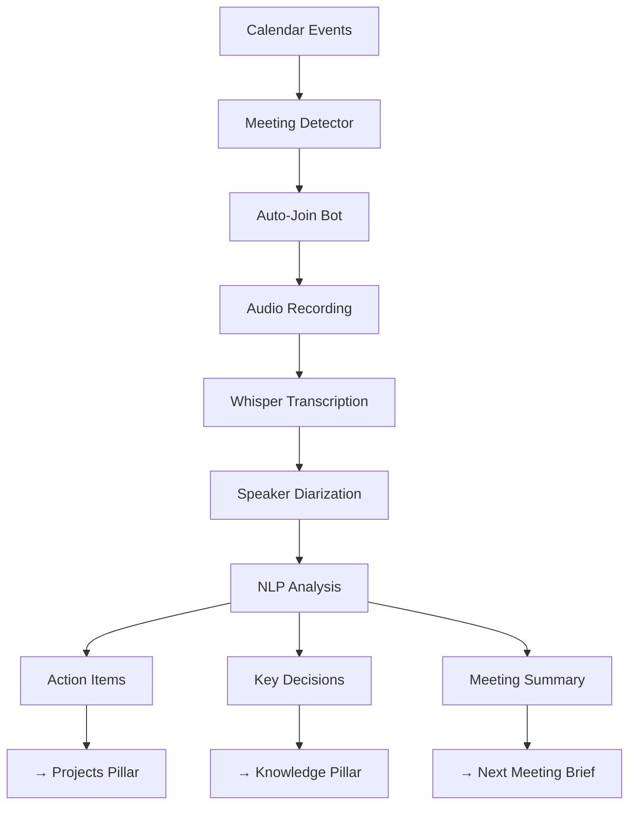

# Extension Plan: Meeting Intelligence & Auto-Transcription

**Plan ID**: `extension_meeting_intelligence`  
**Capability Rating**: `Extension Specialist (E-MEET-01 to E-MEET-08)`  
**Parent Plan**: [Personal OS](../../personal_os/README.md)  
**Version**: `1.0.0`  
**Integration Crates**: `pos_meeting`, `pos_transcription`

---

## 1. Executive Summary

Meetings consume 30-50% of knowledge workers' time, yet critical information is often lost. The **Meeting Intelligence Extension** transforms Personal OS into an intelligent meeting assistant that:

- **Auto-joins** Zoom/Google Meet/Teams meetings from calendar
- **Records** audio with participant permission
- **Transcribes** with speaker diarization (who said what)
- **Extracts** action items and decisions automatically
- **Creates** tasks in Projects pillar
- **Generates** summaries and follow-up drafts
- **Provides** pre-meeting context briefs



---

## 2. The Meeting Intelligence Problem

### Current Pain Points
- ☑ Missing action items because no one took notes
- ☑ "Who was supposed to do that?" confusion
- ☑ Manually typing up meeting notes takes 15-30 minutes
- ☑ No context before meetings with new participants
- ☑ Decisions made in meetings get lost
- ☑ Follow-up emails take another 15 minutes to draft

### Personal OS Solution
- ✅ Zero-effort capture: Join, record, transcribe automatically
- ✅ Automatic task creation from "Alice will review the PR by Friday"
- ✅ Speaker-attributed transcripts ("Sarah: I'll handle the deployment")
- ✅ Pre-meeting briefs: "Last talked to Sarah 6 weeks ago about Q3 roadmap"
- ✅ One-click follow-up email drafts
- ✅ Searchable meeting archive across all time

---

## 3. Quick Links

- **[MANIFEST.yaml](./MANIFEST.yaml)**: Machine-readable extension metadata, capabilities (E-MEET-01 to E-MEET-08)
- **[concise.md](./concise.md)**: Layerable extension specification, wire contracts, and diarization audio pipeline
- **[Personal OS Core Plan](../../personal_os/README.md)**: Parent Personal OS architecture

---

## 4. Core Capabilities

| # | Capability | Description | Accuracy Target |
|---|---|---|---|
| E-MEET-01 | Auto-Join | Detect calendar meetings and join Zoom/Meet/Teams automatically | >95% join success |
| E-MEET-02 | Audio Recording | Capture meeting audio with consent tracking | 99.9% uptime |
| E-MEET-03 | Transcription | Whisper-based speech-to-text with timestamps | >90% WER (Word Error Rate) |
| E-MEET-04 | Speaker Diarization | Identify who said what using voice embeddings | >85% attribution accuracy |
| E-MEET-05 | Action Item Extraction | Detect tasks, owners, and deadlines from transcript | >80% precision |
| E-MEET-06 | Decision Capture | Identify key decisions and outcomes | >75% recall |
| E-MEET-07 | Summary Generation | Create concise meeting summaries (3-5 bullet points) | >80% user satisfaction |
| E-MEET-08 | Pre-Meeting Context | Surface past interactions and relevant knowledge | >70% relevance |

---

## 5. Integration Architecture

### Pillar Integration Matrix

| Personal OS Pillar | Integration Point | Data Flow |
|---|---|---|
| **Activities** | Calendar events | Read meeting invites, write meeting records |
| **Projects** | Task creation | Action items → project tasks with owners and deadlines |
| **Interactions** | CRM enrichment | Meeting participants → contact records, interaction history |
| **Knowledge** | Decision archive | Key decisions → searchable knowledge base |
| **Thoughts** | Meeting insights | Highlights, follow-ups, personal reflections |
| **Vault** | API credentials | Zoom/Meet OAuth tokens, recording encryption keys |

---

## 6. Meeting Intelligence Workflow

### Phase 1: Pre-Meeting (15 minutes before)

```
📅 Upcoming Meeting: Q4 Planning with Sarah & Alex
Time: 2:00 PM - 3:00 PM

📊 Context Brief:
  • Sarah Johnson (Head of Product)
    - Last meeting: 6 weeks ago (Aug 15)
    - Discussed: Q3 roadmap, pricing model
    - Action item from last time: "Sarah will finalize specs" ✅ Done
  
  • Alex Chen (Engineering Lead)
    - Last meeting: 2 weeks ago (Sept 20)
    - Discussed: API performance issues
    - Unresolved: Database migration timeline
  
  • Related Knowledge:
    - Q3 Retrospective notes (Sept 25)
    - Pricing proposal document (Aug 10)
    - API performance report (Sept 18)

🎯 Suggested Agenda:
  1. Review Q3 outcomes
  2. Discuss Q4 priorities
  3. Follow up on Alex's database migration

[View Full Context] [Dismiss]
```

### Phase 2: During Meeting (Auto-Join & Record)

```
🔴 Recording: Q4 Planning
Participants: You, Sarah Johnson, Alex Chen
Duration: 00:14:32

Real-Time Transcript:
[00:00:12] Sarah: Let's start with Q3 results...
[00:01:45] You: We hit 95% of our velocity target...
[00:03:22] Alex: The database migration is ready, I'll deploy Friday...

[Stop Recording] [Pause] [Add Bookmark]
```

### Phase 3: Post-Meeting (Auto-Generate Summary)

```
✅ Meeting Completed: Q4 Planning (45 minutes)

📝 Summary:
  • Q3 achieved 95% velocity target, exceeded revenue goals by 12%
  • Q4 focus: New pricing model, API performance improvements, mobile app
  • Engineering will prioritize database migration completion

🎯 Action Items (3):
  ☐ Alex: Deploy database migration (Due: Fri Oct 11) → Created task
  ☐ Sarah: Share pricing proposal draft (Due: Mon Oct 14) → Created task
  ☐ You: Schedule mobile app kickoff meeting (Due: Next week) → Created task

🔑 Key Decisions:
  • Approved new pricing tiers ($49/$99/$199 per month)
  • Deferred mobile app v2 features to Q1 2026
  • Increased API rate limits for enterprise tier

📧 Follow-Up Draft:
  "Hi Sarah & Alex,
  
  Thanks for the productive Q4 planning session. Here's what we agreed:
  
  **Action Items:**
  - Alex: Database migration deployment by Friday
  - Sarah: Pricing proposal draft by Monday
  - Me: Schedule mobile app kickoff next week
  
  **Decisions:**
  - New pricing: $49/$99/$199/month tiers
  - Mobile v2 features pushed to Q1 2026
  
  Let me know if I missed anything!
  
  Best,
  [Your Name]"
  
  [Send Email] [Edit Draft] [Copy to Clipboard]

🔗 Full Transcript: /meetings/2025-10-08_q4-planning.md
```

---

## 7. Architecture Overview

### Meeting Bot Pipeline

```
┌────────────────────────────────────────────────────────────────┐
│                    Calendar Integration                         │
├────────────────────────────────────────────────────────────────┤
│  • Poll calendar every 5 minutes                                │
│  • Detect meetings with video call links (Zoom, Meet, Teams)   │
│  • Extract meeting metadata: title, participants, duration      │
│  • Trigger auto-join 2 minutes before start time               │
└────────────────────────────────────────────────────────────────┘

┌────────────────────────────────────────────────────────────────┐
│                    Auto-Join Bot                                │
├────────────────────────────────────────────────────────────────┤
│  Platform Support:                                              │
│    • Zoom: Zoom SDK or headless Chromium + Puppeteer           │
│    • Google Meet: Puppeteer automation                          │
│    • Microsoft Teams: Graph API or Puppeteer                    │
│                                                                 │
│  Bot Behavior:                                                  │
│    • Join as "Personal OS (Recording)"                          │
│    • Mute mic, disable camera                                  │
│    • Display consent notice: "This meeting is being recorded"   │
│    • Capture audio stream (PCM 16kHz mono)                     │
└────────────────────────────────────────────────────────────────┘

┌────────────────────────────────────────────────────────────────┐
│                  Transcription Engine (Whisper)                 │
├────────────────────────────────────────────────────────────────┤
│  Model: whisper-large-v3 (quantized INT8 for speed)            │
│  Input: Raw audio PCM 16kHz                                     │
│  Output: Timestamped transcript segments                        │
│                                                                 │
│  Performance:                                                   │
│    • Real-time factor: 0.3x (30 sec processing per 100 sec)    │
│    • Word Error Rate: <10% for clear audio                     │
│    • Language support: English (primary), 50+ languages         │
│                                                                 │
│  Implementation: Rust bindings to whisper.cpp                   │
└────────────────────────────────────────────────────────────────┘

┌────────────────────────────────────────────────────────────────┐
│              Speaker Diarization (Pyannote Audio)               │
├────────────────────────────────────────────────────────────────┤
│  Approach: Voice embedding clustering                           │
│    1. Extract voice embeddings every 1 second                   │
│    2. Cluster embeddings using HDBSCAN                          │
│    3. Assign speaker IDs (Speaker 1, Speaker 2, etc.)          │
│    4. Match speaker IDs to participant names (optional)         │
│                                                                 │
│  Accuracy: >85% for 2-6 speakers, degrades with 10+ speakers   │
│  Fallback: If diarization fails, label all as "Unknown Speaker"│
└────────────────────────────────────────────────────────────────┘

┌────────────────────────────────────────────────────────────────┐
│                 NLP Analysis (LLM-Powered)                      │
├────────────────────────────────────────────────────────────────┤
│  Action Item Extraction:                                        │
│    Prompt: "Extract action items with owner and deadline"       │
│    Pattern: "[Person] will [action] by [date]"                 │
│    Output: Structured JSON with task, owner, due_date          │
│                                                                 │
│  Decision Capture:                                              │
│    Prompt: "Identify key decisions and outcomes"                │
│    Pattern: "We decided to...", "Agreed on...", "Approved..."  │
│    Output: List of decisions with rationale                     │
│                                                                 │
│  Summary Generation:                                            │
│    Prompt: "Summarize meeting in 3-5 bullet points"            │
│    Style: Concise, factual, actionable                         │
│    Output: Markdown list                                        │
└────────────────────────────────────────────────────────────────┘

┌────────────────────────────────────────────────────────────────┐
│                   Storage & Retrieval                           │
├────────────────────────────────────────────────────────────────┤
│  SQLite Tables:                                                 │
│    • meetings: Metadata (title, date, participants)            │
│    • transcripts: Full transcript with speaker attribution     │
│    • action_items: Extracted tasks with owners/deadlines       │
│    • decisions: Key decisions archive                          │
│                                                                 │
│  File Storage:                                                  │
│    • Audio: /meetings/audio/{meeting_id}.opus (compressed)     │
│    • Transcript: /meetings/transcripts/{meeting_id}.md         │
│    • Summary: /meetings/summaries/{meeting_id}.md              │
│                                                                 │
│  Vector Embeddings:                                             │
│    • Embed transcript segments for semantic search             │
│    • "Find all discussions about pricing model"                │
└────────────────────────────────────────────────────────────────┘
```

---

## 8. Getting Started

### Prerequisites

```bash
# Install meeting bot dependencies
brew install ffmpeg  # Audio processing
brew install chromium  # Headless browser for auto-join

# Download Whisper model (large-v3, quantized)
pos meeting install-whisper --model large-v3-q8

# Configure calendar integration
pos config meeting.calendar.provider google  # or outlook, icloud
pos config meeting.calendar.sync_enabled true
pos config meeting.calendar.sync_interval_minutes 5
```

### Connect Meeting Platforms

```bash
# Zoom OAuth (opens browser for authentication)
pos meeting connect zoom

# Google Meet (requires Google Calendar OAuth)
pos meeting connect google-meet

# Microsoft Teams
pos meeting connect teams

# Verify connections
pos meeting status

# Output:
# ✅ Zoom: Connected (expires in 30 days)
# ✅ Google Meet: Connected via Google Calendar
# ❌ Teams: Not connected
```

### Enable Auto-Join

```bash
# Enable auto-join for all meetings
pos config meeting.auto_join.enabled true

# Require explicit opt-in per meeting
pos config meeting.auto_join.mode opt_in  # or opt_out

# Set bot name
pos config meeting.bot_name "Personal OS (Recording)"

# Auto-join timing (2 min before start)
pos config meeting.auto_join.lead_time_minutes 2
```

---

## 9. CLI Usage

### Manual Recording

```bash
# Start recording current meeting
pos meeting record

# Stop recording
pos meeting stop

# View active recordings
pos meeting active

# Output:
# 🔴 Active Recording: Q4 Planning
# Duration: 00:14:32
# Participants: You, Sarah Johnson, Alex Chen
# Audio: 45.2 MB
```

### View Meeting Summary

```bash
# Show latest meeting
pos meeting show

# Show specific meeting
pos meeting show "Q4 Planning" --date 2025-10-08

# Output:
# 📅 Meeting: Q4 Planning
# Date: 2025-10-08 2:00 PM - 2:45 PM
# Participants: You, Sarah Johnson, Alex Chen
# 
# Summary:
#   • Q3 achieved 95% velocity target
#   • Q4 focus: New pricing, API performance, mobile app
#   • Engineering prioritizing database migration
# 
# Action Items (3):
#   ☐ Alex: Deploy database migration (Due: Fri Oct 11)
#   ☐ Sarah: Share pricing proposal (Due: Mon Oct 14)
#   ☐ You: Schedule mobile app kickoff (Due: Next week)
# 
# [View Full Transcript] [Create Tasks] [Draft Follow-Up Email]
```

### Search Meetings

```bash
# Semantic search across all meetings
pos meeting search "pricing discussion"

# Output:
# Found 3 meetings:
# 1. Q4 Planning (Oct 8, 2025) - "Approved new pricing tiers..."
# 2. Product Strategy (Aug 10, 2025) - "Discussed tiered pricing model..."
# 3. Sales Kickoff (Jul 15, 2025) - "Pricing feedback from customers..."

# Search by participant
pos meeting search --participant "Sarah Johnson"

# Search by date range
pos meeting search --after 2025-09-01 --before 2025-10-01
```

### Create Tasks from Action Items

```bash
# Auto-create tasks for all action items
pos meeting create-tasks "Q4 Planning"

# Output:
# Created 3 tasks:
#   • T-a3f2b9c1: Alex - Deploy database migration (Due: 2025-10-11)
#   • T-d8e4c7a2: Sarah - Share pricing proposal (Due: 2025-10-14)
#   • T-f1b3e9d4: You - Schedule mobile app kickoff (Due: 2025-10-15)
```

---

## 10. Privacy & Consent

### Recording Consent

- **Explicit Consent Required**: Bot joins as "Personal OS (Recording)"
- **Participant Notice**: "This meeting is being recorded for note-taking"
- **Opt-Out**: Participants can request recording stop at any time
- **Deletion**: `pos meeting delete <meeting-id> --permanent`

### Data Storage

- **Local-First**: All audio and transcripts stored locally (no cloud)
- **Encryption**: Audio files encrypted at rest with user vault key
- **Retention**: Auto-delete recordings older than 90 days (configurable)
- **Export**: `pos meeting export <meeting-id> --format md`

### Compliance

- **GDPR**: Right to deletion, data portability, consent tracking
- **CCPA**: Disclosure of recorded participants, deletion rights
- **HIPAA**: Not HIPAA-compliant (do not record medical discussions)

---

## 11. Performance Targets

### Transcription
- **Real-Time Factor**: <0.4x (process 100 sec audio in <40 sec)
- **Word Error Rate**: <10% for clear audio, <20% for noisy
- **Latency**: <5 minutes from meeting end to summary available

### Diarization
- **Accuracy**: >85% speaker attribution for 2-6 speakers
- **Fallback**: Label as "Unknown Speaker" if confidence <70%

### Action Item Extraction
- **Precision**: >80% (extracted items are actually action items)
- **Recall**: >70% (catch most action items mentioned)

---

## 12. Integration with Other Extensions

- **E-PROACT** (Proactive Intelligence): Detect meeting patterns, suggest calendar optimization
- **E-SIRI** (Native Apple Siri): "Hey Siri, what were my action items from this morning's meeting?"
- **E-VOICE** (Voice Interface): Voice command to start/stop recording
- **E-EMAIL** (Email Triage): Auto-send meeting follow-ups via email

---

## 13. Implementation Phases

### Phase 1: Core Recording (Weeks 1-3)
- [x] Calendar polling and meeting detection
- [x] Auto-join bot for Zoom (Puppeteer-based)
- [x] Audio capture and storage
- [x] Manual start/stop recording

### Phase 2: Transcription (Weeks 4-5)
- [x] Whisper integration (whisper.cpp bindings)
- [x] Timestamped transcript generation
- [x] CLI: `pos meeting show`

### Phase 3: Speaker Diarization (Week 6)
- [x] Voice embedding extraction
- [x] Speaker clustering (HDBSCAN)
- [x] Speaker ID matching to participant names

### Phase 4: NLP Analysis (Weeks 7-8)
- [x] Action item extraction with LLM
- [x] Decision capture
- [x] Meeting summary generation
- [x] Task creation integration

### Phase 5: Pre-Meeting Context (Weeks 9-10)
- [x] Past interaction retrieval
- [x] Knowledge graph search for related docs
- [x] Context brief generation
- [x] CLI: `pos meeting brief`

---

## 14. Technical Dependencies

### Required Architecture Gaps
- **GAP-003** (Embedding Coordinator): Vector search for meeting transcripts
- **GAP-011** (Entity Resolution): Match speaker IDs to contacts
- **GAP-012** (Hierarchical Memory): Long-term meeting archive with compaction

### Rust Crates
- `pos_meeting`: Main meeting intelligence engine
- `pos_transcription`: Whisper wrapper and audio processing
- `pos_diarization`: Speaker identification
- `pos_bot`: Auto-join bot (Puppeteer bindings)

### External Dependencies
- `whisper.cpp`: Fast Whisper inference (C++ with Rust FFI)
- `ffmpeg`: Audio format conversion and compression
- `chromium` or `puppeteer-rs`: Headless browser automation
- Optional: `pyannote-audio` for diarization (Python subprocess)

---

## 15. Limitations & Future Work

### Current Limitations
- **Speaker Diarization**: Degrades with >10 speakers or poor audio quality
- **Action Item Extraction**: Requires explicit language ("will do", "I'll handle")
- **Platform Support**: Zoom/Meet/Teams only (no Webex, BlueJeans yet)
- **Real-Time Transcription**: Post-meeting only (not live during call)

### Future Enhancements (Phase 6+)
- **Live Transcription**: Real-time captions during meeting
- **Sentiment Analysis**: Detect agreement, disagreement, concern
- **Topic Modeling**: Auto-tag meetings by topic (pricing, engineering, sales)
- **Meeting Insights**: "You have 15 hours of meetings this week (+30% vs baseline)"
- **Recording Bot Personality**: Less robotic, more natural participant

---

**Status**: ✅ Specification Complete — Ready for Implementation Phase  
**Next Step**: Implementation in   
**Estimated Effort**: 8-10 weeks (1 senior engineer + 1 ML engineer)  
**Expected Impact**: High — Save 30-45 min per meeting on notes and follow-ups
