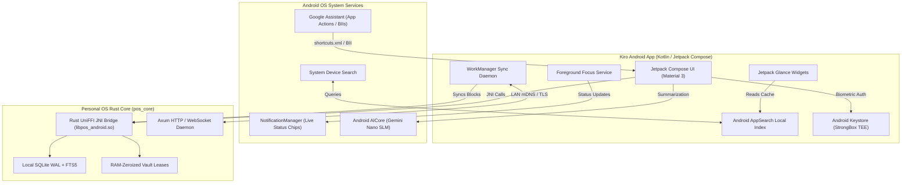

# Extension Plan: Native Android Apps with Google Assistant & Gemini Nano Integration

**Plan ID**: `extension_native_android`  
**Capability Rating**: `Extension Specialist (E-AND-01 to E-AND-12)`  
**Parent Plan**: [Personal OS](../../personal_os/README.md)  
**Version**: `1.0.0`  
**Platforms**: Android 13+ (API 33+), Wear OS 4+, Android Auto  
**Runtime**: Kotlin 2.0, Jetpack Compose, Rust UniFFI JNI (`libpos_android.so`)

---

## 1. Executive Summary

Native Android companion application that deeply embeds Personal OS into the Android ecosystem using **Google Assistant App Actions, Jetpack Glance Widgets, Rich Ongoing Notifications, Android AppSearch, and on-device Gemini Nano (AICore)**. 

Enables Personal OS to work seamlessly across Android phones, foldables, tablets, Wear OS smartwatches, and Android Auto with zero-cloud voice control, proactive glanceable widgets, and hardware-backed biometric security.

### Key Features

**Google Assistant & Voice Interaction**
- *"Hey Google, capture a thought in Kiro"*
- *"Hey Google, what's on my Kiro agenda today?"*
- *"Hey Google, log my morning workout in Kiro"*
- *"Hey Google, start a 45-minute focus session in Kiro"*

**Proactive Audio Debriefs (TTS & Pixel Buds)**
- Morning brief spoken aloud upon alarm dismissal or through Bluetooth earbuds.
- Urgent task and calendar reminders announced via Android Text-To-Speech.
- Android Auto integration providing hands-free morning briefing during commutes.

**System-Level Quick Capture**
- **Notification Bubble**: Floating overlay accessible from any app for instant thought capture.
- **Quick Settings Tile**: Single pull-down toggle to start focus timer or record quick audio memo.
- **AppSearch Integration**: Local, zero-latency search indexing of thoughts and tasks within system-wide device search.

**Glanceable Displays & Wearables**
- **Jetpack Glance Widgets**: Interactive home screen and lock screen widgets built with declarative Compose.
- **Ongoing Notifications**: Real-time Pomodoro countdown, active task timer, and autonomous CI/CD progress in the notification shade and status bar chips.
- **Wear OS 4+ App**: Smartwatch standalone companion with interactive Compose Tiles and watch face Complications.

---

## 2. Architecture Overview



---

## 3. Core Capabilities

| # | Capability | Description | Android System Implementation |
|---|---|---|---|
| **E-AND-01** | **Assistant App Actions** | Voice control via Built-in Intents (BIIs) and custom actions | `shortcuts.xml`, `actions.xml`, Google Assistant SDK |
| **E-AND-02** | **AppSearch Indexing** | Local high-speed search exposed to system device search | `androidx.appsearch:appsearch`, `@Document` entities |
| **E-AND-03** | **Glance Widgets** | Interactive, glanceable home screen and lock screen widgets | `androidx.glance:glance-appwidget` with Compose |
| **E-AND-04** | **Rich Ongoing Notifications** | Real-time focus session countdown and status bar chips | Foreground Service, `NotificationCompat.Builder` |
| **E-AND-05** | **WorkManager Background Sync** | Battery-conscious, constrained background synchronization | `androidx.work:work-runtime-ktx` with network constraints |
| **E-AND-06** | **Rust UniFFI JNI Bridge** | Direct safe Rust bindings cross-compiled for Android NDK | `uniffi-rs` (`aarch64-linux-android`, `x86_64-linux-android`) |
| **E-AND-07** | **Hardware Keystore** | Hardware-backed key derivation & biometric gate | Android Keystore System (`KeyGenParameterSpec`, StrongBox) |
| **E-AND-08** | **Wear OS Tiles & Complications** | Smartwatch app with glanceable habit ticking and complications | `androidx.wear.tiles:tiles`, `androidx.wear.watchface` |
| **E-AND-09** | **On-Device Gemini Nano** | Local SLM text summarization without cloud network egress | Android AICore / Google AI Edge SDK |
| **E-AND-10** | **TTS Audio Announcements** | Spoken morning brief over Pixel Buds & Android Auto | `android.speech.tts.TextToSpeech`, CarAppService |
| **E-AND-11** | **Floating Bubbles & QS Tiles** | System-wide quick capture overlay and Quick Settings tile | `TileService`, `NotificationCompat.BubbleMetadata` |
| **E-AND-12** | **Material You Dynamic Theming** | Fluid adaptation to system wallpaper palette & predictive back | Dynamic Color API, `BackHandler` predictive gestures |

---

## 4. Google Assistant Intent & App Actions Definitions

### 4.1. App Actions Configuration (`res/xml/shortcuts.xml`)

```xml
<?xml version="1.0" encoding="utf-8"?>
<shortcuts xmlns:android="http://schemas.android.com/apk/res/android">
    <!-- 1. Quick Thought Capture Intent -->
    <capability android:name="actions.intent.CREATE_NOTE">
        <intent
            android:action="android.intent.action.VIEW"
            android:targetPackage="dev.personalos.kiro"
            android:targetClass="dev.personalos.kiro.ui.ThoughtCaptureActivity">
            <parameter
                android:name="note.text"
                android:key="content" />
        </intent>
    </capability>

    <!-- 2. Agenda / Task Query Intent -->
    <capability android:name="actions.intent.GET_ITEM_LIST">
        <intent
            android:action="android.intent.action.VIEW"
            android:targetPackage="dev.personalos.kiro"
            android:targetClass="dev.personalos.kiro.ui.AgendaActivity">
            <parameter
                android:name="itemList.name"
                android:key="category" />
        </intent>
    </capability>

    <!-- 3. Start Focus Session Intent -->
    <capability android:name="custom.actions.intent.START_FOCUS_SESSION">
        <intent
            android:action="android.intent.action.VIEW"
            android:targetPackage="dev.personalos.kiro"
            android:targetClass="dev.personalos.kiro.service.FocusService">
            <parameter
                android:name="duration"
                android:key="duration_minutes" />
        </intent>
    </capability>
</shortcuts>
```

### 4.2. Kotlin Rust UniFFI JNI Bridge

The Android app communicates directly with `pos_core` via safe UniFFI auto-generated Kotlin wrappers:

```kotlin
package dev.personalos.kiro.bridge

import dev.personalos.core.*

class PersonalOSBridge private constructor() {
    private val client: NativePersonalOSClient

    init {
        System.loadLibrary("pos_android")
        client = NativePersonalOSClient.initialize(
            storagePath = AppContext.get().filesDir.absolutePath,
            logLevel = "INFO"
        )
    }

    suspend fun captureThought(content: String, tags: List<String>): String {
        return client.captureThought(content, tags)
    }

    suspend fun getDailyAgenda(dateIso: String): AgendaSnapshot {
        return client.getDailyAgenda(dateIso)
    }

    suspend fun logHabit(habitId: String, value: Int): HabitStreakResult {
        return client.logHabit(habitId, value)
    }

    companion object {
        val instance: PersonalOSBridge by lazy { PersonalOSBridge() }
    }
}
```

---

## 5. Security & Invariant Mapping

Personal OS on Android strictly enforces platform invariants:
1. **Zero-Knowledge Memory (Invariant 1)**: Cryptographic keys never leave the Android Keymaster hardware enclave in plaintext. RAM allocations mapped to Rust implement `ZeroizeOnDrop`.
2. **HITL Financial Gate (Invariant 2)**: Actions involving financial approval (`pos_finance`) require explicit biometric authorization via `BiometricPrompt` on Android.
3. **Local-First Offline Resilience (Invariant 3)**: All search queries run locally against AppSearch and SQLite; local summarization leverages on-device Gemini Nano when offline.
4. **Tamper Evidence (Invariant 4)**: Every state mutation committed locally is cryptographically signed and appended to `context_ledger.yaml`.
