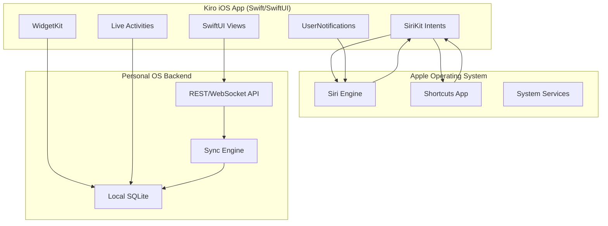

# Extension Plan: Native Apple Apps with Siri Integration

**Plan ID**: `extension_native_apple_siri`  
**Capability Rating**: `Extension Specialist (E-SIRI-01 to E-SIRI-12)`  
**Parent Plan**: [Personal OS](../../personal_os/README.md)  
**Version**: `1.0.0`  
**Platforms**: iOS 16+, iPadOS 16+, macOS 13+, watchOS 9+

---

## 1. Executive Summary

Native Apple ecosystem apps that deeply integrate with **Siri, Shortcuts, Widgets, and Live Activities**. Enables Personal OS to work seamlessly across iPhone, iPad, Mac, and Apple Watch with voice control, proactive suggestions, and system-level integration.

### Key Features

**Siri Voice Interaction**
- "Hey Siri, capture a thought in Kiro"
- "Hey Siri, what's on my Kiro agenda today?"
- "Hey Siri, log my morning exercise in Kiro"
- "Hey Siri, add task: review PR in Kiro"

**Announce Notifications**
- Morning brief automatically announced through AirPods
- Important task reminders spoken aloud
- Meeting starting soon announcements
- Budget alerts via Siri voice

**Shortcuts Integration**
- Custom shortcuts for common workflows
- Automation triggers (location, time, NFC)
- Siri suggestions based on usage patterns

**System Integration**
- Lock screen widgets
- Live Activities for focus sessions
- Calendar integration
- Contacts integration

---

## 2. Architecture Overview



---

## 3. Core Capabilities

| # | Capability | Description | Implementation |
|---|---|---|---|
| E-SIRI-01 | SiriKit Intents | Voice commands via predefined intents | INCreateNoteIntent, INSearchForNotebookItemsIntent |
| E-SIRI-02 | Announce Notifications | Alerts spoken through AirPods/CarPlay | UNNotificationSound with interruption level |
| E-SIRI-03 | Shortcuts | Custom workflows in Shortcuts app | INIntent + parameters |
| E-SIRI-04 | Lock Screen Widgets | Quick view of tasks/habits | WidgetKit + AccessoryFamily |
| E-SIRI-05 | Live Activities | Real-time focus session tracking | ActivityKit |
| E-SIRI-06 | App Intents | Modern intent system (iOS 16+) | AppIntents framework |
| E-SIRI-07 | Spotlight Search | System-wide search integration | Core Spotlight indexing |
| E-SIRI-08 | Handoff | Continue tasks across devices | NSUserActivity |
| E-SIRI-09 | Background Sync | Sync when app not active | Background Refresh + URLSession |
| E-SIRI-10 | Widget Suggestions | Proactive widget placement | TimelineProvider relevance |
| E-SIRI-11 | Focus Filters | Filter content by Focus mode | FocusFilter protocol |
| E-SIRI-12 | Apple Watch | Companion watchOS app | WatchConnectivity |

---

## 4. SiriKit Intent Definitions

### 4.1. Custom Intents (Intents.intentdefinition)

**CaptureThoughtIntent**
```swift
@available(iOS 16, macOS 13, watchOS 9, *)
struct CaptureThoughtIntent: AppIntent {
    static var title: LocalizedStringResource = "Capture Thought"
    static var description = IntentDescription("Quickly capture a thought or idea")
    
    @Parameter(title: "Content", requestValueDialog: "What's on your mind?")
    var content: String
    
    @Parameter(title: "Tags", optionsProvider: TagsOptionsProvider())
    var tags: [String]?
    
    func perform() async throws -> some IntentResult {
        // Call Personal OS API
        let thought = try await KiroAPI.shared.createThought(content: content, tags: tags)
        return .result(value: thought.id)
    }
}
```

**QueryAgendaIntent**
```swift
struct QueryAgendaIntent: AppIntent {
    static var title: LocalizedStringResource = "Get My Agenda"
    static var description = IntentDescription("View upcoming tasks and meetings")
    
    @Parameter(title: "Timeframe")
    var timeframe: AgendaTimeframe
    
    func perform() async throws -> some IntentResult & ReturnsValue<AgendaSnapshot> {
        let agenda = try await KiroAPI.shared.getAgenda(timeframe: timeframe)
        return .result(value: agenda)
    }
}

enum AgendaTimeframe: String, AppEnum {
    case today, tomorrow, thisWeek, nextWeek
    
    static var typeDisplayRepresentation = TypeDisplayRepresentation(name: "Timeframe")
    static var caseDisplayRepresentations: [Self: DisplayRepresentation] = [
        .today: "Today",
        .tomorrow: "Tomorrow",
        .thisWeek: "This Week",
        .nextWeek: "Next Week"
    ]
}
```

**LogHabitIntent**
```swift
struct LogHabitIntent: AppIntent {
    static var title: LocalizedStringResource = "Log Habit"
    static var description = IntentDescription("Mark a habit as complete")
    
    @Parameter(title: "Habit", optionsProvider: HabitsOptionsProvider())
    var habitID: String
    
    func perform() async throws -> some IntentResult {
        let result = try await KiroAPI.shared.logHabit(id: habitID)
        return .result(dialog: "✅ Logged \(result.habitName). Streak: \(result.streak) days 🔥")
    }
}
```

**CreateTaskIntent**
```swift
struct CreateTaskIntent: AppIntent {
    static var title: LocalizedStringResource = "Create Task"
    
    @Parameter(title: "Title", requestValueDialog: "What's the task?")
    var title: String
    
    @Parameter(title: "Project", optionsProvider: ProjectsOptionsProvider())
    var projectID: String?
    
    @Parameter(title: "Priority")
    var priority: TaskPriority
    
    @Parameter(title: "Due Date")
    var dueDate: Date?
    
    func perform() async throws -> some IntentResult {
        let task = try await KiroAPI.shared.createTask(
            title: title,
            projectID: projectID,
            priority: priority,
            dueDate: dueDate
        )
        return .result(dialog: "✅ Created task: \(task.title)")
    }
}

enum TaskPriority: String, AppEnum {
    case low, medium, high
    
    static var typeDisplayRepresentation = TypeDisplayRepresentation(name: "Priority")
    static var caseDisplayRepresentations: [Self: DisplayRepresentation] = [
        .low: DisplayRepresentation(title: "Low", subtitle: "🟢"),
        .medium: DisplayRepresentation(title: "Medium", subtitle: "🟡"),
        .high: DisplayRepresentation(title: "High", subtitle: "🔴")
    ]
}
```

---

## 5. Announce Notifications Implementation

### 5.1. Notification Configuration

```swift
import UserNotifications

class KiroNotificationManager {
    static let shared = KiroNotificationManager()
    
    func scheduleAnnouncedNotification(
        title: String,
        body: String,
        sound: UNNotificationSound = .defaultCritical,
        interruptionLevel: UNNotificationInterruptionLevel = .timeSensitive
    ) async throws {
        let content = UNMutableNotificationContent()
        content.title = title
        content.body = body
        content.sound = sound
        content.interruptionLevel = interruptionLevel
        
        // Allow Siri to announce this notification
        content.shouldSuppressDefaultAction = false
        
        let request = UNNotificationRequest(
            identifier: UUID().uuidString,
            content: content,
            trigger: nil // Immediate
        )
        
        try await UNUserNotificationCenter.current().add(request)
    }
    
    // Morning Brief Announcement
    func scheduleMorningBrief(agenda: AgendaSnapshot) async throws {
        let body = """
        Good morning! You have \(agenda.meetingCount) meetings today.
        Top priority: \(agenda.topTask?.title ?? "None").
        \(agenda.overdueCount > 0 ? "\(agenda.overdueCount) overdue tasks." : "")
        """
        
        try await scheduleAnnouncedNotification(
            title: "Your Kiro Daily Brief",
            body: body,
            interruptionLevel: .timeSensitive
        )
    }
    
    // Task Reminder
    func announceTaskReminder(task: Task) async throws {
        try await scheduleAnnouncedNotification(
            title: "Task Starting Soon",
            body: "\(task.title) is scheduled in 15 minutes",
            interruptionLevel: .active
        )
    }
    
    // Budget Alert
    func announceBudgetAlert(category: String, spent: Double, limit: Double) async throws {
        try await scheduleAnnouncedNotification(
            title: "Budget Alert",
            body: "You've spent $\(spent) of $\(limit) on \(category) this month",
            sound: .defaultCritical,
            interruptionLevel: .timeSensitive
        )
    }
}
```

### 5.2. Notification Settings

```swift
// Request authorization with announcement capability
func requestNotificationPermissions() async throws {
    let options: UNAuthorizationOptions = [
        .alert,
        .sound,
        .badge,
        .announcement, // Key for Siri announcements
        .timeSensitive
    ]
    
    try await UNUserNotificationCenter.current().requestAuthorization(options: options)
}
```

---

## 6. Shortcuts Integration

### 6.1. Predefined Shortcuts

**Morning Routine Shortcut**
- Trigger: 7:00 AM on weekdays
- Actions:
  1. Get My Agenda (QueryAgendaIntent)
  2. Announce via Siri
  3. Show lock screen widget

**Quick Capture Shortcut**
- Trigger: Back tap (Accessibility)
- Actions:
  1. Ask for input
  2. Capture Thought (CaptureThoughtIntent)
  3. Show confirmation

**Evening Reflection Shortcut**
- Trigger: 9:00 PM daily
- Actions:
  1. Ask "How was your day?"
  2. Capture as journal entry
  3. Show habit completion widget

**Commute Context Shortcut**
- Trigger: Connect to CarPlay
- Actions:
  1. Get upcoming meetings
  2. Announce through car speakers
  3. Set navigation if meeting has location

### 6.2. Shortcut Parameters

```swift
struct MorningBriefShortcut: AppShortcutsProvider {
    static var appShortcuts: [AppShortcut] {
        AppShortcut(
            intent: QueryAgendaIntent(),
            phrases: [
                "Get my \(.applicationName) agenda",
                "What's on my \(.applicationName) schedule",
                "Show my \(.applicationName) day"
            ],
            shortTitle: "Daily Brief",
            systemImageName: "sun.horizon"
        )
        
        AppShortcut(
            intent: CaptureThoughtIntent(),
            phrases: [
                "Capture a thought in \(.applicationName)",
                "Add note to \(.applicationName)",
                "Quick capture in \(.applicationName)"
            ],
            shortTitle: "Quick Capture",
            systemImageName: "lightbulb"
        )
    }
}
```

---

## 7. WidgetKit Implementation

### 7.1. Lock Screen Widgets

**Circular Progress Widget (Habits)**
```swift
struct HabitStreakWidget: Widget {
    var body: some WidgetConfiguration {
        StaticConfiguration(
            kind: "HabitStreak",
            provider: HabitProvider()
        ) { entry in
            HabitStreakView(entry: entry)
        }
        .configurationDisplayName("Habit Streak")
        .description("Track your daily habit streak")
        .supportedFamilies([
            .accessoryCircular,
            .accessoryInline,
            .accessoryRectangular
        ])
    }
}

struct HabitStreakView: View {
    var entry: HabitEntry
    
    @Environment(\.widgetFamily) var family
    
    @ViewBuilder
    var body: some View {
        switch family {
        case .accessoryCircular:
            Gauge(value: Double(entry.completedToday), in: 0...Double(entry.totalHabits)) {
                Text("\(entry.completedToday)")
            }
            .gaugeStyle(.accessoryCircular)
            
        case .accessoryInline:
            Text("🔥 \(entry.longestStreak) day streak")
            
        case .accessoryRectangular:
            VStack(alignment: .leading) {
                Text("Habits Today")
                    .font(.caption)
                HStack {
                    Text("\(entry.completedToday)/\(entry.totalHabits)")
                        .font(.title2.bold())
                    Spacer()
                    Text("🔥 \(entry.longestStreak)")
                }
            }
            
        default:
            EmptyView()
        }
    }
}
```

**Inline Widget (Next Task)**
```swift
struct NextTaskWidget: Widget {
    var body: some WidgetConfiguration {
        StaticConfiguration(
            kind: "NextTask",
            provider: TaskProvider()
        ) { entry in
            Text("⏰ \(entry.task.title) at \(entry.task.dueTime)")
        }
        .supportedFamilies([.accessoryInline])
    }
}
```

### 7.2. Home Screen Widgets

**Medium Widget (Daily Summary)**
```swift
struct DailySummaryWidget: Widget {
    var body: some WidgetConfiguration {
        StaticConfiguration(
            kind: "DailySummary",
            provider: DailyProvider()
        ) { entry in
            DailySummaryView(entry: entry)
        }
        .configurationDisplayName("Daily Summary")
        .supportedFamilies([.systemMedium, .systemLarge])
    }
}

struct DailySummaryView: View {
    var entry: DailyEntry
    
    var body: some View {
        VStack(alignment: .leading, spacing: 12) {
            HStack {
                Text("Today's Focus")
                    .font(.headline)
                Spacer()
                Text(Date.now, style: .date)
                    .font(.caption)
                    .foregroundStyle(.secondary)
            }
            
            // Top 3 tasks
            ForEach(entry.topTasks.prefix(3)) { task in
                HStack {
                    Circle()
                        .fill(task.priority.color)
                        .frame(width: 8, height: 8)
                    Text(task.title)
                        .font(.subheadline)
                        .lineLimit(1)
                    Spacer()
                    Text(task.project)
                        .font(.caption)
                        .foregroundStyle(.secondary)
                }
            }
            
            // Stats
            HStack(spacing: 16) {
                StatChip(label: "Habits", value: "\(entry.habitsCompleted)/\(entry.habitsTotal)")
                StatChip(label: "Meetings", value: "\(entry.meetingCount)")
                StatChip(label: "Overdue", value: "\(entry.overdueCount)")
            }
        }
        .padding()
    }
}
```

---

## 8. Live Activities

**Focus Session Tracker**
```swift
struct FocusSessionAttributes: ActivityAttributes {
    public struct ContentState: Codable, Hashable {
        var elapsedMinutes: Int
        var totalMinutes: Int
        var taskName: String
        var isBreak: Bool
    }
    
    var sessionID: String
}

struct FocusSessionLiveActivity: Widget {
    var body: some WidgetConfiguration {
        ActivityConfiguration(for: FocusSessionAttributes.self) { context in
            // Lock screen UI
            HStack {
                VStack(alignment: .leading) {
                    Text(context.state.isBreak ? "☕️ Break Time" : "🎯 Focus Session")
                        .font(.caption.bold())
                    Text(context.state.taskName)
                        .font(.caption)
                }
                
                Spacer()
                
                Text("\(context.state.elapsedMinutes)/\(context.state.totalMinutes) min")
                    .font(.system(.body, design: .rounded).monospacedDigit())
            }
            .padding()
            
        } dynamicIsland: { context in
            DynamicIsland {
                // Expanded UI
                DynamicIslandExpandedRegion(.leading) {
                    Text(context.state.taskName)
                        .font(.caption)
                }
                DynamicIslandExpandedRegion(.trailing) {
                    Text("\(context.state.elapsedMinutes) min")
                        .font(.caption.monospacedDigit())
                }
                DynamicIslandExpandedRegion(.bottom) {
                    ProgressView(value: Double(context.state.elapsedMinutes), total: Double(context.state.totalMinutes))
                }
            } compactLeading: {
                Image(systemName: context.state.isBreak ? "cup.and.saucer.fill" : "brain.head.profile")
            } compactTrailing: {
                Text("\(context.state.elapsedMinutes)")
                    .monospacedDigit()
            } minimal: {
                Image(systemName: "timer")
            }
        }
    }
}

// Starting a Live Activity
func startFocusSession(task: Task, duration: Int) async throws {
    let attributes = FocusSessionAttributes(sessionID: UUID().uuidString)
    let initialState = FocusSessionAttributes.ContentState(
        elapsedMinutes: 0,
        totalMinutes: duration,
        taskName: task.title,
        isBreak: false
    )
    
    let activity = try Activity.request(
        attributes: attributes,
        content: .init(state: initialState, staleDate: nil),
        pushType: nil
    )
    
    // Update every minute
    Timer.scheduledTimer(withTimeInterval: 60, repeats: true) { _ in
        Task {
            let newState = FocusSessionAttributes.ContentState(
                elapsedMinutes: currentMinutes,
                totalMinutes: duration,
                taskName: task.title,
                isBreak: false
            )
            await activity.update(.init(state: newState, staleDate: nil))
        }
    }
}
```

---

## 9. API Client Layer

**Personal OS Swift Client**
```swift
actor KiroAPIClient {
    static let shared = KiroAPIClient()
    
    private let baseURL: URL
    private let session: URLSession
    
    init() {
        // Use local Personal OS instance or cloud sync endpoint
        self.baseURL = URL(string: "http://localhost:8080/api/v1")!
        self.session = URLSession.shared
    }
    
    // MARK: - Thoughts
    func createThought(content: String, tags: [String]?) async throws -> Thought {
        let request = CreateThoughtRequest(content: content, tags: tags)
        return try await post("/thoughts", body: request)
    }
    
    func searchThoughts(query: String) async throws -> [Thought] {
        return try await get("/thoughts/search?q=\(query)")
    }
    
    // MARK: - Activities
    func getAgenda(timeframe: AgendaTimeframe) async throws -> AgendaSnapshot {
        let start: Date
        let end: Date
        
        switch timeframe {
        case .today:
            start = Calendar.current.startOfDay(for: Date())
            end = Calendar.current.date(byAdding: .day, value: 1, to: start)!
        case .tomorrow:
            start = Calendar.current.date(byAdding: .day, value: 1, to: Date())!
            end = Calendar.current.date(byAdding: .day, value: 1, to: start)!
        case .thisWeek:
            start = Date()
            end = Calendar.current.date(byAdding: .weekOfYear, value: 1, to: start)!
        case .nextWeek:
            start = Calendar.current.date(byAdding: .weekOfYear, value: 1, to: Date())!
            end = Calendar.current.date(byAdding: .weekOfYear, value: 1, to: start)!
        }
        
        return try await get("/activities/agenda?start=\(start.ISO8601Format())&end=\(end.ISO8601Format())")
    }
    
    func logHabit(id: String) async throws -> HabitLogResult {
        return try await post("/activities/habits/\(id)/log", body: EmptyBody())
    }
    
    // MARK: - Projects
    func createTask(title: String, projectID: String?, priority: TaskPriority, dueDate: Date?) async throws -> Task {
        let request = CreateTaskRequest(
            title: title,
            projectID: projectID,
            priority: priority.rawValue,
            dueDate: dueDate?.ISO8601Format()
        )
        return try await post("/projects/tasks", body: request)
    }
    
    func getTasks(filter: TaskFilter) async throws -> [Task] {
        return try await get("/projects/tasks?\(filter.queryString)")
    }
    
    // MARK: - Generic Request Helpers
    private func get<T: Decodable>(_ path: String) async throws -> T {
        let url = baseURL.appendingPathComponent(path)
        let (data, _) = try await session.data(from: url)
        return try JSONDecoder().decode(T.self, from: data)
    }
    
    private func post<T: Decodable, B: Encodable>(_ path: String, body: B) async throws -> T {
        var request = URLRequest(url: baseURL.appendingPathComponent(path))
        request.httpMethod = "POST"
        request.setValue("application/json", forHTTPHeaderField: "Content-Type")
        request.httpBody = try JSONEncoder().encode(body)
        
        let (data, _) = try await session.data(for: request)
        return try JSONDecoder().decode(T.self, from: data)
    }
}

struct EmptyBody: Encodable {}
```

---

## 10. App Structure

**Main App**
```swift
@main
struct KiroApp: App {
    @StateObject private var appState = AppState()
    
    var body: some Scene {
        WindowGroup {
            ContentView()
                .environmentObject(appState)
                .task {
                    await appState.initialize()
                }
        }
    }
    
    init() {
        // Register app shortcuts
        AppShortcutsProvider.updateAppShortcutParameters()
    }
}

@MainActor
class AppState: ObservableObject {
    @Published var isAuthenticated = false
    @Published var syncStatus: SyncStatus = .idle
    
    func initialize() async {
        // Request permissions
        try? await requestNotificationPermissions()
        
        // Start background sync
        await BackgroundSyncManager.shared.startPeriodicSync()
        
        // Index content in Spotlight
        await SpotlightIndexer.shared.indexAll()
    }
}
```

---

## 11. Example User Flows

### Flow 1: Morning Brief via Siri

```
7:00 AM - Scheduled notification triggers

[AirPods announce through Siri]
"Good morning! You have 3 meetings today.
Your top priority is: Finish authentication refactor.
You have 2 overdue tasks."

[User taps AirPod]
User: "Hey Siri, show me my Kiro agenda"

[Siri opens app to agenda view]
```

### Flow 2: Quick Thought Capture

```
[User double-taps back of iPhone - Custom shortcut trigger]

Siri: "What's on your mind?"

User: "The caching layer needs a write-through policy for consistency"

Siri: "Got it, I've captured that thought in Kiro"

[Thought saved with automatic timestamp and location]
```

### Flow 3: Habit Tracking via Watch

```
[User completes morning exercise]

[Opens Kiro on Apple Watch]
[Taps "Morning Exercise" habit]

Watch: "✅ Logged. 7 day streak! 🔥"
[Haptic feedback]

[Lock screen widget updates to show 1/3 habits complete]
```

### Flow 4: Focus Session with Live Activity

```
[In Kiro app]
User selects task: "Write API documentation"
User starts 25-minute focus session

[Dynamic Island shows]
Compact: 🧠 25

[User expands Dynamic Island]
Expanded view shows:
- Task: Write API documentation
- Progress bar: 10/25 minutes
- Quick actions: End session, Take break

[After 25 minutes]
[Siri announces through AirPods]
"Focus session complete! Time for a 5-minute break."
```

---

## 12. Privacy & Security

**Local Data Storage**
- Core Data for structured data
- FileProvider for document access
- Keychain for API tokens
- End-to-end encryption for cloud sync

**Siri Privacy**
- All intents processed on-device when possible
- No audio sent to Personal OS servers
- Siri interactions logged locally only
- User can disable Siri integration per-intent

**Background Sync**
- Uses Background Tasks framework
- Scheduled during low-power periods
- Respects Low Power Mode
- Encrypted communication with Personal OS backend

---

## 13. Technical Requirements

**Minimum Platform Versions**
- iOS 16.0+ (for App Intents, Live Activities)
- iPadOS 16.0+
- macOS 13.0+
- watchOS 9.0+

**Frameworks**
- SwiftUI (UI layer)
- AppIntents (Siri integration)
- WidgetKit (widgets)
- ActivityKit (Live Activities)
- UserNotifications (announcements)
- Core Data (local persistence)
- Combine (reactive updates)
- WatchConnectivity (Apple Watch sync)

**Backend Integration**
- REST API client for Personal OS
- WebSocket for real-time updates
- Background URLSession for sync
- Network reachability detection

---

## 14. Development Phases

**Phase 1: Core App (Weeks 1-3)**
- SwiftUI main interface
- API client layer
- Core Data models
- Basic CRUD operations

**Phase 2: Siri Integration (Weeks 4-5)**
- App Intents definitions
- Intent handlers
- Shortcuts integration
- Siri phrase suggestions

**Phase 3: Notifications (Week 6)**
- Announce notifications
- Morning brief automation
- Task reminders
- Budget alerts

**Phase 4: Widgets (Week 7)**
- Lock screen widgets
- Home screen widgets
- Timeline providers
- Deep links

**Phase 5: Live Activities (Week 8)**
- Focus session tracking
- Dynamic Island integration
- Push updates
- Completion handlers

**Phase 6: Apple Watch (Week 9)**
- watchOS companion app
- Complications
- Quick actions
- WatchConnectivity sync

**Phase 7: Advanced Features (Week 10+)**
- Spotlight indexing
- Handoff support
- Focus Filters
- CarPlay integration
