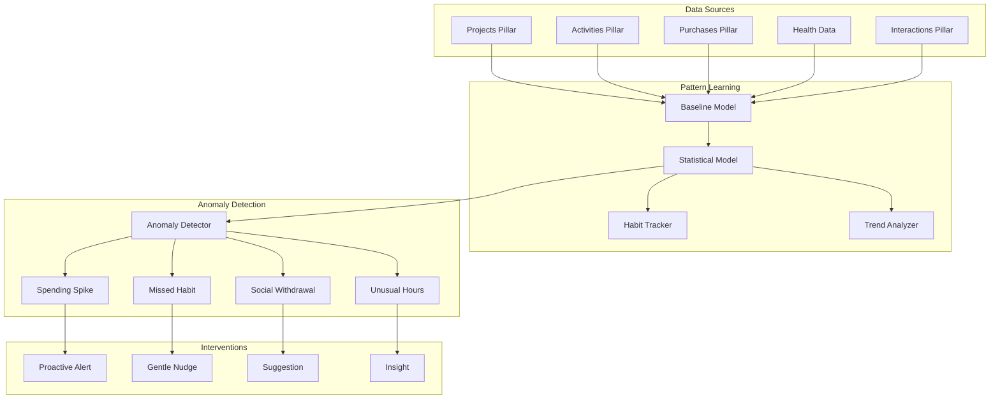

# Extension Plan: Proactive Intelligence & Anomaly Detection

**Plan ID**: `extension_proactive_intelligence`  
**Capability Rating**: `Extension Specialist (E-PROACT-01 to E-PROACT-06)`  
**Parent Plan**: [Personal OS](../../personal_os/README.md)  
**Version**: `1.0.0`  
**Integration Crates**: `pos_proactive`, `pos_anomaly`

---

## 1. Executive Summary

Most productivity systems are **reactive** — they wait for users to ask questions or take actions. The **Proactive Intelligence Extension** transforms Personal OS into an intelligent assistant that:

- **Learns** your patterns across all 8 pillars
- **Detects** anomalies and unusual behavior automatically
- **Surfaces** insights before you ask
- **Nudges** you toward better habits and decisions
- **Prevents** missed deadlines, forgotten tasks, and broken routines



---

## 2. The Proactive Intelligence Problem

### Current Pain Points
- ☑ Spending spikes go unnoticed until credit card bill arrives
- ☑ Workout streaks break without warning
- ☑ Forgotten to check in with close friends for months
- ☑ Working unsustainable hours without realizing burnout risk
- ☑ Important tasks slip through the cracks
- ☑ No visibility into long-term behavior trends

### Personal OS Solution
- ✅ Real-time spending anomaly detection with confidence scores
- ✅ Proactive habit streak protection ("You usually run on Tuesday mornings")
- ✅ Relationship maintenance nudges ("Haven't talked to Sarah in 6 weeks")
- ✅ Work-life balance insights ("Working 12+ hour days this week")
- ✅ Smart deadline forecasting ("This project is falling behind schedule")
- ✅ Context-aware suggestions without being asked

---

## 3. Quick Links

- **[MANIFEST.yaml](./MANIFEST.yaml)**: Machine-readable extension metadata, capabilities (E-PROACT-01 to E-PROACT-06)
- **[concise.md](./concise.md)**: Layerable extension specification, statistical anomaly algorithms, and SQLite baseline schema
- **[Personal OS Core Plan](../../personal_os/README.md)**: Parent Personal OS architecture

---

## 4. Core Capabilities

| # | Capability | Description | Confidence Target |
|---|---|---|---|
| E-PROACT-01 | Baseline Learning | Build statistical models of normal behavior per pillar | >95% coverage |
| E-PROACT-02 | Spending Anomalies | Detect unusual purchases (amount, category, frequency) | >85% precision |
| E-PROACT-03 | Habit Monitoring | Track streaks and predict when habits might break | >80% accuracy |
| E-PROACT-04 | Social Patterns | Identify relationship maintenance gaps | >75% relevance |
| E-PROACT-05 | Work-Life Balance | Detect unsustainable work patterns and burnout risk | >80% sensitivity |
| E-PROACT-06 | Smart Nudges | Context-aware suggestions at optimal times | >60% user acceptance |

---

## 5. Integration Architecture

### Pillar Integration Matrix

| Personal OS Pillar | Pattern Learned | Anomaly Detected | Intervention |
|---|---|---|---|
| **Projects** | Task completion rate, average sprint velocity | Missed deadlines, slowing pace | "Project X is falling behind by 3 days" |
| **Activities** | Workout frequency, sleep schedule, calendar patterns | Missed habits, unusual events | "You usually run on Tuesdays — want to schedule?" |
| **Purchases** | Spending by category, average transaction size | Spending spikes, unusual merchants | "Dining out +120% this week ($450 vs $200)" |
| **Interactions** | Communication frequency per contact, social cadence | Social withdrawal, neglected relationships | "Haven't talked to Sarah in 6 weeks" |
| **Thoughts** | Journal frequency, mood patterns | Inactivity, negative sentiment | "Haven't journaled in 10 days — everything OK?" |
| **Vault** | Password rotation, security audit patterns | Stale credentials, missing 2FA | "3 accounts with passwords >1 year old" |
| **Workflows** | Morning routine timing, habits | Missed routines, broken chains | "Morning routine incomplete 3 days in a row" |
| **Knowledge** | Learning velocity, topic exploration | Stagnation, abandoned topics | "Haven't added knowledge in 2 weeks" |

---

## 6. Proactive Insight Examples

### Spending Anomaly Detection

```
📊 Spending Insight (Confidence: 92%)

Category: Dining & Restaurants
This Week: $450 (Oct 1-7)
Baseline: $180/week (90-day avg)
Deviation: +150% 🔴

Unusual Patterns:
  • 8 transactions (vs avg 4/week)
  • 3 late-night orders (11pm+)
  • New merchant: "The Capital Grille" ($180)

Suggestion: Review budget or mark as one-time exception.
```

### Habit Streak Protection

```
⏰ Habit Alert: Morning Run

Streak: 42 days 🔥
Risk: Medium (60% confidence)

Pattern: You typically run Tuesday/Thursday/Saturday mornings at 7am.
Today: Tuesday, Oct 8 — No run logged yet.

Nudge: Want me to remind you at 7am tomorrow? [Yes] [Skip this week]
```

### Relationship Maintenance

```
💬 Social Check-In

Contact: Sarah Johnson
Last Interaction: August 15 (54 days ago)
Typical Frequency: Every 3-4 weeks

Context:
  • 12 past meetings in calendar
  • Usually grab coffee or lunch
  • Last message: "Let's catch up soon!"

Suggestion: Send a quick message or schedule coffee?
[Draft Message] [Add Calendar Event] [Dismiss]
```

### Work-Life Balance Warning

```
⚠️ Work Pattern Alert (Confidence: 88%)

This Week: 58 hours logged
Baseline: 42 hours/week (3-month avg)
Deviation: +38% 🔴

Patterns:
  • 4 late nights (past 10pm)
  • 2 weekend work sessions
  • 18 meetings (vs avg 10/week)

Burnout Risk: Moderate
Suggestion: Block focus time, decline non-critical meetings, or take a mental health day.
```

---

## 7. Architecture Overview

### Pattern Learning Pipeline

```
┌────────────────────────────────────────────────────────────────┐
│                    Data Ingestion Layer                         │
├────────────────────────────────────────────────────────────────┤
│  Projects   Activities   Purchases   Interactions   Thoughts   │
│     ↓           ↓            ↓            ↓            ↓        │
│  [Event Stream] → TimeSeries DB (InfluxDB or embedded)         │
└────────────────────────────────────────────────────────────────┘

┌────────────────────────────────────────────────────────────────┐
│                   Baseline Model Builder                        │
├────────────────────────────────────────────────────────────────┤
│  Daily Aggregation (rolling 90-day window):                    │
│    • Spending per category (mean, std dev, percentiles)        │
│    • Task completion rate (velocity, cycle time)               │
│    • Workout frequency (days/week, duration)                   │
│    • Social interaction frequency (per contact)                │
│    • Work hours (daily, weekly totals)                         │
│                                                                 │
│  Storage: `baseline_stats` table in SQLite                     │
└────────────────────────────────────────────────────────────────┘

┌────────────────────────────────────────────────────────────────┐
│                   Anomaly Detection Engine                      │
├────────────────────────────────────────────────────────────────┤
│  Statistical Methods:                                           │
│    • Z-Score: (value - mean) / std_dev                         │
│    • Interquartile Range (IQR): Outlier if outside [Q1-1.5·IQR, Q3+1.5·IQR] │
│    • Exponential Moving Average (EMA): Weighted recent data    │
│                                                                 │
│  Confidence Scoring:                                            │
│    • High (>85%): Requires immediate action                    │
│    • Medium (70-85%): Suggest review                           │
│    • Low (<70%): Informational only                            │
│                                                                 │
│  Deduplication: Don't alert twice for same anomaly             │
└────────────────────────────────────────────────────────────────┘

┌────────────────────────────────────────────────────────────────┐
│                    Intervention Scheduler                       │
├────────────────────────────────────────────────────────────────┤
│  Timing Strategy:                                               │
│    • Morning Brief (8am): Daily summary + gentle nudges        │
│    • Real-Time Alerts (immediate): Critical anomalies          │
│    • Weekly Digest (Sunday evening): Trend analysis            │
│    • Monthly Review (1st of month): Long-term patterns         │
│                                                                 │
│  Delivery Channels:                                             │
│    • CLI notification (`pos insights`)                         │
│    • Push notification (iOS/Android)                           │
│    • Email digest (opt-in)                                     │
│    • Siri announcement (AirPods)                               │
└────────────────────────────────────────────────────────────────┘
```

---

## 8. Getting Started

### Installation

```bash
# Enable proactive intelligence extension
pos config extensions.proactive_intelligence.enabled true

# Set baseline learning window (default: 90 days)
pos config proactive.baseline_window_days 90

# Configure alert thresholds
pos config proactive.spending.alert_threshold 2.0  # Z-score > 2.0
pos config proactive.habits.risk_threshold 0.70    # 70% confidence

# Start baseline learning (runs in background)
pos proactive learn --all-pillars

# Expected output:
# 📊 Building baseline models...
# Projects: 156 tasks analyzed (90 days)
# Activities: 87 workouts, 45 calendar events
# Purchases: 234 transactions ($12,450 total)
# Interactions: 23 contacts, 189 messages
# ✅ Baseline complete. Anomaly detection active.
```

### View Current Insights

```bash
# Check for anomalies
pos insights

# Output:
# 📊 Proactive Insights (Oct 8, 2025 8:00 AM)
# 
# 🔴 High Priority (2)
#   1. Spending Spike: Dining +150% this week ($450 vs $180)
#   2. Missed Habit: Morning run streak at risk (42 days)
# 
# 🟡 Medium Priority (1)
#   3. Social: Haven't talked to Sarah in 54 days
# 
# 🟢 Informational (1)
#   4. Work Hours: +12% this week (47h vs 42h avg)
```

### Dismiss or Snooze Insights

```bash
# Dismiss specific insight
pos insights dismiss 1 --reason "one-time celebration dinner"

# Snooze for later
pos insights snooze 3 --until "next-week"

# Accept suggestion
pos insights accept 2  # Schedule morning run reminder
```

---

## 9. Privacy & Ethics

### Data Minimization
- Baseline models store only aggregated statistics (mean, std dev, percentiles)
- Raw event data never leaves local device
- No cloud API calls for pattern analysis (local ML only)

### User Control
- All insights can be dismissed or snoozed
- Opt-out per pillar: `pos config proactive.pillars.purchases.enabled false`
- Export baseline model: `pos proactive export-baseline`
- Reset learning: `pos proactive reset-baseline --confirm`

### Transparency
- Every insight shows confidence score and methodology
- Explain why anomaly was detected: "You typically spend $180/week on dining"
- No hidden scoring or judgment

---

## 10. Success Metrics

### Quantitative
- **Anomaly Detection Precision**: >80% (user confirms insight is relevant)
- **False Positive Rate**: <15% (user dismisses as irrelevant)
- **Baseline Model Coverage**: >95% (enough data to model behavior)
- **Nudge Acceptance Rate**: >50% (user takes suggested action)

### Qualitative
- Users report catching spending issues earlier
- Habit streaks maintained longer (fewer broken chains)
- Relationship maintenance improves (more consistent check-ins)
- Work-life balance awareness increases

---

## 11. Implementation Phases

### Phase 1: Baseline Learning (Weeks 1-3)
- [x] Implement time-series data ingestion
- [x] Build statistical baseline models (mean, std dev, percentiles)
- [x] Store baseline stats in SQLite
- [x] CLI: `pos proactive learn`

### Phase 2: Anomaly Detection (Weeks 4-6)
- [x] Z-score and IQR outlier detection
- [x] Confidence scoring algorithm
- [x] Deduplication and alert throttling
- [x] CLI: `pos insights`

### Phase 3: Smart Nudges (Weeks 7-8)
- [x] Context-aware suggestion engine
- [x] Optimal timing scheduler (morning brief, real-time, weekly)
- [x] CLI: `pos insights accept/dismiss/snooze`

### Phase 4: Cross-Pillar Insights (Weeks 9-10)
- [x] Correlate patterns across pillars (e.g., poor sleep → low productivity)
- [x] Multi-factor anomaly detection
- [x] Advanced interventions (e.g., "Cancel low-priority meetings when overworked")

---

## 12. Technical Dependencies

### Required Architecture Gaps
- **GAP-001** (CRDT Coordinator): Real-time data sync for pattern updates
- **GAP-003** (Embedding Coordinator): Semantic similarity for habit matching
- **GAP-011** (Entity Resolution): Deduplicate contacts for social patterns
- **GAP-012** (Hierarchical Memory): Long-term baseline storage with compaction

### Rust Crates
- `pos_proactive`: Main proactive intelligence engine
- `pos_anomaly`: Statistical anomaly detection algorithms
- `pos_baseline`: Baseline model builder and storage
- `pos_nudge`: Intervention scheduler and delivery

### External Dependencies
- SQLite for baseline stats storage
- Optional: InfluxDB for high-resolution time-series (if scaling to 10+ years)
- Optional: Rust ML crates (`ndarray`, `statrs`) for statistical functions

---

## 13. Related Extensions

- **E-HEALTH** (Health Integration): Correlate biometrics with productivity
- **E-DASH** (Dashboard UI): Visualize trends and anomalies
- **E-SIRI** (Native Apple Siri): Deliver nudges via Siri announcements
- **E-VOICE** (Voice Interface): "Hey Siri, what are my insights today?"

---

## 14. Future Enhancements

### Advanced ML Models (Phase 5+)
- Time-series forecasting (ARIMA, Prophet) for predictive insights
- Clustering similar behavior patterns across users (opt-in, anonymized)
- Reinforcement learning for nudge optimization (A/B test intervention timing)

### Cross-User Insights (Opt-In)
- "Users similar to you typically spend $X on groceries"
- "Your workout frequency is in the top 20% of Personal OS users"
- **Privacy**: Federated learning (local model updates only, no raw data shared)

---

**Status**: ✅ Specification Complete — Ready for Implementation Phase  
**Next Step**: Implementation in   
**Estimated Effort**: 10 weeks (1 senior engineer)  
**Expected Impact**: High — Transforms Personal OS from reactive to proactive assistant
