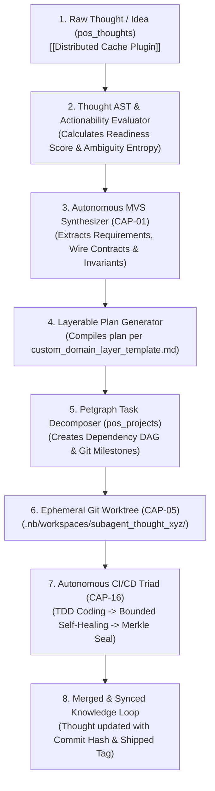

# Extension Plan: Thought-to-Project Autonomous Plan Pipeline

**Plan ID**: `extension_thought_to_project`  
**Capability Rating**: `Extension Specialist (E-THOUGHT-01 to E-THOUGHT-08)`  
**Parent Plan**: [Personal OS Core Plan](../../personal_os/README.md)  
**Master Framework**: [Parent Master Context Engineering Framework](../../master/parent-master-plan/README.md)  
**Template Standard**: [custom_domain_layer_template.md](../../templates/custom_domain_layer_template.md)  
**Status**: Specification Complete, Ready for Implementation

---

## 1. Executive Summary

In personal knowledge management, brilliant thoughts, architectural ideas, and feature sketches often remain trapped in digital notebooks (Zettelkasten notes, voice memos, fleeting ideas) because the cognitive friction of translating a raw thought into a rigorous software specification, decomposing it into task backlogs, configuring git branches, and coding unit tests is too high.

The **Thought-to-Project Autonomous Plan Pipeline** bridges **`pos_thoughts`** (Zettelkasten / CommonMark AST) directly into **`pos_projects`** (Git2 / Worktrees / Task DAG) and hooks into the **Percipience Autonomous CI/CD Triad** (`.nb/core/autonomous_cicd.py`). 



---

## 2. Quick Links

- **[MANIFEST.yaml](./MANIFEST.yaml)**: Machine-readable extension metadata, capabilities (`E-THOUGHT-01` to `E-THOUGHT-08`), and metrics.
- **[concise.md](./concise.md)**: Layerable domain specification per `custom_domain_layer_template.md`, Quad-Space mapping, wire contracts, and CI/CD bridge.
- **[detailed.md](./detailed.md)**: Exhaustive implementation blueprint, AST parser design, Petgraph algorithms, worktree sandboxing, and test suites.
- **[Parent Master Plan](../../master/parent-master-plan/README.md)**: Governing enterprise context engineering framework.

---

## 3. The 8 Core Capabilities

| Capability | Name | Purpose | Output Artifact |
|---|---|---|---|
| **E-THOUGHT-01** | Thought AST Evaluator | Parses CommonMark AST, extracts headings, tags, wikilinks, and computes actionability score (0.00–1.00). | `readiness_score` & semantic graph |
| **E-THOUGHT-02** | MVS Spec Synthesizer | Auto-derives Minimum Viable Set inputs from informal thoughts per `CAP-01`. | `user/inputs/<slug>_mvs.yaml` |
| **E-THOUGHT-03** | Ambiguity Resolver | Detects fuzzy requirements; triggers interactive clarification RFCs per `CAP-35`. | `user/hitl/clarifications/<slug>_rfc.md` |
| **E-THOUGHT-04** | Domain Plan Generator | Compiles a structured Layerable Domain Plan adhering to `custom_domain_layer_template.md`. | `.nb/plan/extensions/<slug>/concise.md` |
| **E-THOUGHT-05** | Petgraph Task Decomposer | Decomposes plan into an acyclic dependency graph of atomic tasks with priority lanes. | Directed task graph in SQLite & Linear/GitHub |
| **E-THOUGHT-06** | Git Worktree Provisioner | Creates ephemeral worktrees in `.nb/workspaces/` isolated from user branches per `CAP-05`. | Isolated git branch `feat/<slug>` |
| **E-THOUGHT-07** | Autonomous CI/CD Bridge | Triggers closed-loop coding, linting, TDD, and bounded self-healing (max 3 retries) per `CAP-16`. | Passing test evidence & Merkle block |
| **E-THOUGHT-08** | Knowledge Loop Closer | Backlinks git commit hashes, PR URLs, and test receipts into the original Zettelkasten note. | Updated `pos_thoughts` markdown node |

---

## 4. End-to-End User Scenario & CLI

### Step 1: Capture Raw Thought in CLI or Voice
```bash
# Capture a quick architectural thought
pos thought capture "Idea: Implement a local vector cache for Tantivy hybrid search to reduce query latency from 15ms to 3ms. Use mmap with LRU eviction and BLAKE3 cache keys." --tags idea,perf,rust
```

### Step 2: Promote Thought to Actionable Plan
```bash
# Evaluate thought actionability and synthesize plan
pos thought promote --id thought-98a2f1 --template custom_domain_layer

# Output:
# 🧠 Parsing CommonMark AST for thought-98a2f1...
# 📊 Actionability Score: 0.92 (High Readiness)
# 📝 Synthesizing MVS Specification: user/inputs/vector_cache_mvs.yaml
# 📐 Generating Domain Plan: .nb/plan/extensions/vector_cache/concise.md
# 🌲 Generating Petgraph Task DAG: 4 atomic tasks identified
# 🌿 Ephemeral Worktree Created: .nb/workspaces/subagent_vector_cache/
```

### Step 3: Trigger Autonomous CI/CD Pipeline
```bash
# Dispatch autonomous coding subagents to implement the plan
pos project execute-autonomous --plan .nb/plan/extensions/vector_cache/concise.md

# Pipeline Output:
# 🤖 Subagent agent_project_orchestrator dispatched into worktree
# 🔨 TDD Phase: Generating tests in workplace/modules/pos_storage/tests/cache_test.rs
# ⚙️ Implementation Phase: Implementing LRU mmap cache
# 🧪 Verification: cargo test -p pos_storage -> PASS (3 passed, 0 failed)
# 🛡️ Merkle Ledger Sealed: Block 9 (SHA-256: e8b2...014c)
# 🚀 Merged branch feat/vector_cache into main!
# 🔗 Thought updated: [[Thoughts/Vector Cache]] marked as #shipped with commit e8b27f
```

---

## 5. Architectural Invariants

1. **Zero-Hallucination Scope Guard**: The plan generator cannot invent architectural dependencies or external cloud services not implied by the thought or present in system contracts.
2. **Ambiguity Entropy Gate**: If ambiguity entropy exceeds $0.40$ (vague requirements or unspecified interfaces), autonomous CI/CD execution is halted until the user resolves the clarification RFC in `user/hitl/`.
3. **Worktree Sandboxing**: All code generation executes strictly inside ephemeral git worktrees (`.nb/workspaces/subagent_<id>/`). The user's active checkout remains clean and untouched.
4. **Cryptographic Traceability**: Every transition from thought $\rightarrow$ plan $\rightarrow$ task $\rightarrow$ commit is cryptographically chained in `context_ledger.yaml`.
