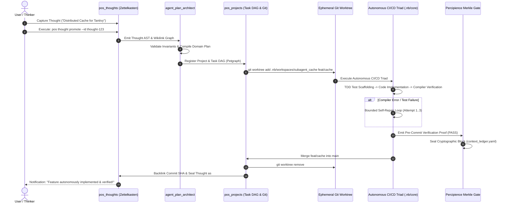

# Layerable Context Engineering Plan: Thought-to-Project Autonomous Plan Pipeline

### Executive Overview & Domain Grounding
This document is the standardized **Layerable Domain-Specific Context Engineering Plan** integrating **`pos_thoughts`** (Zettelkasten / CommonMark AST) with **`pos_projects`** (Git2 / Worktrees / Task DAG) under the governing **Parent Master Context Engineering Framework** (`.nb/plan/master/parent-master-plan/concise.md`).

This domain pipeline establishes an automated, zero-loss cognitive bridge converting informal conceptual notes, fleeting ideas, and architectural sketches into formal, machine-executable software plans that are subsequently built, tested, and sealed by the **Autonomous CI/CD Triad** (`.nb/core/autonomous_cicd.py`):

1. **Thought AST Extraction & Readiness Scoring**: Traverses Markdown AST using `pulldown-cmark`, extracting technical nouns, code blocks, wikilinks (`[[Concept]]`), and calculating a formal actionability score ($0.00 \le S \le 1.00$).
2. **Autonomous MVS Derivation (`CAP-01`) & Ambiguity Resolution (`CAP-35`)**: Normalizes sparse thought text into a structured Minimum Viable Set (MVS) specification in `user/inputs/`, generating clarification RFCs in `user/hitl/` if ambiguity entropy exceeds $0.40$.
3. **Plan Compilation per `custom_domain_layer_template.md`**: Auto-synthesizes a standardized, layerable domain specification in `.nb/plan/extensions/<slug>/concise.md` complete with wire contracts, invariants, and test harnesses.
4. **Petgraph Task DAG & Git Worktree Orchestration (`CAP-05`)**: Translates requirements into an acyclic task dependency graph in `pos_projects`, automatically provisioning isolated ephemeral git worktrees (`.nb/workspaces/subagent_<slug>/`).
5. **Autonomous Closed-Loop CI/CD Triad Execution (`CAP-16`)**: Dispatches coding subagents to implement features via bounded TDD self-healing ($\le 3$ retries), verified by pre-commit gatekeepers and sealed into the SHA-256 Merkle ledger (`CAP-08`).
6. **Bidirectional Knowledge Loop Closure**: Merges verified PR into `main` and backlinks git commit proofs, PR URLs, and test evidence into the originating Zettelkasten thought note.

---

## 1. Domain-Specific Quad-Space Mapping

```
.
├── context/
│   ├── contracts/
│   │   ├── thought_to_project_wire_contracts.yaml # Intersystem RPC/REST schema between thoughts & projects
│   │   └── plan_synthesis_contract.json           # MVS specification & Plan generation schema
│   └── rules/
│       ├── plan_derivation_invariants.md          # Zero-hallucination, entropy bounds, and scope guards
│       └── worktree_isolation_rules.md            # Ephemeral branch naming and sandboxing constraints
├── agentic/
│   ├── custom/agents/
│   │   ├── agent_thought_synthesizer.yaml         # Evaluates thought AST & computes actionability score
│   │   ├── agent_plan_architect.yaml              # Synthesizes MVS spec & compiles domain layer plan
│   │   └── agent_autonomous_coder.yaml            # Executes TDD coding inside ephemeral git worktree
│   └── custom/workflows/
│       ├── wf_thought_to_plan.yaml                # Raw Thought -> AST -> MVS Spec -> Layerable Plan
│       └── wf_plan_to_cicd.yaml                   # Plan -> Petgraph DAG -> Worktree -> CI/CD Triad
├── workplace/
│   ├── modules/
│   │   ├── pos_thoughts/                          # Source: CommonMark AST parser & wikilink graph
│   │   ├── pos_projects/                          # Target: Git2 worktree manager & Petgraph task DAG
│   │   └── pos_agents/                            # Runtime: Subagent dispatch & ReAct execution loops
│   ├── shared/
│   │   └── contracts/                             # Code-generated Serde DTOs for thought/project payloads
│   └── templates/bridge/
│       └── virtual_cicd_mock_bridge.rs            # In-memory mock compiler/test runner for headless verification
└── user/
    ├── inputs/
    │   └── generated_specs/                       # Auto-synthesized MVS YAML specifications
    └── hitl/
        ├── clarification_rfcs/                    # Ambiguity clarification requests awaiting user sign-off
        └── plan_approval_queue.md                 # Interactive human sign-off before worktree code generation
```

---

## 2. Wire Contracts & Safety Invariants

### 2.1. Primary Wire Contract (`context/contracts/thought_to_project_wire_contracts.yaml`)
```yaml
schema_version: "1.0.0"
domain: "thought_to_project"
service_endpoint: "/api/v1/thought_to_project"
methods:
  - name: "evaluate_thought_readiness"
    input_schema:
      type: "object"
      required: ["thought_id", "content_markdown"]
      properties:
        thought_id: { type: "string" }
        content_markdown: { type: "string" }
    output_schema:
      type: "object"
      required: ["actionability_score", "detected_domain", "extracted_entities", "ambiguity_entropy"]
      properties:
        actionability_score: { type: "number", minimum: 0.0, maximum: 1.0 }
        detected_domain: { type: "string" }
        extracted_entities: { type: "array", items: { type: "string" } }
        ambiguity_entropy: { type: "number" }

  - name: "derive_layerable_plan"
    input_schema:
      type: "object"
      required: ["thought_id", "domain_slug", "title"]
      properties:
        thought_id: { type: "string" }
        domain_slug: { type: "string" }
        title: { type: "string" }
    output_schema:
      type: "object"
      required: ["plan_path", "mvs_spec_path", "task_count", "ephemeral_branch"]
      properties:
        plan_path: { type: "string" }
        mvs_spec_path: { type: "string" }
        task_count: { type: "integer" }
        ephemeral_branch: { type: "string" }

  - name: "close_knowledge_loop"
    input_schema:
      type: "object"
      required: ["thought_id", "commit_hash", "merkle_block_id", "status"]
      properties:
        thought_id: { type: "string" }
        commit_hash: { type: "string" }
        merkle_block_id: { type: "integer" }
        status: { type: "string", enum: ["shipped", "failed", "quarantined"] }
```

### 2.2. Non-Negotiable Invariants (`context/rules/plan_derivation_invariants.md`)
1. **Zero-Hallucination Scope Guard**: The plan generator cannot inject technologies, endpoints, or dependencies that are not explicitly present in the thought note or system contracts.
2. **Ambiguity Entropy Gate**: If ambiguity entropy exceeds $0.40$, autonomous code generation is blocked; an RFC must be emitted to `user/hitl/clarification_rfcs/` for interactive clarification.
3. **Strict Git Worktree Sandboxing**: Subagents are strictly forbidden from modifying the user's active branch. All code generation, testing, and compilation occur in isolated worktrees (`.nb/workspaces/subagent_<slug>/`).
4. **Bidirectional Cryptographic Traceability**: The initial thought UUID, generated plan hash, git commit hash, and Merkle block receipt must be mutually linked in `context_ledger.yaml`.

---

## 3. Specialized Subagents & Delivery Workflows

### 3.1. Subagent Specifications
- **`agent_thought_synthesizer`** (Tier A/B): Traverses CommonMark AST from `pos_thoughts`, calculates actionability metrics, and extracts semantic entities.
- **`agent_plan_architect`** (Tier A): Synthesizes MVS specification and compiles the formal layerable domain plan per `custom_domain_layer_template.md`.
- **`agent_autonomous_coder`** (Tier B/A): Executes TDD implementation, bounded self-repair loops ($\le 3$ retries), and Merkle sealing inside the ephemeral worktree.

### 3.2. Delivery Workflow DAG: `wf_thought_to_cicd.yaml`

```mermaid
flowchart LR
    Step1["1. Parse Thought AST (pulldown-cmark)"] --> Step2["2. Compute Actionability & Ambiguity"]
    Step2 -->|Entropy <= 0.40| Step3["3. Synthesize MVS & Domain Plan"]
    Step2 -->|Entropy > 0.40| HITL["HITL Clarification RFC"]
    HITL --> Step3
    Step3 --> Step4["4. Decompose Petgraph Task DAG"]
    Step4 --> Step5["5. Provision Ephemeral Git Worktree"]
    Step5 --> Step6["6. Autonomous CI/CD Triad (TDD & Self-Healing)"]
    Step6 --> Step7["7. Pre-Commit Gatekeeper & Merkle Seal"]
    Step7 --> Step8["8. Fast-Forward Merge & Backlink Thought"]
```


---

## 4. End-to-End Execution Sequence Loopback Bridge



---

## 5. Surgical Rollback & Poisoning Defense

If a subagent produces hallucinated or defective code during autonomous execution:
1. **Worktree Isolation**: Contaminated mutations are contained inside `.nb/workspaces/subagent_<slug>/`; `main` branch remains untouched.
2. **Bounded Retry Threshold**: If tests still fail after 3 automated repair cycles, the pipeline terminates self-healing, marks the task `quarantined`, and moves the failure traceback to `user/hitl/poisoning_quarantine.md`.
3. **Reclaim Leases**: Percipience reclaims the ephemeral worktree lease without disturbing concurrent sibling modules.

---

## 6. Verification & Gatekeeper Protocol

```bash
# 1. Audit context ledger and prompt manifest integrity
./.nb/bin/percipience audit

# 2. Test thought promotion and AST parsing
cargo test -p pos_thoughts --test ast_actionability_test

# 3. Test Petgraph task DAG decomposition and worktree provisioning
cargo test -p pos_projects --test worktree_orchestration_test

# 4. Run end-to-end simulated thought-to-plan pipeline
cargo test -p pos_workflows --test thought_to_cicd_pipeline_test
```
