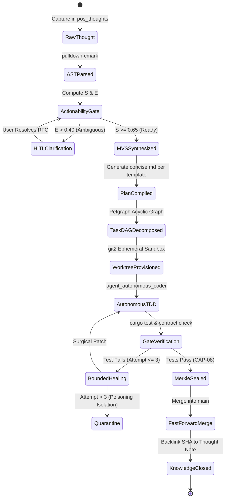

# Thought-to-Project Autonomous Plan Pipeline: Comprehensive Implementation Blueprint

### Executive Overview & Strategic Motivation
In modern engineering workflows, the bottleneck is rarely the initial conception of an idea, nor is it the execution of verified code in production. The primary friction point lies in the **translation phase**: converting an unstructured, informal thought into an implementable, test-driven software specification, breaking it down into actionable dependency graphs, establishing isolated Git branches, and configuring autonomous CI/CD gates.

The **Thought-to-Project Autonomous Plan Pipeline** bridges this chasm by establishing a zero-loss, cryptographically verifiable pipeline between **`pos_thoughts`** (Zettelkasten / CommonMark AST) and **`pos_projects`** (Git2 / Worktrees / Task DAG). Leveraging the **Percipience Context Engineering Framework**, thoughts are deterministically evaluated, normalized into Minimum Viable Set (MVS) specifications, compiled into standardized Layerable Domain Plans per [`custom_domain_layer_template.md`](../../templates/custom_domain_layer_template.md), and executed autonomously by the **Autonomous CI/CD Triad** (`.nb/core/autonomous_cicd.py`).

---

## 1. Mathematical Formulation & AST Extraction

### 1.1. CommonMark AST Traversal
Using `pulldown-cmark`, the engine parses raw thoughts into a structured AST:
- **Headings**: Extracted as high-level architectural domains or feature boundaries.
- **Code Blocks**: Extracted as target languages (e.g. ````rust`), type definitions, or API signatures.
- **Wikilinks**: Traversed as dependency pointers (`[[Concept A]]` indicates dependency or semantic relation).
- **Checklists**: Extracted as explicit user-specified deliverables.

### 1.2. Actionability Readiness Score ($S$)
Before promoting a thought into a software plan, the engine evaluates its implementation readiness:
$$S = \min\left(1.0, \; w_h \cdot H + w_c \cdot C + w_l \cdot L + w_t \cdot T\right)$$
Where:
- $H$: Heading hierarchy depth normalized ($0.0 \le H \le 1.0$).
- $C$: Presence of concrete code snippets or data schemas ($C \in \{0.0, 0.5, 1.0\}$).
- $L$: Connected wikilinks count normalized ($L = \min(1.0, \frac{\text{links}}{3})$).
- $T$: Technical noun density extracted via fast local POS tagging.
- Default weights: $w_h = 0.20, w_c = 0.35, w_l = 0.20, w_t = 0.25$.
- **Threshold**: If $S \ge 0.65$, the thought qualifies for autonomous plan compilation.

### 1.3. Ambiguity Entropy Formulation ($E$)
To prevent subagents from hallucinating undefined business logic, ambiguity entropy is computed:
$$E = -\sum_{i=1}^{N} p_i \log_2(p_i)$$
Where $p_i$ represents the uncertainty distribution across core architectural dimensions (Data Model, API Contract, Error Handling, Concurrency Model).
- If $E \le 0.40$: Autonomous derivation proceeds immediately.
- If $E > 0.40$: Autonomous execution pauses; a structured Clarification RFC is drafted in `user/hitl/clarification_rfcs/`.

---

## 2. Pipeline State Transitions & Rust Architecture



---

## 3. Database Schema Updates (`pos_storage`)

To track the lifecycle from thought to autonomous merge, the following relational tables are established in SQLite:

```sql
-- Pipeline Run Ledger
CREATE TABLE IF NOT EXISTS thought_project_pipelines (
    id TEXT PRIMARY KEY,
    thought_id TEXT NOT NULL REFERENCES thoughts(id),
    project_id TEXT NOT NULL REFERENCES projects(id),
    status TEXT NOT NULL CHECK (status IN ('evaluating', 'rfc_pending', 'plan_compiled', 'worktree_active', 'cicd_running', 'shipped', 'quarantined')),
    actionability_score REAL NOT NULL,
    ambiguity_entropy REAL NOT NULL,
    generated_plan_path TEXT,
    ephemeral_branch TEXT,
    worktree_path TEXT,
    target_commit_sha TEXT,
    merkle_block_id INTEGER,
    created_at DATETIME NOT NULL DEFAULT CURRENT_TIMESTAMP,
    updated_at DATETIME NOT NULL DEFAULT CURRENT_TIMESTAMP
);

-- Petgraph Task DAG Nodes
CREATE TABLE IF NOT EXISTS pipeline_task_nodes (
    id TEXT PRIMARY KEY,
    pipeline_id TEXT NOT NULL REFERENCES thought_project_pipelines(id) ON DELETE CASCADE,
    title TEXT NOT NULL,
    task_type TEXT NOT NULL CHECK (task_type IN ('wire_contract', 'test_scaffold', 'core_impl', 'integration_gate')),
    dependencies JSON NOT NULL DEFAULT '[]', -- Array of parent task UUIDs
    execution_status TEXT NOT NULL DEFAULT 'pending' CHECK (execution_status IN ('pending', 'running', 'completed', 'failed')),
    retry_count INTEGER NOT NULL DEFAULT 0,
    output_diff TEXT,
    created_at DATETIME NOT NULL DEFAULT CURRENT_TIMESTAMP
);
```

---

## 4. Git Worktree & CI/CD Triad Integration

### 4.1. Worktree Isolation Protocol
1. Subagent receives task DAG from `pos_projects`.
2. Invokes `git2::Repository::worktree()` to create `.nb/workspaces/subagent_<slug>_<timestamp>/` branching from `main`.
3. Sets up local environment and executes all file edits, formatting, and test suites exclusively in the sandboxed directory.
4. The user's active checkout on `main` is completely protected from uncommitted scratch diffs.

### 4.2. Autonomous CI/CD Triad Loop (`.nb/core/autonomous_cicd.py`)
- **Step 1 (Scaffolding)**: Generates wire contracts in `context/contracts/` and Serde DTOs in `shared/contracts/`.
- **Step 2 (TDD Scaffolding)**: Generates failing test suites matching requirements.
- **Step 3 (Implementation)**: Implements production logic in `workplace/modules/`.
- **Step 4 (Verification Gate)**: Runs `cargo test -p <module>`. If tests fail, `DiagnosticLogPruner` extracts AST error slices and reprompts `agent_autonomous_coder` with a hard ceiling of 3 retries.
- **Step 5 (Merkle Sealing)**: Computes SHA-256 hash of diff, appends transition block to `context_ledger.yaml`, and fast-forward merges the verified branch to `main`.
- **Step 6 (Knowledge Closure)**: Calls `pos_thoughts::update_note()` to append:
  ```markdown
  ---
  ## 🚀 Implementation Proof
  - **Status**: Shipped ✅
  - **Plan**: `.nb/plan/extensions/<slug>/concise.md`
  - **Git Commit**: `e8b27f4`
  - **Merkle Block**: Block #9 (`SHA-256: e8b2...014c`)
  ---
  ```

---

## 5. Verification & Testing Strategy

```bash
# 1. Unit test CommonMark AST extraction and readiness scoring
cargo test -p pos_thoughts --test readiness_score_test

# 2. Test Petgraph dependency DAG topological sorting and cycle detection
cargo test -p pos_projects --test task_dag_cycle_test

# 3. Test git2 worktree isolation and atomic merge
cargo test -p pos_projects --test ephemeral_worktree_test

# 4. Run end-to-end thought-to-plan-to-CI/CD simulation in headless enclave
cargo test -p pos_workflows --test e2e_thought_to_cicd_test
```
