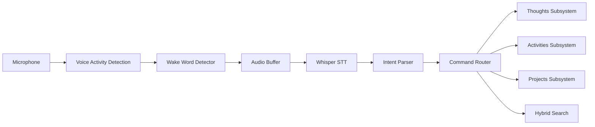

# Extension Plan: Voice Interface & Dictation System

**Plan ID**: `extension_voice_interface`  
**Capability Rating**: `Extension Specialist (E-VOICE-01 to E-VOICE-06)`  
**Parent Plan**: [Personal OS](../../personal_os/README.md)  
**Version**: `1.0.0`  
**Integration Crates**: `pos_voice`, `pos_audio`

---

## 1. Executive Summary

The **Voice Interface Extension** enables hands-free interaction with Personal OS through natural speech. It's the fastest way to capture thoughts, query information, and control your digital life without touching a keyboard.

### Key Use Cases

**Thought Capture While Walking**
> "Hey Kiro, capture thought: The async runtime could benefit from work-stealing scheduler instead of round-robin."

**Morning Routine Query**
> "Hey Kiro, what's on my agenda today?"
> 
> *Response: "You have 3 meetings: 9am standup, 2pm code review with Sarah, 4pm Q4 planning. Top priority: finish PR #123."*

**Quick Task Creation**
> "Hey Kiro, create task: refactor database layer in nb-antwalk project, priority high."

**Voice Journaling**
> "Hey Kiro, start journal entry."
> 
> *Enters continuous listening mode*
> 
> "Today was productive. Finished the authentication refactor. Learned about zero-copy serialization. Tomorrow I want to tackle the caching layer..."

---

## 2. Architecture Overview



---

## 3. Core Capabilities

| # | Capability | Description | Latency Target |
|---|---|---|---|
| E-VOICE-01 | Speech-to-Text | Whisper-based local transcription | < 1s for 10s audio |
| E-VOICE-02 | Wake Word | "Hey Kiro" activation | < 500ms detection |
| E-VOICE-03 | Intent Recognition | Command vs query vs capture | > 90% accuracy |
| E-VOICE-04 | Thought Capture | Voice-to-text journaling | < 2s end-to-end |
| E-VOICE-05 | Query Interface | Natural language queries | < 3s response |
| E-VOICE-06 | TTS Response | Optional voice responses | < 1s synthesis |

---

## 4. Voice Commands

### Thought Capture
- "Capture thought: [content]"
- "Add note: [content]"
- "Journal entry: [content]"
- "Quick capture: [content]"

### Queries
- "What's on my agenda [today/tomorrow]?"
- "Search for [query]"
- "What are my top priorities?"
- "When is my next meeting?"
- "How much did I spend this month?"

### Task Management
- "Create task: [title] in [project], priority [high/medium/low]"
- "Complete task: [title]"
- "List tasks for [project]"

### Habit Tracking
- "Log habit: [habit name]"
- "Did I [exercise/meditate] today?"
- "What's my streak for [habit]?"

### System Control
- "Start morning brief"
- "Run inbox zero workflow"
- "Sync email"
- "Lock vault"

---

## 5. Hardware Options

### Option 1: Local Machine (macOS/Linux/Windows)
- Use built-in microphone
- Background daemon listens for wake word
- Lowest latency, highest privacy

### Option 2: Raspberry Pi Always-On Device
- Dedicated microphone array (ReSpeaker 4-Mic HAT)
- Runs headless voice daemon
- Communicates with Personal OS over local network
- Can be placed anywhere in room

### Option 3: Mobile Companion App
- iOS/Android app with voice button
- Records and sends to Personal OS API
- Works remotely (end-to-end encrypted)

---

## 6. Privacy & Security

**100% Local Processing**
- Whisper runs entirely on-device
- Audio never leaves your machine
- No cloud API calls for transcription

**Audio Retention**
- Audio files deleted immediately after transcription
- Only transcribed text stored
- Optional: save audio for voice journal entries

**Wake Word Privacy**
- Continuous listening uses low-power VAD (Voice Activity Detection)
- Only audio after wake word detection is processed
- False positive rate: < 1 per hour

---

## 7. Getting Started

### Installation
```bash
# Install voice extension
cargo build -p pos_voice --release

# Download Whisper model (one-time)
pos voice setup --model base.en  # 74MB, fastest
# or
pos voice setup --model small.en  # 244MB, more accurate

# Start voice daemon
pos voice daemon start
```

### First Commands
```bash
# Test microphone
pos voice test-mic

# Try a command (without wake word)
pos voice command "What's on my agenda today?"

# Enable wake word detection
pos voice enable-wake-word

# Now say: "Hey Kiro, capture thought: test successful"
```

---

## 8. Technical Stack

- **Speech-to-Text**: `whisper.cpp` (C++ with Rust FFI)
- **Wake Word**: Porcupine (Picovoice) or custom Whisper-based detector
- **Audio Input**: `cpal` (cross-platform audio library)
- **VAD**: `webrtc-vad` (Voice Activity Detection)
- **Intent Parsing**: LLM-based (lightweight Haiku)

---

## 9. Example Session

```
[You]: Hey Kiro

[Kiro]: 🎤 Listening...

[You]: What's on my agenda today?

[Kiro]: You have 3 meetings:
        - 9am: Daily standup
        - 2pm: Code review with Sarah
        - 4pm: Q4 Planning
        
        Top tasks:
        - Finish PR #123 (high priority)
        - Review architecture doc (medium)

[You]: Hey Kiro

[Kiro]: 🎤 Listening...

[You]: Create task: implement caching layer in nb-antwalk, priority high

[Kiro]: ✅ Created task "Implement caching layer" in nb-antwalk project, priority high

[You]: Hey Kiro

[Kiro]: 🎤 Listening...

[You]: Start journal entry

[Kiro]: 🎤 Recording journal... (say "stop" when done)

[You]: Today was really productive. I finally figured out the async lifetime issue 
       that was blocking me. The key insight was using Arc instead of references.
       Tomorrow I want to tackle the database connection pooling. Stop.

[Kiro]: ✅ Journal entry saved (147 words)
```

---

## 10. Roadmap

**Phase 1** (MVP): Basic STT + command execution  
**Phase 2**: Wake word detection  
**Phase 3**: Voice thought capture workflow  
**Phase 4**: TTS responses (optional)  
**Phase 5**: Raspberry Pi daemon for always-on listening  
**Phase 6**: Mobile app integration
