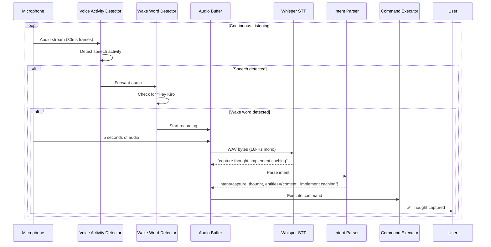

# Layerable Extension Plan: Voice Interface & Dictation

### Executive Overview
This extension enables hands-free interaction with Personal OS through natural speech, using local Whisper-based transcription for complete privacy. Voice commands reduce friction for thought capture (3 seconds vs 30 seconds typing), enable accessibility, and support on-the-go productivity.

---

## 1. Extension-Specific Quad-Space Mapping

```
.
├── context/
│   ├── contracts/
│   │   ├── voice_interface_wire_contracts.yaml  # Voice command API, intent schemas
│   │   ├── voice_audio_pipeline.json            # Audio processing pipeline spec
│   │   └── voice_command_grammar.yaml           # Supported command patterns
│   └── rules/
│       ├── voice_privacy_rules.md               # Audio retention, local processing
│       └── voice_accessibility_standards.md     # WCAG voice input compliance
├── agentic/
│   ├── custom/agents/
│   │   ├── agent_voice_assistant.yaml           # Main voice interface coordinator (Tier B)
│   │   ├── agent_intent_parser.yaml             # Command vs query classification (Tier B)
│   │   └── agent_voice_transcriber.yaml         # Whisper transcription manager (Tier C)
│   └── custom/workflows/
│       ├── wf_voice_capture.yaml                # Voice thought capture flow
│       ├── wf_voice_query.yaml                  # Voice query execution
│       └── wf_voice_journal.yaml                # Continuous voice journaling
├── workplace/
│   ├── modules/
│   │   ├── pos_voice/                           # Voice command engine
│   │   ├── pos_audio/                           # Audio input/output (cpal)
│   │   └── pos_whisper/                         # Whisper.cpp FFI bindings
│   └── integrations/
│       ├── whisper_ffi.rs                       # Rust FFI to whisper.cpp
│       ├── vad_detector.rs                      # Voice Activity Detection
│       └── wake_word_detector.rs                # "Hey Kiro" detection
└── user/
    ├── inputs/
    │   ├── voice_commands_config.yaml           # Custom voice commands
    │   └── audio_devices.yaml                   # Microphone/speaker settings
    └── outputs/
        └── voice_transcripts/                   # Saved transcriptions
```

---

## 2. Voice Command Wire Contracts

### 2.1. Primary Wire Contract (`context/contracts/voice_interface_wire_contracts.yaml`)
```yaml
schema_version: "1.0.0"
domain: "voice_interface"
service_endpoint: "/api/v1/voice"

operations:
  - id: "transcribe_audio"
    description: "Transcribe audio to text using Whisper"
    input:
      audio_data: bytes (WAV format, 16kHz, mono)
      language: string (default: "en")
      model: enum[tiny, base, small, medium] (default: "base")
    output:
      text: string
      confidence: float (0.0-1.0)
      duration_ms: integer
      
  - id: "parse_intent"
    description: "Parse voice command intent"
    input:
      transcription: string
    output:
      intent: enum[capture_thought, query, create_task, log_habit, system_command]
      entities: object
      confidence: float
      
  - id: "execute_voice_command"
    description: "Execute parsed voice command"
    input:
      intent: string
      entities: object
    output:
      success: boolean
      result: string
      spoken_response: string (optional TTS text)

intent_patterns:
  capture_thought:
    patterns:
      - "capture thought: {content}"
      - "add note: {content}"
      - "journal: {content}"
      - "remember: {content}"
    entities:
      content: string (required)
      
  query:
    patterns:
      - "what's on my agenda {timeframe}?"
      - "search for {query}"
      - "what are my {entity_type}?"
      - "when is {event}?"
    entities:
      timeframe: enum[today, tomorrow, this week]
      query: string
      entity_type: enum[tasks, meetings, priorities]
      event: string
      
  create_task:
    patterns:
      - "create task: {title} in {project}, priority {priority}"
      - "add task: {title}"
      - "remind me to {title}"
    entities:
      title: string (required)
      project: string (optional)
      priority: enum[high, medium, low] (default: medium)
      
  log_habit:
    patterns:
      - "log habit: {habit_name}"
      - "I {past_tense_verb} today"
      - "mark {habit_name} complete"
    entities:
      habit_name: string (required)
      
  system_command:
    patterns:
      - "start {workflow_name}"
      - "run {workflow_name}"
      - "{action} vault"
    entities:
      workflow_name: string
      action: enum[lock, unlock]
```

### 2.2. Audio Processing Pipeline

```yaml
# Voice Activity Detection (VAD)
vad:
  algorithm: webrtc_vad
  aggressiveness: 2  # 0-3 (3 most aggressive)
  frame_duration_ms: 30
  min_speech_duration_ms: 300
  max_pause_duration_ms: 800

# Wake Word Detection
wake_word:
  phrase: "hey kiro"
  sensitivity: 0.5  # 0.0-1.0 (higher = more sensitive, more false positives)
  detector: porcupine  # or custom_whisper
  buffer_before_wake_ms: 500  # Include 500ms before wake word
  buffer_after_wake_ms: 5000  # Record up to 5s after activation

# Whisper Configuration
whisper:
  model: base.en  # tiny.en (39MB), base.en (74MB), small.en (244MB)
  language: en
  translate: false
  no_timestamps: false
  max_segment_length: 30  # seconds
```

---

## 3. Audio Pipeline Architecture



---

## 4. Specialized Agent Manifests

| Agent ID | Name | Model Tier | Responsibility |
|---|---|---|---|
| `agent_voice_assistant` | Voice Assistant Coordinator | Tier_B | Main voice interface orchestration, response generation |
| `agent_intent_parser` | Intent Parser | Tier_B | Command classification and entity extraction |
| `agent_voice_transcriber` | Transcription Manager | Tier_C | Whisper model management, audio preprocessing |

---

## 5. Voice Command Categories

### 5.1. Thought Capture (Fastest Use Case)
```
User: "Hey Kiro, capture thought: use arena allocation for parse tree"
System: ✅ Thought captured
Time: 1.2 seconds (vs 30+ seconds typing)
```

### 5.2. Queries
```
User: "Hey Kiro, what's on my agenda today?"
System: "You have 3 meetings: 9am standup, 2pm code review, 4pm planning. 
         Top priority: finish PR #123."
Time: 2.8 seconds
```

### 5.3. Task Management
```
User: "Hey Kiro, create task: refactor database layer in nb-antwalk, priority high"
System: ✅ Created task "Refactor database layer" in nb-antwalk, priority high
```

### 5.4. Habit Tracking
```
User: "Hey Kiro, log habit: morning exercise"
System: ✅ Logged. Current streak: 7 days 🔥
```

### 5.5. Voice Journaling (Continuous Mode)
```
User: "Hey Kiro, start journal entry"
System: 🎤 Recording... (say "stop" when done)
User: [Speaks for 2 minutes about the day]
User: "Stop"
System: ✅ Journal entry saved (347 words)
```

---

## 6. Privacy & Security Rules

### Voice Privacy Rules (`context/rules/voice_privacy_rules.md`)

**Rule 1: Local Processing Only**
- All transcription runs locally via Whisper
- Audio never transmitted to cloud services
- Network calls only for downstream actions (e.g., create task)

**Rule 2: Audio Retention Policy**
- Raw audio deleted immediately after transcription
- Exception: Voice journal entries (audio saved if user opts in)
- Transcribed text stored with normal thought retention policy

**Rule 3: Wake Word Privacy**
- Continuous listening uses low-power VAD only
- Full audio processing begins AFTER wake word detected
- False positive rate target: < 1 per hour

**Rule 4: Secure Audio Paths**
- Audio buffers use memory scrubbing (`Zeroize`)
- Temp audio files written to secure directory with 0600 permissions
- Cleanup on daemon shutdown

---

## 7. CLI Usage Examples

```bash
# Setup (one-time)
pos voice setup --model base.en
# Downloads whisper-base.en model (74MB) to ~/.pos/models/

# Start voice daemon (background)
pos voice daemon start
# ✅ Voice daemon started. Wake word: "Hey Kiro"

# Test transcription (without wake word)
pos voice transcribe --file test.wav
# Transcription: "This is a test of the voice interface"
# Confidence: 0.94
# Duration: 2.3 seconds

# Interactive command mode
pos voice command
# 🎤 Listening... (Ctrl+C to stop)
# [You speak: "What's on my agenda today?"]
# You have 3 meetings today...

# Voice journal mode
pos voice journal
# 🎤 Recording journal entry... (say "stop recording" to finish)
# [Continuous transcription with live feedback]

# Check daemon status
pos voice status
# Voice daemon: ✅ Running (PID 12345)
# Model: base.en (74MB)
# Wake word: enabled
# False positives today: 2

# View voice logs
pos voice logs --tail 20
```

---

## 8. Performance Targets

| Metric | Target | Measurement |
|---|---|---|
| Transcription latency | < 1s for 10s audio | Whisper inference time |
| Wake word detection | < 500ms | Time to detect "Hey Kiro" |
| End-to-end command | < 3s | Wake → execute → feedback |
| Word Error Rate (WER) | < 10% | Manual evaluation on 1000 utterances |
| Wake word false positive | < 1 per hour | Continuous 24h monitoring |
| CPU usage (idle listening) | < 5% | macOS Activity Monitor |

---

## 9. Implementation Phases

### Phase 1: Core Transcription (Week 1-2)
- `pos_whisper` crate with whisper.cpp FFI
- Basic audio input via `cpal`
- CLI command: `pos voice transcribe --file audio.wav`

### Phase 2: Wake Word Detection (Week 3)
- VAD integration (`webrtc-vad`)
- Porcupine wake word detection
- Continuous listening daemon

### Phase 3: Intent Recognition (Week 4)
- `agent_intent_parser` with pattern matching + LLM fallback
- Command routing to Personal OS pillars
- Voice thought capture workflow

### Phase 4: Advanced Features (Week 5-6)
- Continuous voice journaling mode
- Optional TTS responses
- Raspberry Pi daemon for always-on listening

### Phase 5: Optimization (Week 7)
- Model quantization for faster inference
- Multi-language support
- Custom voice command macros
