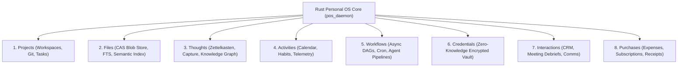

# Domain Plan: Personal OS (Rust-Based Agentic Life Operating System)

**Plan ID**: `domain_personal_os`  
**Capability Rating**: `Domain Specialist (P-OS-01 to P-OS-12)`  
**Parent Plan**: [Parent Master Plan](../master/parent-master-plan/concise.md)  
**Version**: `1.0.0`  
**Runtime Core**: Safe Rust (2021 Edition, `tokio`, `sqlx`, `tantivy`, `axum`)

---

## 1. Executive Summary

**Personal OS** is a unified, offline-first, privacy-preserving, high-performance agentic operating system written in Rust. It serves as your personal cognitive co-pilot, orchestrating eight core dimensions of personal and professional life:



The system is designed on top of the **Neutron Binary Percipience Parent Master Context Framework**, inheriting cryptographic Merkle audit ledgers, AST token compression, and surgical rollback guarantees.

---

## 2. Quick Links

- **[concise.md](./concise.md)**: Concise layerable domain specification (~220 lines), frontmatter, wire contracts, and agent manifests.
- **[detailed.md](./detailed.md)**: Comprehensive architectural blueprint, Rust crate decomposition, database schemas, cryptographic invariants, and verification harnesses (~1500 lines).
- **[MANIFEST.yaml](./MANIFEST.yaml)**: Machine-readable plan metadata, version hash ledger, and phase roadmap.
- **[Parent Master Plan](../master/parent-master-plan/README.md)**: Master orchestration framework standard.

---

## 3. The Eight Core Pillars

| # | Domain Pillar | Primary Responsibility | Key Rust Crates |
|---|---|---|---|
| 1 | **Projects** | Workspaces, Git repositories, worktrees, sprint tasks, issues | `git2`, `petgraph`, `ignore` |
| 2 | **Files** | Universal file ingestion, BLAKE3 CAS, semantic chunking, directory watcher | `notify`, `tantivy`, `blake3`, `infer` |
| 3 | **Thoughts** | Quick capture, second brain, atomic notes, bidirectional links | `pulldown-cmark`, `sqlite-vec`, `petgraph` |
| 4 | **Activities** | Calendar sync, time tracking, habit logs, health/focus telemetry | `chrono`, `icalendar`, `rrule` |
| 5 | **Workflows** | Declarative async task DAGs, event triggers, cron jobs, subagent loops | `tokio`, `async-trait`, `cron` |
| 6 | **Credentials** | Encrypted vault, OS keychain, zero-knowledge master key, ephemeral leases | `ring`, `argon2`, `keyring`, `zeroize` |
| 7 | **Interactions** | Personal CRM, contacts, communication logs, meeting debriefs | `rusqlite` / `sqlx`, `vcard4`, `serde_json` |
| 8 | **Purchases** | Financial ledger, receipt OCR/parser, subscription renewal alerts | `rust_decimal`, `tesseract` / OCR bridge |

---

## 4. Architectural Invariants

1. **Local-First & Zero-Knowledge**: All databases, vectors, and blobs reside on local NVMe storage. Cloud sync is end-to-end encrypted; credentials never leave the local vault in plaintext.
2. **Memory Scrubbing**: Sensitive secrets in RAM implement `zeroize::ZeroizeOnDrop` to prevent cold-boot or heap-dump exfiltration.
3. **Sub-15ms Hybrid Search**: Queries across thoughts, files, and projects execute simultaneously via Tantivy BM25 and vector embeddings with reciprocal rank fusion (RRF).
4. **Sandboxed Subagent Execution**: Agent operations run with least-privilege capability tokens, with human-in-the-loop (HITL) approval required for external mutation, credential export, or financial transactions.

---

## 5. Getting Started & CLI Usage

```bash
# Verify the plan within the Percipience framework
./.nb/bin/percipience audit

# Build the Rust Personal OS daemon and CLI
cargo build --workspace --release

# Initialize personal data vault
pos vault init --keychain

# Start local agentic daemon & web dashboard
pos daemon start --port 8080
```
