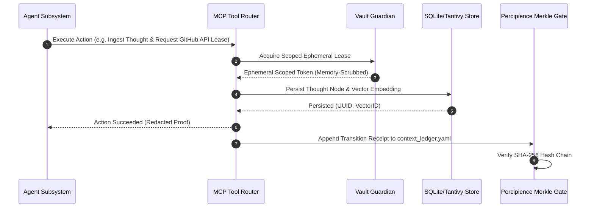

# Layerable Context Engineering Plan: Personal OS (Rust-Based Agentic System)

### Executive Overview & Domain Grounding
This document is the **Layerable Domain-Specific Context Engineering Plan** for **Personal OS**, an offline-first, high-concurrency, memory-safe agentic life operating system implemented in Rust. Layered directly onto the **Parent Master Context Engineering Framework** (`.nb/plan/master/parent-master-plan/concise.md`), it governs eight interconnected dimensions of digital life coordinated by an autonomous meta-orchestrator:

1. **Projects Subsystem**: Unified management of local code repositories, tasks, milestones, git worktrees, and external issue trackers.
2. **Files Subsystem**: BLAKE3 content-addressable storage (CAS), directory watching (`notify`), text extraction, and hybrid vector/FTS indexing.
3. **Thoughts Subsystem**: Quick captures, daily journals, Zettelkasten knowledge graphs, bidirectional wikilinks, and associative semantic recall.
4. **Activities Subsystem**: Calendar sync (iCal/CalDAV), habit tracking, time-blocking, health metrics, and priority scheduling.
5. **Workflows Subsystem**: Declarative async task DAGs (`tokio`), durable saga execution, cron scheduling, event triggers, and autonomous agent loops.
6. **Credentials Subsystem**: Zero-knowledge encrypted secret vault (Argon2id + ChaCha20-Poly1305), OS keychain integration, and memory-zeroized ephemeral leasing.
7. **Interactions Subsystem**: Personal CRM, communication history (email, chat, meetings), context injection, and relationship follow-ups.
8. **Purchases Subsystem**: Plain-text financial ledger, receipt OCR parsing, recurring subscription auditing, and budget alerts.
9. **Meta-Orchestrator Subsystem**: Semantic intent classification, priority routing, dynamic agent instantiation, and multi-processor coordination.

---

## 1. Domain-Specific Quad-Space Mapping

```
.
├── context/
│   ├── contracts/
│   │   ├── personal_os_wire_contracts.yaml    # Core IPC/REST/MCP schemas across 8 pillars
│   │   ├── vault_security_contract.json       # Memory-scrubbed secret request/lease contract
│   │   └── hybrid_search_contract.json        # Combined Tantivy/Vector query wire contract
│   └── rules/
│       ├── personal_os_invariants.md          # Zero-trust, offline-first, RAM scrubbing rules
│       └── financial_safety_rules.md          # HITL requirements for payments and purchases
├── agentic/
│   ├── custom/agents/
│   │   ├── agent_meta_orchestrator.yaml       # Semantic intent classification & processor router
│   │   ├── agent_project_orchestrator.yaml    # Workspace, git worktree & task coordinator
│   │   ├── agent_file_indexer.yaml            # BLAKE3 CAS & document parser daemon
│   │   ├── agent_thought_synthesizer.yaml     # Knowledge graph & associative thought agent
│   │   ├── agent_activity_scheduler.yaml      # Calendar, habits & telemetry manager
│   │   ├── agent_workflow_runner.yaml         # Async DAG execution & routine trigger agent
│   │   ├── agent_vault_guardian.yaml          # Security gatekeeper & capability lease broker
│   │   ├── agent_crm_manager.yaml             # Contacts & communication debrief specialist
│   │   └── agent_finance_tracker.yaml         # Expenses, subscriptions & receipt auditor
│   └── custom/workflows/
│       ├── wf_orchestrate_request.yaml        # Multi-processor request orchestration
│       ├── wf_morning_brief.yaml              # Daily agenda, high-priority tasks & reminders
│       ├── wf_file_ingestion.yaml             # Watcher event -> OCR -> Tantivy/Vector index
│       └── wf_vault_credential_lease.yaml     # Scoped agent auth -> Zeroize drop workflow
├── workplace/
│   ├── modules/
│   │   ├── pos_core/                          # Shared domain entities, events & state store
│   │   ├── pos_storage/                       # SQLite WAL + Tantivy + BLAKE3 blob storage & MPSC batcher
│   │   ├── pos_vault/                         # Ring, Argon2id, Keyring, Zeroize & BIP-39 recovery
│   │   ├── pos_orchestrator/                  # Meta-orchestration layer & processor registry
│   │   ├── pos_agents/                        # Actor runtime, MCP client/server & sandbox executor
│   │   ├── pos_server/                        # Axum HTTP/WebSocket API daemon
│   │   └── pos_cli/                           # Canonical `pos` terminal binary (clap v4)
│   ├── shared/
│   │   └── contracts/                         # Rust stubs & serde DTOs generated from context
│   └── templates/bridge/
│       └── virtual_vault_mock_bridge.rs       # In-memory mock HSM for headless CI testing
└── user/
    ├── inputs/
    │   ├── personal_os_profile.yaml           # User configuration, monitored paths, preferences
    │   └── credentials_seed.yaml.enc          # Master-encrypted seed configuration
    └── hitl/
        ├── financial_authorization_queue.md   # Manual sign-off required for purchases/leases
        └── poisoning_quarantine.md            # Quarantined malformed inputs or agent hallucinations
```

---

## 2. Wire Contracts & Safety Invariants

### 2.1. Primary Wire Contract (`context/contracts/personal_os_wire_contracts.yaml`)
```yaml
schema_version: "1.0.0"
domain: "personal_os"
service_endpoint: "/api/v1/personal_os"
pillars:
  - id: "orchestration"
    methods: ["classify_intent", "route_request", "register_processor", "aggregate_results"]
  - id: "projects"
    methods: ["list_workspaces", "sync_repo", "create_worktree", "track_task"]
  - id: "files"
    methods: ["ingest_file", "search_hybrid", "deduplicate", "get_blob"]
  - id: "thoughts"
    methods: ["capture_note", "query_graph", "find_associative", "daily_journal"]
  - id: "activities"
    methods: ["sync_calendar", "log_habit", "record_telemetry", "get_daily_agenda"]
  - id: "workflows"
    methods: ["dispatch_dag", "schedule_cron", "poll_routine", "list_runs"]
  - id: "credentials"
    methods: ["acquire_lease", "revoke_lease", "store_secret", "audit_access"]
  - id: "interactions"
    methods: ["log_interaction", "search_contacts", "record_meeting_debrief"]
  - id: "purchases"
    methods: ["ingest_receipt", "audit_subscriptions", "log_expense", "budget_status"]
```

### 2.2. Non-Negotiable Invariants (`context/rules/personal_os_invariants.md`)
1. **Zero-Knowledge Memory Invariant**: Plaintext credentials MUST never be written to persistent logs, disk files, or LLM context windows. All memory holding secrets must implement `Zeroize` and drop immediately after use.
2. **Human-in-the-Loop Financial & Secret Gate**: Autonomous agents are strictly forbidden from committing financial transactions or exporting private keys without interactive user authorization in `user/hitl/`.
3. **Local-First Offline Resilience**: All indexing, searching, and routine executions must function completely disconnected from external internet services. LLM features gracefully degrade to local embeddings and deterministic rule fallbacks when offline.
4. **Cryptographic State Tamper Evidence**: All state-modifying actions (vault access, workspace mutations, expense records) must append an immutable Merkle entry to `context_ledger.yaml`.

---

## 3. Specialized Subagent Manifests (`agentic/custom/agents/`)

| Agent ID | Name | Model Tier | Core Responsibility |
|---|---|---|---|
| `agent_meta_orchestrator` | Meta-Orchestrator | Tier_A | Intent classification, processor routing, resource allocation, synthesis |
| `agent_project_orchestrator` | Project Manager | Tier_A | Workspaces, Git branch lifecycle, task decomposition, milestone tracking |
| `agent_file_indexer` | File Indexer | Tier_B | BLAKE3 hashing, OCR, Tantivy tokenization, vector chunking |
| `agent_thought_synthesizer` | Second Brain Synthesizer | Tier_A | Zettelkasten linking, concept extraction, daily reflection synthesis |
| `agent_activity_scheduler` | Life & Schedule Balancer | Tier_B | Calendar conflict resolution, habit streak tracking, focus blocks |
| `agent_workflow_runner` | Workflow Engine | Tier_C/B | Async Tokio DAG execution, cron triggers, event loop routing |
| `agent_vault_guardian` | Vault Security Guardian | Tier_A | Argon2id key derivation, secret lease granting, log redaction |
| `agent_crm_manager` | Interaction & CRM Agent | Tier_B | Meeting summary extraction, follow-up cadence, contact graph |
| `agent_finance_tracker` | Financial & Purchase Auditor | Tier_A/B | Receipt parsing, subscription renewal warnings, envelope budgets |

---

## 4. Virtual Emulation & End-to-End Test Loopback



---

## 5. CLI Execution & Verification Protocol

```bash
# 1. Verify and audit context ledger
./.nb/bin/percipience audit

# 2. Check Rust workspace compilation and safety invariants
cargo check --workspace
cargo test --workspace

# 3. Test memory scrubbing and vault isolation in headless simulator
cargo test -p pos_vault --test zeroize_scrubbing_test

# 4. Run automated CI/CD triad verification
./.nb/bin/percipience cicd run
```
