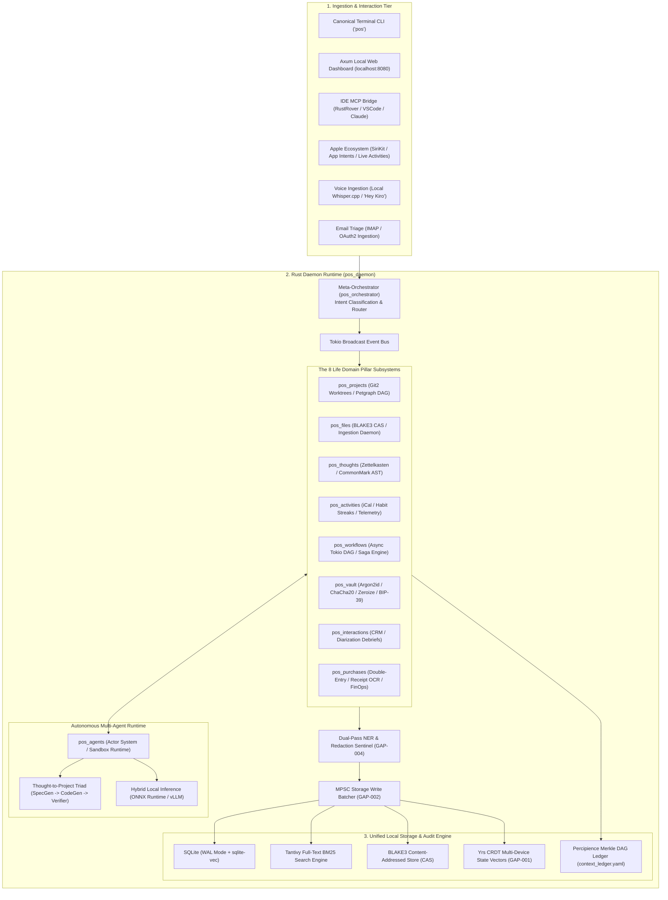
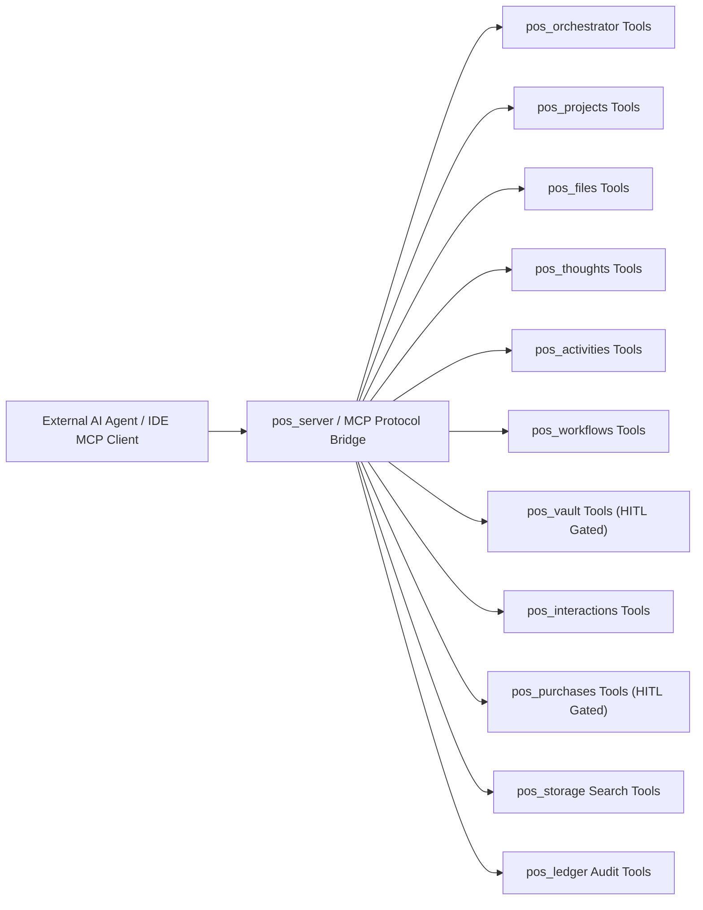

# Personal OS: Comprehensive Architectural Specification & Implementation Blueprint

### Executive Overview & Strategic Motivation
Modern knowledge workers and software engineers grapple with fragmented digital lives spread across dozens of siloed applications: project management tools (Linear, Jira, GitHub), note-taking systems (Obsidian, Notion), cloud file storage (Drive, Dropbox), calendars, password managers (1Password, Bitwarden), communications (Email, Slack, Discord), and personal accounting apps. 

**Personal OS** is an autonomous, unified, local-first, privacy-guaranteed personal operating system built from the ground up in high-performance, 100% safe **Rust (2021 edition)**. Operating as a headless daemon with an interactive CLI, Model Context Protocol (MCP) servers, native Apple SiriKit/App Intents, and a local web dashboard, Personal OS functions as an intelligent cognitive companion that continuously indexes, connects, synthesizes, and acts upon eight foundational pillars of life: **Projects, Files, Thoughts, Activities, Workflows, Credentials, Interactions, and Purchases**, unified by an autonomous **Meta-Orchestrator**.

By anchoring directly into the **Neutron Binary Percipience Context Engineering Framework**, Personal OS guarantees:
1. **Zero-Knowledge Privacy (Invariant 1)**: Plaintext credentials, auth secrets, and personal thoughts remain strictly local; cloud sync is end-to-end encrypted with zero plaintext leakage to logs, prompts, or databases.
2. **Sub-15ms Hybrid Retrieval**: Lightning-fast retrieval across unstructured notes, files, and interactions via Tantivy BM25 lexical search + dense vector HNSW embeddings.
3. **Deterministic Actor & Durable Saga Execution (GAP-005)**: Safe asynchronous multi-agent coordination powered by Tokio, Petgraph, and crash-resilient saga transactions with compensating journals.
4. **Tamper-Evident State Chaining (Invariant 4)**: Cryptographic Merkle DAG ledger (`context_ledger.yaml`) tracking every state mutation, vault access, and financial audit block.
5. **Air-Gapped Offline Resilience (Invariant 3)**: Full indexing, search, local quantized inference (ONNX/vLLM), and routine execution persist completely disconnected from external internet services.

---

## 1. End-to-End System Architecture

The following topology outlines the multi-tiered architecture from edge ingestion to durable storage and cryptographic auditing:



---

## 2. Rust Workspace Crate Decomposition

The codebase is organized as a Cargo workspace with strict module boundaries, zero circular dependencies, and 100% safe Rust (`cargo geiger` verified):

```
workplace/modules/
├── pos_core/               # Shared domain primitives, events, errors, and configuration
├── pos_storage/            # SQLite connection pool, sqlite-vec, Tantivy index, BLAKE3 CAS & Write Batcher
├── pos_vault/              # Zero-knowledge encryption, OS Keychain, Zeroize memory hygiene & BIP-39 recovery
├── pos_projects/           # Git2 integration, worktree manager, task DAG, issue tracker bridges
├── pos_files/              # Notify watcher, text/PDF extraction, OCR pipeline, CAS GC
├── pos_thoughts/           # Markdown AST parser, Zettelkasten wikilink graph, associative recall
├── pos_activities/         # iCalendar / CalDAV parser, habit tracker, time tracking, telemetry logs
├── pos_workflows/          # Tokio async DAG runner, durable saga state machine, cron scheduler
├── pos_interactions/       # Contact entity graph, communication ledger, meeting diarization summarizer
├── pos_purchases/          # Double-entry ledger, receipt parser, subscription detector, budget tracker
├── pos_orchestrator/       # Meta-orchestration layer: intent classifier, priority router, processor registry
├── pos_agents/             # Subagent actor system, sandbox runtime (Bubblewrap/Seatbelt), tool routing
├── pos_server/             # Axum HTTP/WebSocket API daemon & native MCP protocol server
└── pos_cli/                # Production CLI binary (`pos`) built with `clap` v4
```

### Cargo.toml Root Definition
```toml
[workspace]
resolver = "2"
members = [
    "workplace/modules/pos_core",
    "workplace/modules/pos_storage",
    "workplace/modules/pos_vault",
    "workplace/modules/pos_projects",
    "workplace/modules/pos_files",
    "workplace/modules/pos_thoughts",
    "workplace/modules/pos_activities",
    "workplace/modules/pos_workflows",
    "workplace/modules/pos_interactions",
    "workplace/modules/pos_purchases",
    "workplace/modules/pos_orchestrator",
    "workplace/modules/pos_agents",
    "workplace/modules/pos_server",
    "workplace/modules/pos_cli",
]

[workspace.dependencies]
tokio = { version = "1.35", features = ["full"] }
serde = { version = "1.0", features = ["derive"] }
serde_json = "1.0"
serde_yaml = "0.9"
chrono = { version = "0.4", features = ["serde"] }
thiserror = "1.0"
anyhow = "1.0"
tracing = "0.1"
sqlx = { version = "0.7", features = ["runtime-tokio", "sqlite"] }
blake3 = "1.5"
uuid = { version = "1.10", features = ["v4", "serde"] }
async-trait = "0.1"
zeroize = { version = "1.7", features = ["derive"] }
petgraph = "0.6"
parking_lot = "0.12"
lru = "0.12"
jsonschema = "0.18"
```

---

## 3. Deep Dive into the Domain Pillar Engines & Enhancements

### 3.1. Pillar 1: Projects (`pos_projects`) & Thought-to-Project Triad
- **Scope**: Centralized control of code repositories, branch lifecycles, ephemeral subagent worktrees, and task backlogs.
- **Capabilities & Enhancements**:
  - Auto-discovery of local git repositories in configured root paths (`~/Projects`, `~/RustroverProjects`).
  - **Isolated Git2 Worktree Provisioning**: Safely isolates autonomous subagents into temporary Git worktrees (`.worktrees/agentic-*`) to generate, test, and benchmark changes without dirtying the working directory.
  - **Thought-to-Project Integration**: Directly consumes structured project proposals generated from Zettelkasten thoughts, mapping milestones into a `petgraph::DirectedGraph` task DAG.
  - Bidirectional task synchronization with GitHub/Linear via Model Context Protocol (MCP).

### 3.2. Pillar 2: Files (`pos_files`) & Content-Addressed Storage
- **Scope**: Continuous ingestion, hashing, chunking, and dual-indexing of documents, media, code, and downloads.
- **Capabilities & Enhancements**:
  - Background file system watcher (`notify-rs`) monitoring drop folders (`~/Downloads`, `~/Documents/Inbox`).
  - **BLAKE3 Content-Addressable Storage (CAS)**: Cryptographically deduplicates every ingested blob.
  - **MPSC Storage Write Batching (GAP-002)**: Ingestion tasks publish to an in-memory queue; a dedicated Tokio coordinator batches SQLite WAL and Tantivy commits every 100ms or 50 items, eliminating disk write contention.
  - **Generational CAS Garbage Collection (GAP-009)**: Periodically marks active blob hashes across SQLite tables and prunes unreferenced physical files.
  - Multimodal text extraction: PDF (`pdf-extract`), Markdown/Text, and OCR images via native Apple Vision framework or Tesseract.

### 3.3. Pillar 3: Thoughts (`pos_thoughts`) & Zettelkasten Knowledge Graph
- **Scope**: Frictionless capture of fleeting ideas, atomic notes, daily journal reflections, and conceptual synthesis.
- **Capabilities & Enhancements**:
  - Instant quick-capture CLI (`pos thought "New concept on zero-copy IPC"`), Siri voice memo, or Apple Watch intent.
  - Automatic bidirectional wikilink parsing (`[[Concept A]] -> [[Concept B]]`) via CommonMark AST traversal.
  - **Actionability & Ambiguity Evaluation Engine**: Evaluates raw thoughts using local SLM classifiers to determine whether a note is a fleeting thought, an atomic knowledge snippet, or an actionable project proposal.
  - **Associative Recall & Semantic Clustering**: Discovers cross-domain connections using cosine similarity of embeddings stored in `sqlite-vec`.

### 3.4. Pillar 4: Activities (`pos_activities`) & Proactive Intelligence
- **Scope**: Temporal awareness, calendar synchronization, habit tracking, and focus telemetry.
- **Capabilities & Enhancements**:
  - Bidirectional CalDAV / iCalendar synchronization (Apple Calendar, Google Calendar).
  - **Circadian Rhythm & Energy Load Optimization**: Aligns complex engineering tasks with peak cognitive windows and flags meeting fatigue.
  - Habit tracking with streak computation, velocity curves, and predictive reminder triggers.
  - System telemetry: Aggregates active window focus time, git commit frequency, and pomodoro intervals.

### 3.5. Pillar 5: Workflows (`pos_workflows`) & Durable Saga Engine
- **Scope**: Deterministic multi-step automation, recurring routines, and multi-agent coordination.
- **Capabilities & Enhancements**:
  - Declarative YAML/JSON workflow DAG specifications (nodes, dependencies, conditions, timeouts).
  - **Durable Saga Execution (GAP-005)**: Multi-step workflows implement forward operations and reverse compensating transactions with persistent journal checkpoints in SQLite. Crashes or process kills trigger automatic forward-recovery or rollback.
  - Recurring scheduled routines:
    - **Morning Brief Routine (07:30 AM)**: Pulls today's calendar, top 3 project priorities, overdue tasks, weather, and flagged emails.
    - **Evening Reflection Routine (18:30 PM)**: Prompts for daily reflection, tallies completed activities, updates habit streaks, and commits daily journal to git.
    - **Weekly Financial & Workspace Hygiene (Sunday 20:00 PM)**: Reconciles subscriptions, prunes stale git branches, backups vault.

### 3.6. Pillar 6: Credentials (`pos_vault`) & Zero-Knowledge Security
- **Scope**: Cryptographically secure, zero-leak secrets management for API keys, personal tokens, private keys, and passwords.
- **Capabilities & Enhancements**:
  - Master key derivation via Argon2id (memory cost: 64MB, time cost: 3 iterations).
  - Symmetric authenticated encryption via ChaCha20-Poly1305 and AES-256-GCM (`ring`).
  - **BIP-39 Vault Disaster Recovery (GAP-006)**: Generates a 24-word deterministic mnemonic seed phrase for vault recovery; supports optional Shamir Secret Sharing (M-of-N quorum recovery across trusted trustees).
  - **Ephemeral Agent Secret Leases**: Subagents request access to an API key; the vault issues a short-lived in-memory lease. The secret is wrapped in a type implementing `Zeroize` on drop and is scrubbed immediately from RAM.
  - **Dual-Pass NER & Redaction Sentinel (GAP-004)**: All outbound text (logs, stdout, LLM prompts) is scrubbed of PII and cryptographic secrets before transmission.

### 3.7. Pillar 7: Interactions (`pos_interactions`) & Meeting Intelligence
- **Scope**: Maintaining personal and professional relationship context, meeting debriefs, and communication touchpoints.
- **Capabilities & Enhancements**:
  - Contact entity profiles with communication channels, affiliation history, and key interaction logs.
  - **Entity Resolution & Deduplication (GAP-011)**: Uses TF-IDF, Jaro-Winkler, and cosine similarity to resolve duplicate contacts, email aliases, and corporate identities into canonical nodes.
  - **Meeting Diarization & Action Extraction**: Ingests meeting audio via Whisper diarization, automatically extracting key decisions, attendee commitments, and filing follow-up tasks into `pos_projects`.
  - Follow-up Cadence Sentinel: Alerts when key relationships have exceeded user-defined touchpoint thresholds.

### 3.8. Pillar 8: Purchases (`pos_purchases`) & Autonomous Personal FinOps
- **Scope**: Personal financial clarity, expense tracking, and subscription auditing.
- **Capabilities & Enhancements**:
  - Double-entry accounting data model (Assets, Liabilities, Expenses, Income) compatible with plain-text accounting principles (hledger/beancount).
  - Automated invoice extraction via `email_triage` and OCR parsing of vendor, date, line items, and tax.
  - **Recurring Subscription Sentinel**: Detects recurring merchant charges, warns about upcoming auto-renewals, and flags price increases.
  - **Strict HITL Financial Gate (Invariant 2)**: Mandatory human confirmation for any transaction or subscription authorization > $0.00 queued in `user/hitl/financial_authorization_queue.md`.

### 3.9. Meta-Orchestrator (`pos_orchestrator`)
- **Scope**: High-throughput cognitive request classification, intent routing, and processor registration.
- **Capabilities**:
  - LRU-cached pattern classification (`classifier.rs`) resolving intents in < 2ms.
  - Multi-processor routing pipeline (`router.rs`) coordinating synchronous and asynchronous domain engines.
  - Type-safe execution payloads and result envelopes (`types.rs`) with schema validation via `jsonschema`.

---

## 4. Enhanced Unified Storage Schemas (`pos_storage`)

All persistent structured state is stored in SQLite operating in `WAL` mode (`PRAGMA journal_mode = WAL; PRAGMA synchronous = NORMAL; PRAGMA foreign_keys = ON;`).

```sql
-- 1. Projects & Tasks
CREATE TABLE IF NOT EXISTS projects (\n    id TEXT PRIMARY KEY,\n    name TEXT NOT NULL,\n    root_path TEXT UNIQUE,\n    repo_url TEXT,\n    status TEXT NOT NULL CHECK (status IN ('active', 'paused', 'completed', 'archived')),\n    metadata JSON NOT NULL DEFAULT '{}',\n    created_at DATETIME NOT NULL DEFAULT CURRENT_TIMESTAMP,\n    updated_at DATETIME NOT NULL DEFAULT CURRENT_TIMESTAMP\n);\n\nCREATE TABLE IF NOT EXISTS project_tasks (\n    id TEXT PRIMARY KEY,\n    project_id TEXT NOT NULL REFERENCES projects(id) ON DELETE CASCADE,\n    title TEXT NOT NULL,\n    description TEXT,\n    priority INTEGER NOT NULL DEFAULT 2, -- 1=Urgent, 2=High, 3=Normal, 4=Low\n    status TEXT NOT NULL CHECK (status IN ('todo', 'in_progress', 'review', 'done', 'canceled')),\n    due_date DATETIME,\n    created_at DATETIME NOT NULL DEFAULT CURRENT_TIMESTAMP\n);\n\n-- 2. Files & Blob Store\nCREATE TABLE IF NOT EXISTS files (\n    id TEXT PRIMARY KEY,\n    blake3_hash TEXT NOT NULL,\n    file_path TEXT NOT NULL,\n    mime_type TEXT NOT NULL,\n    size_bytes INTEGER NOT NULL,\n    extracted_text TEXT,\n    embedding BLOB, -- 768/1536 float array (sqlite-vec)\n    last_indexed_at DATETIME NOT NULL DEFAULT CURRENT_TIMESTAMP\n);\n\nCREATE TABLE IF NOT EXISTS cas_references (\n    blake3_hash TEXT PRIMARY KEY,\n    ref_count INTEGER NOT NULL DEFAULT 1,\n    size_bytes INTEGER NOT NULL,\n    last_referenced_at DATETIME NOT NULL DEFAULT CURRENT_TIMESTAMP\n);\n\n-- 3. Thoughts & Knowledge Graph\nCREATE TABLE IF NOT EXISTS thoughts (\n    id TEXT PRIMARY KEY,\n    title TEXT NOT NULL,\n    content_raw TEXT NOT NULL,\n    thought_type TEXT NOT NULL CHECK (thought_type IN ('fleeting', 'journal', 'atomic', 'concept')),\n    tags JSON NOT NULL DEFAULT '[]',\n    actionability_score REAL DEFAULT 0.0,\n    ambiguity_score REAL DEFAULT 1.0,\n    embedding BLOB,\n    created_at DATETIME NOT NULL DEFAULT CURRENT_TIMESTAMP,\n    updated_at DATETIME NOT NULL DEFAULT CURRENT_TIMESTAMP\n);\n\nCREATE TABLE IF NOT EXISTS thought_links (\n    source_thought_id TEXT NOT NULL REFERENCES thoughts(id) ON DELETE CASCADE,\n    target_thought_id TEXT NOT NULL REFERENCES thoughts(id) ON DELETE CASCADE,\n    link_type TEXT NOT NULL DEFAULT 'wikilink',\n    PRIMARY KEY (source_thought_id, target_thought_id)\n);\n\n-- 4. Activities & Habits\nCREATE TABLE IF NOT EXISTS activities (\n    id TEXT PRIMARY KEY,\n    title TEXT NOT NULL,\n    category TEXT NOT NULL CHECK (category IN ('meeting', 'focus_work', 'exercise', 'personal', 'rest')),\n    start_time DATETIME NOT NULL,\n    end_time DATETIME,\n    source TEXT NOT NULL DEFAULT 'manual',\n    notes TEXT\n);\n\nCREATE TABLE IF NOT EXISTS habits (\n    id TEXT PRIMARY KEY,\n    name TEXT NOT NULL,\n    frequency TEXT NOT NULL CHECK (frequency IN ('daily', 'weekly', 'custom')),\n    target_count INTEGER NOT NULL DEFAULT 1,\n    current_streak INTEGER NOT NULL DEFAULT 0,\n    created_at DATETIME NOT NULL DEFAULT CURRENT_TIMESTAMP\n);\n\nCREATE TABLE IF NOT EXISTS habit_logs (\n    id TEXT PRIMARY KEY,\n    habit_id TEXT NOT NULL REFERENCES habits(id) ON DELETE CASCADE,\n    completed_at DATETIME NOT NULL DEFAULT CURRENT_TIMESTAMP,\n    value INTEGER NOT NULL DEFAULT 1\n);\n\n-- 5. Durable Sagas & Workflows (GAP-005)\nCREATE TABLE IF NOT EXISTS saga_workflows (\n    saga_id TEXT PRIMARY KEY,\n    name TEXT NOT NULL,\n    status TEXT NOT NULL CHECK (status IN ('pending', 'running', 'completed', 'compensating', 'failed')),\n    current_step INTEGER NOT NULL DEFAULT 0,\n    total_steps INTEGER NOT NULL,\n    context_data JSON NOT NULL DEFAULT '{}',\n    created_at DATETIME NOT NULL DEFAULT CURRENT_TIMESTAMP,\n    updated_at DATETIME NOT NULL DEFAULT CURRENT_TIMESTAMP\n);\n\nCREATE TABLE IF NOT EXISTS saga_steps (\n    step_id TEXT PRIMARY KEY,\n    saga_id TEXT NOT NULL REFERENCES saga_workflows(saga_id) ON DELETE CASCADE,\n    step_index INTEGER NOT NULL,\n    action_name TEXT NOT NULL,\n    status TEXT NOT NULL CHECK (status IN ('pending', 'executed', 'compensated', 'failed')),\n    forward_payload JSON NOT NULL,\n    compensate_payload JSON NOT NULL,\n    executed_at DATETIME\n);\n\n-- 6. Credentials & Vault Leases (Zero Plaintext Secrets)\nCREATE TABLE IF NOT EXISTS vault_items (\n    id TEXT PRIMARY KEY,\n    name TEXT UNIQUE NOT NULL,\n    item_type TEXT NOT NULL CHECK (item_type IN ('api_key', 'password', 'token', 'certificate')),\n    encrypted_payload BLOB NOT NULL,\n    nonce BLOB NOT NULL,\n    salt BLOB NOT NULL,\n    created_at DATETIME NOT NULL DEFAULT CURRENT_TIMESTAMP,\n    updated_at DATETIME NOT NULL DEFAULT CURRENT_TIMESTAMP\n);\n\nCREATE TABLE IF NOT EXISTS vault_leases (\n    lease_id TEXT PRIMARY KEY,\n    vault_item_id TEXT NOT NULL REFERENCES vault_items(id),\n    agent_id TEXT NOT NULL,\n    expires_at DATETIME NOT NULL,\n    revoked BOOLEAN NOT NULL DEFAULT 0\n);\n\n-- 7. Embedding Versioning & Migration (GAP-003)\nCREATE TABLE IF NOT EXISTS embedding_versions (\n    version_id TEXT PRIMARY KEY,\n    model_name TEXT NOT NULL,\n    dimension INTEGER NOT NULL,\n    metric TEXT NOT NULL CHECK (metric IN ('cosine', 'dot', 'euclidean')),\n    is_active BOOLEAN NOT NULL DEFAULT 0,\n    created_at DATETIME NOT NULL DEFAULT CURRENT_TIMESTAMP\n);\n\n-- 8. PII Anonymization Token Vault (GAP-004)\nCREATE TABLE IF NOT EXISTS pii_token_vault (\n    token_id TEXT PRIMARY KEY,\n    entity_type TEXT NOT NULL,\n    encrypted_real_value BLOB NOT NULL,\n    nonce BLOB NOT NULL,\n    created_at DATETIME NOT NULL DEFAULT CURRENT_TIMESTAMP\n);\n```

---

## 5. Security & System Invariants Protocols

Personal OS strictly adheres to the 10 non-negotiable platform rules specified in [`.nb/context/rules/personal_os_invariants.md`](file:///Users/lakhwinder/RustroverProjects/nb_antwalk/.nb/context/rules/personal_os_invariants.md):

```
┌────────────────────────────────────────────────────────────────────────┐
│ THE 10 NON-NEGOTIABLE INVARIANTS                                      │
├────────────────────────────────────────────────────────────────────────┤
│ 1. Zero-Knowledge Memory      │ Plaintext secrets never in logs, DB or prompts │
│ 2. HITL Financial/Secret Gate │ Strict human approval for tx > $0 & key export │
│ 3. Local-First Resilience     │ 100% operational offline without internet      │
│ 4. Tamper Evidence            │ All mutations append to Merkle DAG ledger      │
│ 5. Memory Safety              │ 100% safe Rust (zero unsafe blocks in app)     │
│ 6. Least-Privilege Execution  │ Capability tokens & Bubblewrap sandboxing      │
│ 7. Privacy Boundaries         │ 30-day soft-delete & automated CAS pruning     │
│ 8. Idempotency & Crash Safety │ SQLite WAL & durable saga transaction journals │
│ 9. Rate Limiting & Quotas     │ Ingestion & agent thread token-bucket limits   │
│ 10. Dual-Pass Egress Filter   │ Outbound PII tokenization & regex sanitization │
└────────────────────────────────────────────────────────────────────────┘
```

### 5.1. Memory Sanitization & Zeroize
All cryptographic keys, decrypted secrets, and temporary tokens are held in a specialized wrapper:
```rust
use zeroize::{Zeroize, ZeroizeOnDrop};

#[derive(Zeroize, ZeroizeOnDrop)]
pub struct SecretBuffer {
    inner: Vec<u8>,
}
```
When a `SecretBuffer` leaves its execution scope, its underlying memory allocation is explicitly scrubbed with zeroes via hardware-inviolable compiler intrinsics, preventing memory disclosure via core dumps or heap analysis.

### 5.2. Egress Redaction Sentinel & Dual-Pass NER (GAP-004)
Before any text is passed to an LLM provider, CLI console, or webhook, it passes through `RedactionSentinel`:
1. Collects hashes/prefixes of all active vault secrets.
2. Applies dual-pass Named Entity Recognition (NER) to detect names, SSNs, credit cards, and addresses, replacing them with cryptographic surrogates (`[TOKEN_PERSON_01]`).
3. Applies Shannon entropy and regex scans for API keys (`sk-[a-zA-Z0-9]{48}`, `ghp_[a-zA-Z0-9]{36}`, etc.).
4. Replaces matches with `[REDACTED_SECRET:<hash_prefix>]`.

### 5.3. Human-In-The-Loop (HITL) Safety Gate
The following actions cannot be executed autonomously by background subagents:
- Executing financial payments or finalizing purchases above $0.00.
- Exporting raw private keys or permanent vault master credentials.
- Deleting root workspaces or executing uncommitted destructive `git reset --hard` outside ephemeral subagent worktrees.

When triggered, actions enter `user/hitl/personal_os_approvals.md` and await interactive user confirmation.

---

## 6. Comprehensive Model Context Protocol (MCP) Capabilities

Personal OS exposes an enterprise-grade Model Context Protocol (MCP) interface allowing external AI platforms (RustRover, VSCode, Claude Desktop, Cursor, and custom agent orchestrators) to securely sense, query, and act upon personal state. The server operates over local standard I/O (`pos daemon --mcp-stdio`) or encrypted WebSockets / HTTP SSE (`pos daemon --port 8080`).

### 6.1. Module-by-Module MCP Tool Taxonomy



#### Module 0: Meta-Orchestrator (`pos_orchestrator`)
| MCP Tool Name | Parameters | Description |
|:---|:---|:---|
| `pos_orchestrator_classify_intent` | `request_text: string`, `context?: object` | Runs semantic classification (<2ms LRU cache) returning primary/secondary intent, complexity, and suggested processors. |
| `pos_orchestrator_route_request` | `request_text: string`, `options?: object` | Synthesizes an execution plan and dispatches multi-processor coordination. |
| `pos_orchestrator_list_processors` | `filter_category?: string` | Enumerates registered processors, resource requirements, and health telemetry. |

#### Pillar 1: Projects & Tasks (`pos_projects`)
| MCP Tool Name | Parameters | Description |
|:---|:---|:---|
| `pos_project_status` | `project_id?: string` | Returns active Git branches, pending tasks, recent commits, and dirty status. |
| `pos_project_create_worktree` | `project_id: string`, `branch_name: string` | Provisions an isolated Git worktree (`.worktrees/agentic-*`) for safe subagent code generation. |
| `pos_project_execute_task_dag` | `project_id: string`, `task_ids: string[]` | Executes a Petgraph task DAG with dependency ordering and parallelism. |
| `pos_project_sync_external` | `project_id: string`, `provider: "github" \| "linear"` | Synchronizes issues, PRs, and milestones bidirectionally. |

#### Pillar 2: Files & Blob Storage (`pos_files`)
| MCP Tool Name | Parameters | Description |
|:---|:---|:---|
| `pos_file_ingest` | `file_path: string`, `tags?: string[]` | Ingests file, computes BLAKE3 hash, extracts text/OCR, and queues for hybrid indexing. |
| `pos_file_get_metadata` | `blake3_hash: string` | Retrieves file size, MIME type, reference count, and indexing status. |
| `pos_file_query_cas_blob` | `blake3_hash: string`, `max_bytes?: number` | Safely inspects extracted text content of a content-addressed blob. |
| `pos_file_run_ocr` | `blake3_hash: string`, `language?: string` | Triggers native Apple Vision or Tesseract OCR on stored image/PDF. |

#### Pillar 3: Thoughts & Zettelkasten Knowledge Graph (`pos_thoughts`)
| MCP Tool Name | Parameters | Description |
|:---|:---|:---|
| `pos_capture_thought` | `title: string`, `content: string`, `tags?: string[]` | Quick-captures fleeting notes or concepts, automatically parsing wikilinks (`[[...]]`). |
| `pos_thought_query_graph` | `root_thought_id: string`, `depth?: number` | Returns traversed graph topology with inward and outward wikilinks. |
| `pos_thought_find_associative` | `thought_id: string`, `limit?: number` | Discovers conceptual similarities using cosine distance over vector embeddings. |
| `pos_thought_evaluate_actionability` | `thought_id: string` | Evaluates actionability and ambiguity scores via local SLM classifier. |
| `pos_thought_synthesize_project` | `thought_id: string`, `target_repo?: string` | Converts an actionable thought into an executable project proposal and task DAG. |

#### Pillar 4: Activities, Calendar & Habits (`pos_activities`)
| MCP Tool Name | Parameters | Description |
|:---|:---|:---|
| `pos_get_agenda` | `date?: string` | Returns scheduled meetings, focus work blocks, and deadlines for a given date. |
| `pos_activity_schedule_block` | `title: string`, `start_time: string`, `duration_min: number`, `category: string` | Allocates a focus session, checking for calendar conflicts. |
| `pos_habit_log` | `habit_id: string`, `value?: number` | Logs a habit completion and updates current streaks. |
| `pos_habit_get_status` | `filter?: string` | Returns all active habits, success rates, and predictive burnout warnings. |
| `pos_telemetry_get_focus_metrics` | `start_date: string`, `end_date: string` | Aggregates daily focus time, git commit frequency, and productivity curves. |

#### Pillar 5: Workflows & Sagas (`pos_workflows`)
| MCP Tool Name | Parameters | Description |
|:---|:---|:---|
| `pos_workflow_dispatch_saga` | `saga_name: string`, `steps: object[]` | Dispatches a crash-resilient saga workflow with forward and compensating transactions. |
| `pos_workflow_get_saga_status` | `saga_id: string` | Queries step execution, journal checkpoints, and rollback status. |
| `pos_workflow_trigger_routine` | `routine: "morning_brief" \| "evening_reflection" \| "weekly_hygiene"` | Triggers a scheduled routine and returns synthesized markdown output. |

#### Pillar 6: Credentials & Vault (`pos_vault`)
| MCP Tool Name | Parameters | Description |
|:---|:---|:---|
| `pos_request_credential_lease` | `secret_name: string`, `duration_sec: number` | Requests an ephemeral, RAM-zeroized secret lease. (Gated by capability token). |
| `pos_vault_revoke_lease` | `lease_id: string` | Revokes an active credential lease and triggers immediate memory zeroization. |
| `pos_vault_audit_trail` | `secret_name?: string`, `limit?: number` | Returns Merkle-signed audit records of secret accesses and leases. |

#### Pillar 7: Interactions & CRM (`pos_interactions`)
| MCP Tool Name | Parameters | Description |
|:---|:---|:---|
| `pos_interaction_log_meeting` | `title: string`, `raw_transcript: string`, `attendees: string[]` | Ingests transcript, auto-extracts decisions/commitments, and files action items. |
| `pos_contact_get_context` | `contact_id_or_name: string` | Returns historical interaction timeline, notes, and upcoming follow-ups. |
| `pos_contact_resolve_entity` | `query_name: string`, `email?: string` | Resolves contact aliases and duplicate entities via TF-IDF / Jaro-Winkler. |

#### Pillar 8: Purchases & FinOps (`pos_purchases`)
| MCP Tool Name | Parameters | Description |
|:---|:---|:---|
| `pos_log_expense` | `vendor: string`, `amount: number`, `category: string` | Logs an expense transaction to the double-entry accounting ledger. |
| `pos_purchase_ingest_receipt` | `file_path: string` | Extracts vendor, date, line items, and tax from an invoice/receipt. |
| `pos_purchase_audit_subscriptions` | `none` | Audits recurring subscriptions, renewal dates, and flags 15%+ price increases. |
| `pos_purchase_resolve_hitl` | `approval_id: string`, `decision: "approve" \| "reject"` | Submits user decision for financial operations queued in `user/hitl/`. |

#### Unified Storage & Search (`pos_storage`)
| MCP Tool Name | Parameters | Description |
|:---|:---|:---|
| `pos_search` | `query: string`, `filter_pillar?: string`, `limit?: number` | Sub-15ms hybrid search combining Tantivy BM25 + Vector HNSW embeddings via RRF. |
| `pos_search_lexical_bm25` | `query: string`, `fields?: string[]` | Direct lexical search against Tantivy inverted indexes. |
| `pos_search_semantic_vector` | `vector: number[]`, `limit?: number` | Direct dense vector similarity search in `sqlite-vec`. |

#### Subagent Sandbox & Runtime (`pos_agents`)
| MCP Tool Name | Parameters | Description |
|:---|:---|:---|
| `pos_agent_spawn_sandbox` | `agent_id: string`, `capabilities: string[]`, `working_dir: string` | Spawns a sandboxed agent inside a Bubblewrap / Seatbelt container. |
| `pos_agent_query_status` | `instance_id: string` | Returns CPU, RAM, and capability telemetry for active subagent instances. |

#### Cryptographic Ledger (`context_ledger.yaml`)
| MCP Tool Name | Parameters | Description |
|:---|:---|:---|
| `pos_ledger_verify_chain` | `none` | Performs cryptographic audit of all Merkle blocks, verifying BLAKE3/SHA-256 hashes. |
| `pos_ledger_get_latest_block` | `none` | Returns the index, timestamp, state transition hash, and signature of latest block. |

---

### 6.2. MCP Read-Only Resources (`pos://` URI Scheme)

External MCP clients can inspect system state in real-time via standard MCP resource subscriptions:

| Resource URI Scheme | Description | Access Control / Invariant Protection |
|:---|:---|:---|
| `pos://orchestrator/routing-plans/{id}` | Execution plan and progress for active orchestration runs. | Read-Only |
| `pos://projects/{project_id}/status` | Active Git branch, commit log, and pending task counts. | Read-Only |
| `pos://projects/{project_id}/tasks` | Full task DAG representation in JSON. | Read-Only |
| `pos://files/blobs/{blake3_hash}` | Content-addressed file text extraction. | Read-Only |
| `pos://thoughts/{thought_id}` | Full Markdown AST representation of a thought node. | Read-Only |
| `pos://thoughts/graph` | Global wikilink graph nodes and edges. | Read-Only |
| `pos://activities/today` | Today's scheduled calendar events and time-blocks. | Read-Only |
| `pos://habits/streaks` | Active habit tracking matrix and streak tallies. | Read-Only |
| `pos://workflows/sagas/{saga_id}` | Saga transaction journal and current checkpoint state. | Read-Only |
| `pos://vault/active-leases` | Metadata list of active secret leases (Secret plaintext is NEVER exposed; Invariant 1). | Metadata Only |
| `pos://interactions/{contact_id}` | Full contact timeline and interaction history. | Read-Only |
| `pos://purchases/subscriptions` | Active recurring SaaS and utility subscriptions. | Read-Only |
| `pos://purchases/budget-status` | Monthly budget envelopes and spending velocity. | Read-Only |
| `pos://hitl/pending` | List of actions awaiting interactive human approval. | Read-Only |
| `pos://ledger/blocks/{block_id}` | Cryptographic Merkle block and state transition attestation. | Immutable |

---

### 6.3. Standard MCP Prompts

Personal OS registers built-in prompt workflows that IDEs and agents can invoke with one click:
1. `pos_morning_brief_prompt`: Synthesizes today's calendar, top 3 priorities, and pending reviews.
2. `pos_evening_reflection_prompt`: Reviews today's accomplishments, completed habits, and prepares tomorrow's backlog.
3. `pos_thought_to_project_prompt`: Guides the user through decomposing a fleeting thought into a verifiable project specification.
4. `pos_meeting_debrief_prompt`: Structures raw meeting transcripts into key decisions, follow-ups, and action assignments.
5. `pos_subscription_audit_prompt`: Identifies redundant subscriptions and drafts price negotiation or cancellation requests.

---

### 6.4. Native Apple Ecosystem Integration (`native_apple_siri`)

- Swift-Rust FFI bindings compiled via `uniffi-rs`.
- Interactive SiriKit App Intents for hands-free voice commands.
- Dynamic Island and Lock Screen Live Activities displaying real-time focus timers and autonomous CI/CD pipeline progress.

---

## 7. Phased Implementation Roadmap

### Phase 1: Foundation & Unified Storage Engine (Weeks 1–4)
- Set up Cargo workspace and crate hierarchy (`pos_core`, `pos_storage`, `pos_orchestrator`).
- Implement SQLite connection pool, WAL mode, migrations, and BLAKE3 CAS blob store.
- Integrate Tantivy search engine and `sqlite-vec` extension bindings.
- Implement Tokio MPSC Write Batcher ([`GAP-002`](file:///Users/lakhwinder/RustroverProjects/nb_antwalk/.nb/plan/architecture/storage_write_batching.md)).

### Phase 2: Security Enclave Vault & Privacy (Weeks 5–6)
- Implement `pos_vault` with Argon2id, ChaCha20-Poly1305, and `keyring-rs`.
- Implement memory scrubbing (`ZeroizeOnDrop`) and ephemeral lease manager.
- Implement BIP-39 24-word seed phrase recovery and Shamir secret sharing ([`GAP-006`](file:///Users/lakhwinder/RustroverProjects/nb_antwalk/.nb/plan/architecture/vault_disaster_recovery.md)).
- Implement `RedactionSentinel` and dual-pass NER scrubber ([`GAP-004`](file:///Users/lakhwinder/RustroverProjects/nb_antwalk/.nb/plan/architecture/pii_anonymization.md)).

### Phase 3: The 8 Domain Pillar Engines (Weeks 7–14)
- Implement `pos_projects` with Git2 worktree isolation and task Petgraph.
- Implement `pos_files` with `notify-rs` watcher and CAS Garbage Collection ([`GAP-009`](file:///Users/lakhwinder/RustroverProjects/nb_antwalk/.nb/plan/architecture/cas_garbage_collection.md)).
- Implement `pos_thoughts` with CommonMark AST parser and wikilink graph.
- Implement `pos_activities` with iCal/CalDAV sync and habit streak engine.
- Implement `pos_interactions` with meeting diarization and entity resolution ([`GAP-011`](file:///Users/lakhwinder/RustroverProjects/nb_antwalk/.nb/plan/architecture/entity_resolution.md)).
- Implement `pos_purchases` with double-entry accounting and receipt OCR.
- Implement `thought_to_project` autonomous CI/CD triad.

### Phase 4: Agent Runtime, Sagas & Local Inference (Weeks 15–18)
- Implement `pos_workflows` with Tokio DAG runner and Durable Sagas ([`GAP-005`](file:///Users/lakhwinder/RustroverProjects/nb_antwalk/.nb/plan/architecture/saga_workflow_durability.md)).
- Implement `pos_agents` with multi-model cognitive router and Bubblewrap/Seatbelt sandboxing ([`GAP-008`](file:///Users/lakhwinder/RustroverProjects/nb_antwalk/.nb/plan/architecture/subagent_sandboxing.md)).
- Implement ONNX Runtime and vLLM local quantized inference ([`GAP-007`](file:///Users/lakhwinder/RustroverProjects/nb_antwalk/.nb/plan/architecture/inference_engine_optimization.md)).

### Phase 5: Client Surfaces, Sync & Release (Weeks 19–24)
- Implement `pos_cli` with Clap v4 for comprehensive terminal control.
- Implement `pos_server` with Axum HTTP/WebSocket API daemon and native MCP server exposing all tools and resources.
- Implement Yrs CRDT multi-device sync ([`GAP-001`](file:///Users/lakhwinder/RustroverProjects/nb_antwalk/.nb/plan/architecture/crdt_conflict_resolution.md)) and mDNS discovery ([`GAP-010`](file:///Users/lakhwinder/RustroverProjects/nb_antwalk/.nb/plan/architecture/mobile_peer_discovery.md)).
- Implement Swift-Rust SiriKit / App Intents bridge.
- Link all mutations to the immutable Percipience Merkle ledger (`context_ledger.yaml`).
