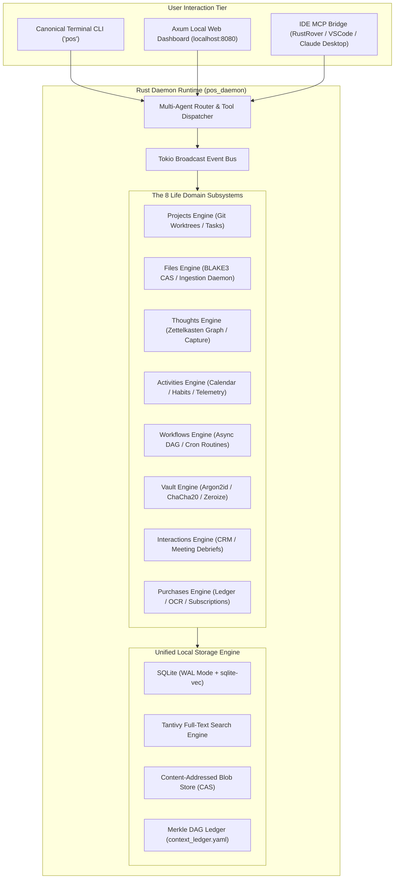

# Personal OS: Comprehensive Architectural Specification & Implementation Blueprint

### Executive Overview & Strategic Motivation
Modern knowledge workers and engineers grapple with fragmented digital lives spread across dozens of siloed applications: project management tools (Linear, Jira, GitHub), note-taking systems (Obsidian, Notion), cloud file storage (Drive, Dropbox), calendars, password managers (1Password, Bitwarden), communications (Email, Slack, Discord), and personal accounting apps. 

**Personal OS** is an autonomous, unified, local-first, privacy-guaranteed personal operating system built from the ground up in high-performance **Rust (2021 edition)**. Operating as a headless daemon with an interactive CLI, Model Context Protocol (MCP) servers, and local web dashboard, Personal OS functions as an intelligent cognitive companion that continuously indexes, connects, synthesizes, and acts upon eight foundational pillars of life: **Projects, Files, Thoughts, Activities, Workflows, Credentials, Interactions, and Purchases**.

By anchoring into the **Neutron Binary Percipience Context Engineering Framework**, Personal OS guarantees:
1. **Zero-Knowledge Privacy**: Plaintext credentials and personal thoughts remain strictly local; cloud sync is end-to-end encrypted.
2. **Sub-15ms Hybrid Retrieval**: Lightning-fast retrieval across unstructured notes, files, and interactions via Tantivy BM25 + Vector HNSW embeddings.
3. **Deterministic Actor & Workflow Execution**: Safe asynchronous multi-agent coordination powered by Tokio, Petgraph, and structured wire contracts.
4. **Tamper-Evident State Chaining**: Cryptographic Merkle DAG ledger tracking every state transition, financial record, and vault access.

---

## 1. High-Level System Architecture



---

## 2. Rust Workspace Crate Decomposition

The codebase is organized as a Cargo workspace with high cohesion, strict isolation, and zero circular dependencies:

```
workplace/modules/
├── pos_core/               # Shared domain primitives, events, errors, and configuration
├── pos_storage/            # SQLite connection pool, sqlite-vec embeddings, Tantivy index, and BLAKE3 CAS
├── pos_vault/              # Zero-knowledge encryption, OS Keychain bindings, Zeroize memory hygiene
├── pos_projects/           # Git2 integration, worktree manager, task DAG, issue tracker bridges
├── pos_files/              # Notify filesystem watcher, text/PDF extraction, OCR pipeline, deduplication
├── pos_thoughts/           # Markdown AST parser, Zettelkasten wikilink graph, associative recall
├── pos_activities/         # iCalendar / CalDAV parser, habit tracker, time tracking, telemetry logs
├── pos_workflows/          # Tokio async DAG runner, cron scheduler, routine orchestrator (Morning Brief)
├── pos_interactions/       # Contact entity graph, communication ledger, meeting transcript summarizer
├── pos_purchases/          # Double-entry ledger, receipt parser, subscription detector, budget tracker
├── pos_agents/             # Subagent actor system, LLM client cascading (Tier A/B/C), tool calling
├── pos_server/             # Axum HTTP/WebSocket API daemon & MCP protocol server
└── pos_cli/                # Production CLI binary (`pos`) built with `clap` v4
```

### Cargo.toml Root Definition
```toml
[workspace]
resolver = "2"
members = [
    "workplace/modules/pos_core",
    "workplace/modules/pos_storage",
    "workplace/modules/pos_vault",
    "workplace/modules/pos_projects",
    "workplace/modules/pos_files",
    "workplace/modules/pos_thoughts",
    "workplace/modules/pos_activities",
    "workplace/modules/pos_workflows",
    "workplace/modules/pos_interactions",
    "workplace/modules/pos_purchases",
    "workplace/modules/pos_agents",
    "workplace/modules/pos_server",
    "workplace/modules/pos_cli",
]

[workspace.dependencies]
tokio = { version = "1.35", features = ["full"] }
serde = { version = "1.0", features = ["derive"] }
serde_json = "1.0"
chrono = { version = "0.4", features = ["serde"] }
thiserror = "1.0"
tracing = "0.1"
sqlx = { version = "0.7", features = ["runtime-tokio", "sqlite"] }
blake3 = "1.5"
uuid = { version = "1.10", features = ["v4", "serde"] }
async-trait = "0.1"
zeroize = { version = "1.7", features = ["derive"] }
```

---

## 3. Deep Dive into the Eight Core Pillars

### 3.1. Pillar 1: Projects (Workspaces, Repos, Tasks)
- **Scope**: Centralized control of code repositories, branch life-cycles, ephemeral subagent worktrees, and project task backlogs.
- **Capabilities**:
  - Auto-discovery of local git repositories in configured root paths (e.g. `~/Projects`, `~/RustroverProjects`).
  - Integration with GitHub/Linear/Jira via MCP for bidirectional task synchronization.
  - Ephemeral Git worktree management for subagents running code generation or refactoring tasks in isolated branches.
  - Task dependency resolution via `petgraph::DirectedGraph`.

### 3.2. Pillar 2: Files (CAS, Search & Ingestion Daemon)
- **Scope**: Continuous ingestion and indexing of documents, downloads, screenshots, media, and code files.
- **Capabilities**:
  - Background file system watcher (`notify-rs`) monitoring drop folders (`~/Downloads`, `~/Documents/Inbox`).
  - Content-Addressable Storage (CAS): Files are hashed with BLAKE3 to prevent duplicate storage.
  - Multimodal text extraction: PDF (`pdf-extract`), Markdown/Text, images via OCR (`tesseract` or native Apple Vision framework on macOS).
  - Dual Indexing: Tantivy inverted index for exact lexical/BM25 queries, alongside dense vector embeddings stored in `sqlite-vec` for semantic queries.

### 3.3. Pillar 3: Thoughts (Second Brain & Zettelkasten)
- **Scope**: Frictionless capture of fleeting ideas, atomic notes, daily journal reflections, and conceptual synthesis.
- **Capabilities**:
  - Instant quick-capture CLI (`pos thought "New idea about zero-copy serialization"`).
  - Automatic bidirectional wikilink parsing (`[[Concept A]] -> [[Concept B]]`) via CommonMark AST traversal.
  - Semantic knowledge graph generation: Finds associative, non-obvious connections between disparate thoughts using cosine similarity of thought embeddings.
  - Automated Daily Journal & Weekly Synthesis: Synthesizes completed tasks, logged thoughts, and interactions into a coherent daily summary.

### 3.4. Pillar 4: Activities (Calendar, Habits & Telemetry)
- **Scope**: Complete temporal awareness, scheduling, habit tracking, and focus telemetry.
- **Capabilities**:
  - iCalendar / CalDAV bidirectional synchronization (Apple Calendar, Google Calendar).
  - Time-blocking assistant: Allocates focused work periods based on active project deadlines and circadian peak hours.
  - Habit tracker with streak computation, reminder triggers, and completion velocity curves.
  - System telemetry: Aggregates active application usage, git commit activity, and focus session timestamps.

### 3.5. Pillar 5: Workflows (Async DAGs & Routines)
- **Scope**: Deterministic automation and multi-agent pipeline execution.
- **Capabilities**:
  - Declarative YAML/JSON workflow DAG specifications (nodes, dependencies, conditions, timeouts).
  - Async execution engine using Tokio task pools with exponential backoff retry.
  - Recurring scheduled routines:
    - **Morning Brief Routine (07:30 AM)**: Pulls today's calendar, top 3 project priorities, overdue tasks, weather, and flagged emails.
    - **Evening Reflection Routine (18:30 PM)**: Prompts for daily reflection, tallies completed activities, updates habit streaks, and commits daily journal to git.
    - **Weekly Financial & Workspace Hygiene (Sunday 20:00 PM)**: Reconciles subscriptions, prunes stale git branches, backups vault.

### 3.6. Pillar 6: Credentials (Zero-Knowledge Encrypted Vault)
- **Scope**: Cryptographically secure, zero-leak secrets management for API keys, personal tokens, private keys, and passwords.
- **Capabilities**:
  - Master key derivation via Argon2id (memory cost: 64MB, time cost: 3 iterations).
  - Symmetric authenticated encryption via ChaCha20-Poly1305 or AES-256-GCM (`ring`).
  - macOS Keychain / Linux Secret Service / Windows Credential Manager integration via `keyring-rs`.
  - **Ephemeral Agent Secret Leases**: Subagents request access to an API key; the vault issues a short-lived in-memory lease. The secret is wrapped in a type implementing `Zeroize` on drop and is scrubbed immediately from RAM.
  - **Zero-Leak Redaction Filter**: Any stdout/stderr, log entry, or LLM prompt buffer is intercepted and scanned against known vault secret hashes before egress.

### 3.7. Pillar 7: Interactions (Personal CRM & Comms)
- **Scope**: Maintaining personal and professional relationship context, meeting notes, and communication touchpoints.
- **Capabilities**:
  - Contact profiles with communication channels, affiliation history, and key interaction logs.
  - Meeting Debrief Engine: Ingests raw meeting transcripts or bullet points, auto-extracts action items, attendees, decisions, and files tasks into Pillar 1 (Projects).
  - Follow-up Cadence Sentinel: Alerts when key relationships have exceeded user-defined touchpoint thresholds (e.g. "Haven't spoken to collaborator X in 30 days").

### 3.8. Pillar 8: Purchases (Expenses, Subscriptions & Receipts)
- **Scope**: Personal financial clarity, expense tracking, and subscription auditing.
- **Capabilities**:
  - Double-entry accounting data model (Assets, Liabilities, Expenses, Income) compatible with plain-text accounting principles (hledger/beancount).
  - Receipt image ingestion: OCR extracts vendor, date, line items, tax, and total amount.
  - Recurring Subscription Auditor: Detects recurring merchant charges, warns about upcoming auto-renewals, and computes annualized burn rate.
  - Budget Envelope Alerts: Real-time warnings when discretionary spending categories approach configured limits.

---

## 4. SQLite Schema Specification (`pos_storage`)

All persistent structured state is stored in a high-performance SQLite database operating in `WAL` mode (`PRAGMA journal_mode = WAL; PRAGMA synchronous = NORMAL; PRAGMA foreign_keys = ON;`).

```sql
-- 1. Projects & Tasks
CREATE TABLE IF NOT EXISTS projects (
    id TEXT PRIMARY KEY,
    name TEXT NOT NULL,
    root_path TEXT UNIQUE,
    repo_url TEXT,
    status TEXT NOT NULL CHECK (status IN ('active', 'paused', 'completed', 'archived')),
    metadata JSON NOT NULL DEFAULT '{}',
    created_at DATETIME NOT NULL DEFAULT CURRENT_TIMESTAMP,
    updated_at DATETIME NOT NULL DEFAULT CURRENT_TIMESTAMP
);

CREATE TABLE IF NOT EXISTS project_tasks (
    id TEXT PRIMARY KEY,
    project_id TEXT NOT NULL REFERENCES projects(id) ON DELETE CASCADE,
    title TEXT NOT NULL,
    description TEXT,
    priority INTEGER NOT NULL DEFAULT 2, -- 1=Urgent, 2=High, 3=Normal, 4=Low
    status TEXT NOT NULL CHECK (status IN ('todo', 'in_progress', 'review', 'done', 'canceled')),
    due_date DATETIME,
    created_at DATETIME NOT NULL DEFAULT CURRENT_TIMESTAMP
);

-- 2. Files & Blob Store
CREATE TABLE IF NOT EXISTS files (
    id TEXT PRIMARY KEY,
    blake3_hash TEXT NOT NULL,
    file_path TEXT NOT NULL,
    mime_type TEXT NOT NULL,
    size_bytes INTEGER NOT NULL,
    extracted_text TEXT,
    embedding BLOB, -- 768/1536 float array (sqlite-vec)
    last_indexed_at DATETIME NOT NULL DEFAULT CURRENT_TIMESTAMP
);

-- 3. Thoughts & Knowledge Graph
CREATE TABLE IF NOT EXISTS thoughts (
    id TEXT PRIMARY KEY,
    title TEXT NOT NULL,
    content_raw TEXT NOT NULL,
    thought_type TEXT NOT NULL CHECK (thought_type IN ('fleeting', 'journal', 'atomic', 'concept')),
    tags JSON NOT NULL DEFAULT '[]',
    embedding BLOB,
    created_at DATETIME NOT NULL DEFAULT CURRENT_TIMESTAMP,
    updated_at DATETIME NOT NULL DEFAULT CURRENT_TIMESTAMP
);

CREATE TABLE IF NOT EXISTS thought_links (
    source_thought_id TEXT NOT NULL REFERENCES thoughts(id) ON DELETE CASCADE,
    target_thought_id TEXT NOT NULL REFERENCES thoughts(id) ON DELETE CASCADE,
    link_type TEXT NOT NULL DEFAULT 'wikilink',
    PRIMARY KEY (source_thought_id, target_thought_id)
);

-- 4. Activities & Habits
CREATE TABLE IF NOT EXISTS activities (
    id TEXT PRIMARY KEY,
    title TEXT NOT NULL,
    category TEXT NOT NULL CHECK (category IN ('meeting', 'focus_work', 'exercise', 'personal', 'rest')),
    start_time DATETIME NOT NULL,
    end_time DATETIME,
    source TEXT NOT NULL DEFAULT 'manual', -- 'ical', 'manual', 'tracker'
    notes TEXT
);

CREATE TABLE IF NOT EXISTS habits (
    id TEXT PRIMARY KEY,
    name TEXT NOT NULL,
    frequency TEXT NOT NULL CHECK (frequency IN ('daily', 'weekly', 'custom')),
    target_count INTEGER NOT NULL DEFAULT 1,
    current_streak INTEGER NOT NULL DEFAULT 0,
    created_at DATETIME NOT NULL DEFAULT CURRENT_TIMESTAMP
);

CREATE TABLE IF NOT EXISTS habit_logs (
    id TEXT PRIMARY KEY,
    habit_id TEXT NOT NULL REFERENCES habits(id) ON DELETE CASCADE,
    completed_at DATETIME NOT NULL DEFAULT CURRENT_TIMESTAMP,
    value INTEGER NOT NULL DEFAULT 1
);

-- 5. Workflows & Schedules
CREATE TABLE IF NOT EXISTS workflows (
    id TEXT PRIMARY KEY,
    name TEXT NOT NULL,
    dag_definition JSON NOT NULL,
    schedule_cron TEXT,
    is_active BOOLEAN NOT NULL DEFAULT 1,
    last_run_at DATETIME,
    last_status TEXT CHECK (last_status IN ('success', 'failed', 'running', NULL))
);

-- 6. Credentials (Zero Plaintext Secrets)
CREATE TABLE IF NOT EXISTS vault_items (
    id TEXT PRIMARY KEY,
    name TEXT UNIQUE NOT NULL,
    item_type TEXT NOT NULL CHECK (item_type IN ('api_key', 'password', 'token', 'certificate')),
    encrypted_payload BLOB NOT NULL,
    nonce BLOB NOT NULL,
    salt BLOB NOT NULL,
    created_at DATETIME NOT NULL DEFAULT CURRENT_TIMESTAMP,
    updated_at DATETIME NOT NULL DEFAULT CURRENT_TIMESTAMP
);

CREATE TABLE IF NOT EXISTS vault_leases (
    lease_id TEXT PRIMARY KEY,
    vault_item_id TEXT NOT NULL REFERENCES vault_items(id),
    agent_id TEXT NOT NULL,
    expires_at DATETIME NOT NULL,
    revoked BOOLEAN NOT NULL DEFAULT 0
);

-- 7. Interactions & Contacts
CREATE TABLE IF NOT EXISTS contacts (
    id TEXT PRIMARY KEY,
    name TEXT NOT NULL,
    email TEXT,
    organization TEXT,
    role TEXT,
    notes TEXT,
    last_contacted_at DATETIME
);

CREATE TABLE IF NOT EXISTS interaction_logs (
    id TEXT PRIMARY KEY,
    contact_id TEXT REFERENCES contacts(id) ON DELETE SET NULL,
    interaction_type TEXT NOT NULL CHECK (interaction_type IN ('email', 'call', 'meeting', 'message')),
    summary TEXT NOT NULL,
    key_decisions JSON DEFAULT '[]',
    action_items JSON DEFAULT '[]',
    occurred_at DATETIME NOT NULL DEFAULT CURRENT_TIMESTAMP
);

-- 8. Purchases & Subscriptions
CREATE TABLE IF NOT EXISTS purchases (
    id TEXT PRIMARY KEY,
    vendor TEXT NOT NULL,
    amount_cents INTEGER NOT NULL,
    currency TEXT NOT NULL DEFAULT 'USD',
    category TEXT NOT NULL,
    receipt_blake3_hash TEXT,
    notes TEXT,
    purchased_at DATETIME NOT NULL DEFAULT CURRENT_TIMESTAMP
);

CREATE TABLE IF NOT EXISTS subscriptions (
    id TEXT PRIMARY KEY,
    vendor TEXT NOT NULL,
    amount_cents INTEGER NOT NULL,
    billing_period TEXT NOT NULL CHECK (billing_period IN ('monthly', 'quarterly', 'annual')),
    next_renewal_date DATE NOT NULL,
    category TEXT NOT NULL,
    is_active BOOLEAN NOT NULL DEFAULT 1
);
```

---

## 5. Security & Invariant Protocols

### 5.1. Memory Sanitization & Zeroize
All cryptographic keys, decrypted secrets, and temporary tokens are held in a specialized wrapper:
```rust
use zeroize::{Zeroize, ZeroizeOnDrop};

#[derive(Zeroize, ZeroizeOnDrop)]
pub struct SecretBuffer {
    inner: Vec<u8>,
}
```
When a `SecretBuffer` leaves its execution scope, its underlying memory allocation is explicitly scrubbed with zeroes via hardware-inviolable compiler intrinsics, preventing memory disclosure via dump analysis.

### 5.2. Egress Redaction Sentinel
Before any text is passed to an LLM provider, CLI console, or webhook, it passes through `RedactionSentinel`:
1. Collects hashes/prefixes of all active vault secrets.
2. Applies Shannon entropy and regex scans for API keys (`sk-[a-zA-Z0-9]{48}`, `ghp_[a-zA-Z0-9]{36}`, etc.).
3. Replaces matches with `[REDACTED_SECRET:<hash_prefix>]`.

### 5.3. Human-In-The-Loop (HITL) Safety Gate
The following actions cannot be executed autonomously by background subagents:
- Executing financial payments or finalizing purchases above $0.00.
- Exporting raw private keys or permanent vault master credentials.
- Deleting root workspaces or executing uncommitted destructive `git reset --hard` outside ephemeral subagent worktrees.

When triggered, actions enter `user/hitl/personal_os_approvals.md` and await interactive user confirmation.

---

## 6. Model Context Protocol (MCP) Integration

Personal OS exposes a native Model Context Protocol (MCP) server so that any external AI assistant (RustRover, VSCode, Claude Desktop, Cursor) can interact with your digital life:

### Available Tools Exposed via MCP:
- `pos_search(query: String, filter_pillar?: String)`: Hybrid Tantivy/vector search across files, thoughts, and contacts.
- `pos_capture_thought(title: String, content: String, tags: Vec<String>)`: Quick capture directly into the knowledge graph.
- `pos_project_status(project_name?: String)`: Returns active git branches, pending tasks, and recent commits.
- `pos_get_agenda(date?: String)`: Returns the scheduled activities, meetings, and deadlines for a given date.
- `pos_log_expense(vendor: String, amount: f64, category: String)`: Logs a purchase to the financial ledger.
- `pos_request_credential_lease(secret_name: String, duration_sec: u32)`: Requests an ephemeral, audited secret token.

---

## 7. Phased Implementation Roadmap

### Phase 1: Workspace & Storage Engine
- Set up Cargo workspace and crate hierarchy.
- Implement `pos_core` and `pos_storage` (SQLite pool, migrations, WAL mode, BLAKE3 CAS blob store).
- Integrate Tantivy search engine and `sqlite-vec` extension bindings.

### Phase 2: Security Enclave Vault
- Implement `pos_vault` with Argon2id, ChaCha20-Poly1305, and `keyring-rs`.
- Implement memory scrubbing (`ZeroizeOnDrop`) and ephemeral lease manager.
- Implement `RedactionSentinel` for outbound stream filtering.

### Phase 3: Domain Pillars Implementation
- Implement `pos_projects` (Git2 bindings, task petgraph).
- Implement `pos_files` (Notify watcher, PDF/Markdown parser).
- Implement `pos_thoughts` (Pulldown-cmark parser, bidirectional link graph).
- Implement `pos_activities` (iCal parser, habit streak engine).
- Implement `pos_interactions` (CRM contact graph, meeting note extractor).
- Implement `pos_purchases` (Double-entry engine, subscription monitor).

### Phase 4: Workflow Engine & Multi-Agent Actor Core
- Implement `pos_workflows` (Tokio DAG runner, cron scheduler).
- Implement built-in routines: Morning Brief, Evening Reflection, Weekly Hygiene.
- Implement `pos_agents` (Multi-model cascading across Tier A/B/C, MCP client/server).

### Phase 5: CLI, Web UI & Percipience Integration
- Implement `pos_cli` with Clap v4 for comprehensive terminal control.
- Implement `pos_server` with Axum and embedded HTMX/vanilla JS dashboard.
- Link state changes to `.nb/context/ledger/context_ledger.yaml` with SHA-256 Merkle block sealing.
