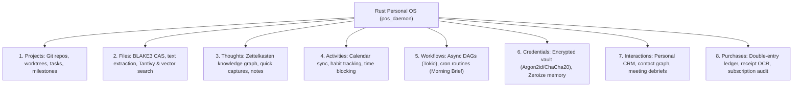

# nb_antwalk: Personal OS & Percipience Context Engineering

Welcome to **nb_antwalk**, an enterprise-grade agentic workspace powered by the **Neutron Binary Percipience Context Engineering Framework** and home to **Personal OS** — a unified, local-first, privacy-preserving agentic operating system written in Rust.

---

## 🧭 Navigation & Plans

The workspace is governed by layered context engineering plans:

- **[Master Context Engineering Framework](file:///Users/lakhwinder/RustroverProjects/nb_antwalk/.nb/plan/master/parent-master-plan/README.md)**: Universal orchestration, Merkle state chaining, AST token compression, and autonomous CI/CD triad.
- **[Personal OS Domain Plan (Overview)](file:///Users/lakhwinder/RustroverProjects/nb_antwalk/.nb/plan/personal_os/README.md)**: The domain plan for the Rust-based personal operating system.
  - **[Concise Specification](file:///Users/lakhwinder/RustroverProjects/nb_antwalk/.nb/plan/personal_os/concise.md)**: Concise layerable domain specification (~220 lines).
  - **[Detailed Implementation Plan](file:///Users/lakhwinder/RustroverProjects/nb_antwalk/.nb/plan/personal_os/detailed.md)**: Exhaustive architectural blueprint, Rust crate design, SQLite schema, security invariants, and roadmap.
  - **[Plan Manifest](file:///Users/lakhwinder/RustroverProjects/nb_antwalk/.nb/plan/personal_os/MANIFEST.yaml)**: Cryptographic manifest, capability matrix (P-OS-01 to P-OS-32), and phase breakdown.
- **[Domain Layer Template](file:///Users/lakhwinder/RustroverProjects/nb_antwalk/.nb/plan/templates/custom_domain_layer_template.md)**: Standard template for layering domain-specific plans.

---

## 🏛️ Personal OS: The Eight Pillars

Personal OS organizes personal and professional digital life across eight interconnected dimensions:



---

## 📦 Workspace Layout

```
.
├── .nb/                        # Percipience Context Engineering Platform
│   ├── bin/percipience        # Canonical gatekeeper executable
│   ├── context/               # Invariants, rules, contracts, and Merkle DAG ledgers
│   ├── core/                  # Percipience Python platform engines
│   └── plan/                  # Layered specifications
│       ├── master/            # Parent Master Context Engineering Framework
│       ├── personal_os/       # Personal OS Domain Architecture & Blueprint
│       └── templates/         # Domain layer templates
├── workplace/                 # Code implementations
│   ├── modules/               # Rust crates (pos_core, pos_vault, pos_storage, etc.)
│   └── docs/                  # Living documentation & architectural visualizers
└── user/                      # Customer-owned inputs, configurations, and HITL queues
    ├── inputs/                # MVS specifications & profile definitions
    └── hitl/                  # Human-in-the-loop approvals & poisoning quarantine
```

---

## 🚀 Quick Verification Commands

```bash
# Verify Merkle DAG integrity and context hierarchy
./.nb/bin/percipience audit
./.nb/bin/percipience validate --layered

# Build and test Rust Personal OS workspace
cargo check --workspace
cargo test --workspace
```
