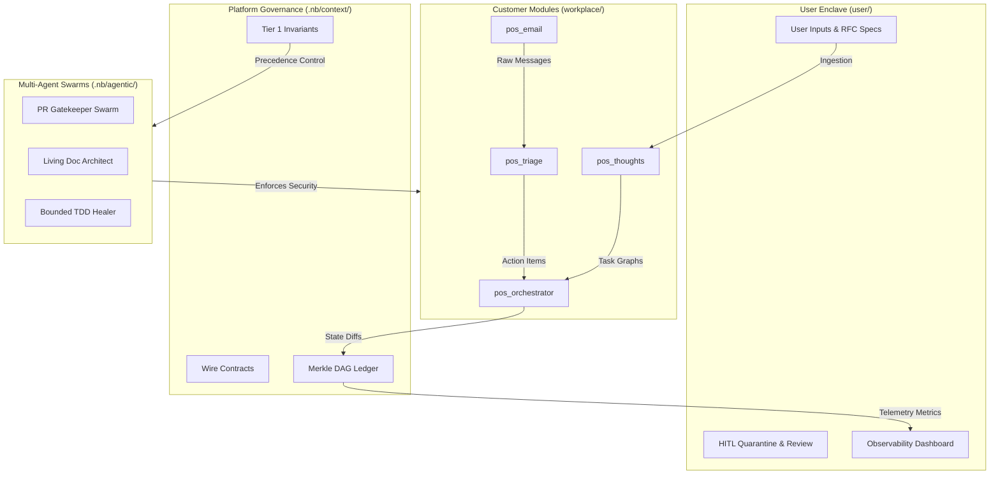
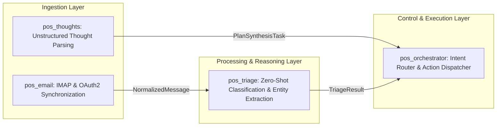
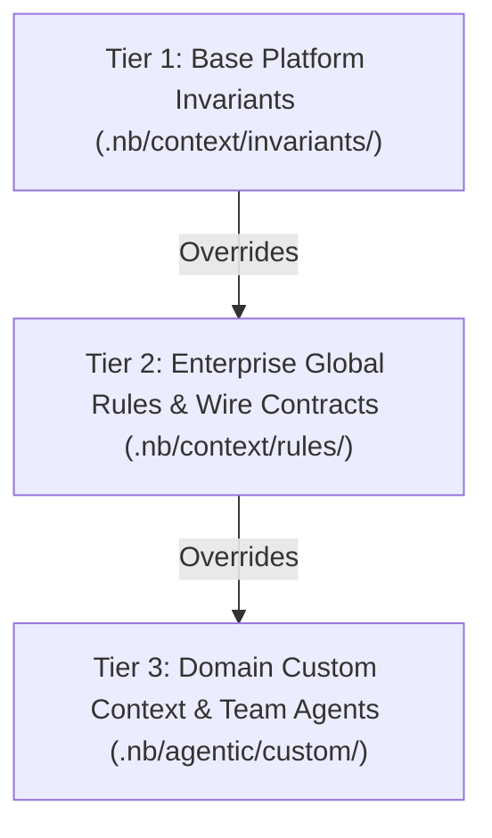

# Personal OS: System Architecture & C4 Topology

**Document Version**: 7.5.0  
**Living Doc Status**: Synchronized & Verified  
**Engine**: `LivingDocEngine` / `agent_living_doc_architect`  

---

## 1. System Context & Quad-Space Isolation

Personal OS operates under strict Quad-Space architectural isolation, separating untrusted user data, customer business logic, platform governance, and autonomous multi-agent swarms.

---

## 2. Microservice Module Topology

---

## 3. Layered Governance Precedence

