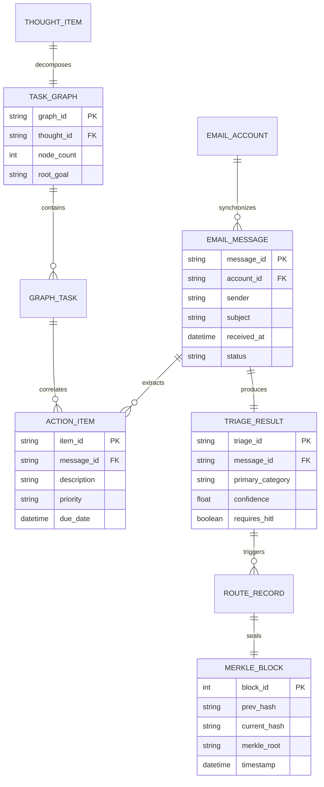

# Entity-Relationship Models & Schema Mappings

**Document Version**: 7.5.0  
**Living Doc Status**: Synchronized & Verified  
**Engine**: `LivingDocEngine` / `agent_living_doc_architect`  

---

## 1. Domain Entities & Contract Relationships

