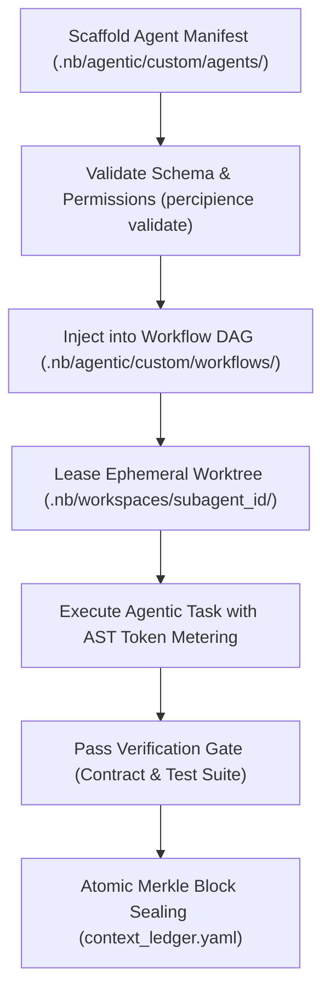

# Custom Agent Plugin Architecture & Healthy Integration Guide

**Document Version**: 7.5.0  
**Enforcement Level**: Standard Integration Pattern  
**Governing Core Engine**: `.nb/core/agent_plugin_engine.py` / `AgentPluginEngine`  

---

## 1. Overview & Purpose

Percipience provides an extensible custom agent plugin framework that allows engineering teams to introduce domain-specific intelligence (e.g. security auditors, code linting sentinels, specialized test scanners, living doc architects) into autonomous workflow DAGs while upholding strict platform boundaries.

---

## 2. The Healthy Plugin Integration Pattern

To prevent rogue agents from compromising repository integrity, every custom agent MUST follow the five-point Healthy Integration Pattern:

1. **Declarative Specification**: Every agent must define an external manifest in `.nb/agentic/custom/agents/<agent_name>.yaml` specifying `id`, `name`, `role`, `authority_tier` (`tier_b` or `tier_a`), `permissions`, and `assigned_workflows`.
2. **Ephemeral Worktree Sandboxing**: The agent executes within an isolated Git worktree (`.nb/workspaces/subagent_<id>`). It is physically barred from mutating the repository's root branch without passing an atomic verification gate.
3. **AST Token Budgeting**: The agent's prompts and outputs are monitored against strict per-task token quotas to prevent runaway cost loops.
4. **Pre/Post Contract Verification**: Inputs and outputs must strictly conform to versioned JSON Schema Draft-07 wire contracts under `.nb/context/contracts/`.
5. **Cryptographic State Sealing**: All actions, state mutations, and generated artifacts are sealed into the Merkle DAG chain as `RP_AGENT_<name>` recovery points. If an agent introduces anomalies, surgical rollback instantly restores clean state.

---

## 3. Custom Agent Plugin Lifecycle



---

## 4. Manifest Template (`agentic/templates/custom_agent_template.yaml`)

```yaml
id: "agent_custom_specialist"
name: "Domain Specialist Agent"
version: "1.0.0"
role: "Domain Specific Automated Reasoning & Validation"
authority_tier: "tier_b"
model_cascade_preference: "tier_b_high_throughput"
permissions:
  filesystem_read: ["workplace/modules/", "workplace/docs/"]
  filesystem_write: ["workplace/docs/"]
  network_egress: false
  subprocess_exec: false
assigned_workflows:
  - "wf_pr_gatekeeper"
wire_contracts:
  input: "common_schema.json"
  output: "common_schema.json"
```
