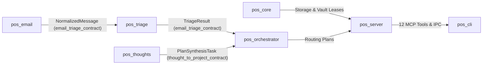

# Poly-Module Interface Catalog

**Document Version**: 7.5.0  
**Living Doc Status**: Synchronized & Verified  
**Engine**: `LivingDocEngine` / `agent_living_doc_architect`  

---

## 1. Module Inventory & Public API Surfaces

| Module ID | Domain & Responsibility | Public API Surface / Types | Dependencies |
| :--- | :--- | :--- | :--- |
| `pos_core` | Storage, Zero-Knowledge Vault, Privacy Redaction & Invariants | `Database`, `VaultManager`, `SecretBuffer`, `RedactionSentinel`, `HitlFinancialGate` | `rusqlite`, `zeroize`, `regex` |
| `pos_orchestrator` | Core Intent Routing, Subagent Leases & Pipeline Dispatch | `Router`, `RoutingPlan`, `IntentClassifier`, `ProcessorRegistry` | `tokio`, `async-channel`, `serde` |
| `pos_thoughts` | Thought Ingestion, Task Graph Decomposition & Project Synthesis | `ThoughtParser`, `TaskGraph`, `ActionabilityScorer`, `AmbiguityDetector` | `serde`, `serde_json`, `uuid` |
| `pos_email` | Multi-Account Ingestion, IMAP/OAuth2 Bridge & Account Management | `EmailSyncEngine`, `EmailStore`, `EmailAccount`, `RawMessage` | `async_trait`, `chrono`, `uuid` |
| `pos_triage` | Zero-Shot Classification, Action Item Extraction & Threat Scanning | `EmailClassifier`, `FeatureExtractor`, `EntityExtractor`, `PillarDispatcher` | `pos_email`, `regex`, `chrono` |
| `pos_server` | API Daemon & 12 Consolidated Model Context Protocol (MCP) Tools | `PersonalOsService`, `McpServer`, `McpToolDefinition` | `pos_core`, `pos_orchestrator`, `tokio` |
| `pos_cli` | Canonical Production CLI Binary (`pos`) for Terminal Management | `Cli`, `Commands`, `ThoughtCommands`, `ProjectCommands`, `FinanceCommands` | `clap`, `pos_server`, `tokio` |

---

## 2. Cross-Module Contract Bindings

---

## 3. Module Recovery Points & Verification

- `pos_core`: Current Verified Recovery Point `RP_CORE_001`
- `pos_orchestrator`: Current Verified Recovery Point `RP_ORCH_001`
- `pos_thoughts`: Current Verified Recovery Point `RP_THOUGHT_001`
- `pos_email`: Current Verified Recovery Point `RP_EMAIL_001`
- `pos_triage`: Current Verified Recovery Point `RP_TRIAGE_001`
- `pos_server`: Current Verified Recovery Point `RP_SERVER_001`
- `pos_cli`: Current Verified Recovery Point `RP_CLI_001`
