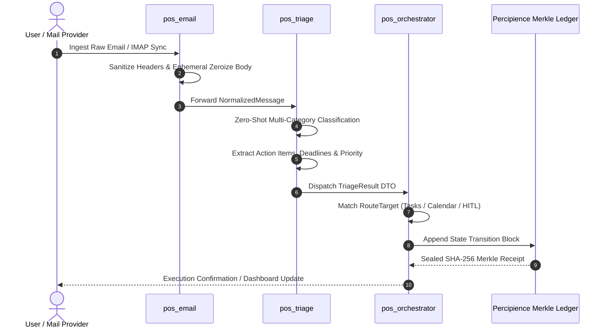
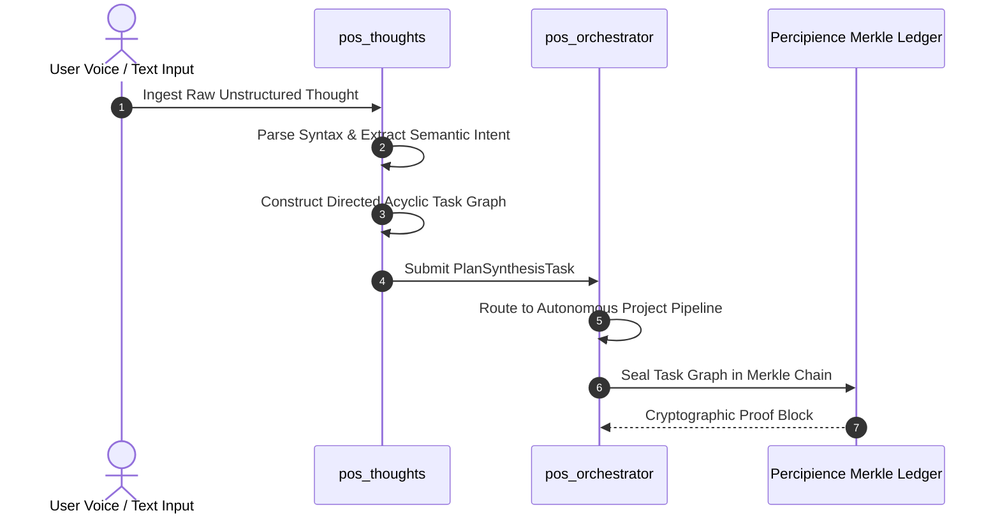

# Runtime Execution & Cross-Module Sequence Flows

**Document Version**: 7.5.0  
**Living Doc Status**: Synchronized & Verified  
**Engine**: `LivingDocEngine` / `agent_living_doc_architect`  

---

## 1. End-to-End Email Ingestion, Triage & Task Dispatch Flow

---

## 2. Thought Ingestion & Task Decomposition Sequence

